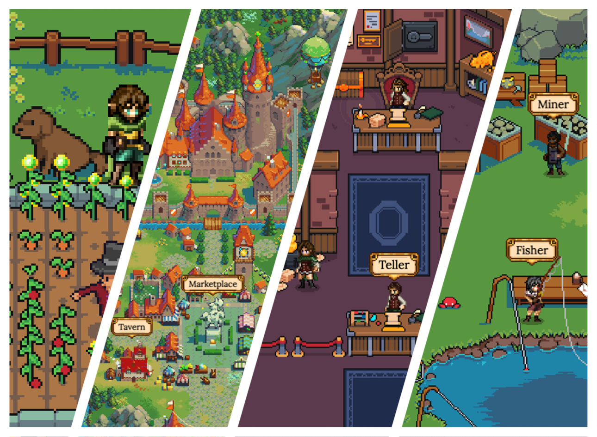

# Defi Kingdoms

## Introduction

DeFi Kingdoms is a game, a DEX, a liquidity pool opportunity, a market of rare utility driven NFTs, and it all plays out seamlessly in the incredibly nostalgic form of fantasy pixel art. We’re excited to release the DeFi Kingdom universe to the world. Come join our lovely community!

### The motivation for Creating DeFi Kingdoms

We’re big fans of the innovation happening in DeFi and in blockchain technology in general, but we've been waiting for a DeFi project to really embrace the full potential of the blockchain in game form. Investing and getting those sweet returns and moon shots is undoubtedly fun, but why can't it feel more like a game? Why can't we build an operation and level it up to increase returns? Why can't we do daily quests to collect rare NFTs that actually augment and impact the rewards and returns? Once we decided it needed to be built, we jumped head first into production, and DeFi Kingdoms was born!

#### A Dedicated Team and a Shared Vision

We wanted a dex that allows holders to not just hold a monetary token, but own a token that is usable, valuable, and that gives back to holders in many fun ways. We’ve packaged DeFi elements into a fun and synergistic game, providing JEWEL token holders with an engaging and meaningful experience. We’re here for the long term, planning features for phases soon to come, and some a little further down the road to set this community and project up for maximum awesomeness. :)
