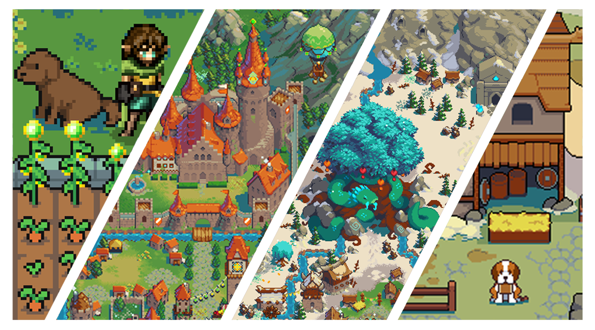

# DeFi Kingdoms

### Introduction

DeFi Kingdoms is a cross-chain, fantasy RPG game built on a strong DeFi protocol. The game features DEXs, liquidity pool opportunities, and a market of rare, utility-driven NFTs, which all together create a beautiful, immersive online world in the incredibly nostalgic form of fantasy pixel art.&#x20;

DeFi Kingdoms gameplay is live on the following blockchains:

* **DeFi Kingdoms: Crystalvale** lives on [DFK Chain](how-defi-kingdoms-works/defi-kingdoms-blockchain.md), an [Avalanche](https://www.avax.network/) L1
* **DeFi Kingdoms: Serendale** can be found on the [Kaia](https://www.kaia.io/) blockchain
* The **DFK Colosseum**, featuring exclusive PVP content, is built on [Metis](https://www.metis.io/)

<figure><picture><source srcset=".gitbook/assets/partner_logos_dark.png" media="(prefers-color-scheme: dark)"></picture><figcaption></figcaption></figure>

Come join our amazing [community](https://www.defikingdoms.com/social.html)!

### The Motivation for Creating DeFi Kingdoms

As big fans of the innovation happening in DeFi and in blockchain technology in general, our team had been waiting for a DeFi project to truly embrace the full potential of the blockchain in game form. Trading, returns, and moonshots are undoubtedly fun, but why couldn't it feel more like a game? Why couldn't we build an operation and level it up to increase returns? Why couldn't we do daily quests and collect rare NFTs that actually augment and impact the rewards and returns? Once we decided it needed to be built, we jumped headfirst into production, and DeFi Kingdoms was born!

### A Dedicated Team and a Shared Vision

We wanted a DEX that allows holders to not just hold a monetary token, but own a token that is usable, valuable, and gives back in many fun ways. We’ve packaged DeFi elements into a fun and synergistic game, providing JEWEL, CRYSTAL, and JADE token holders with an engaging and meaningful experience. We’re here for the long term, planning features for phases soon to come–and some a little further down the road–to set this community and project up for maximum success.
