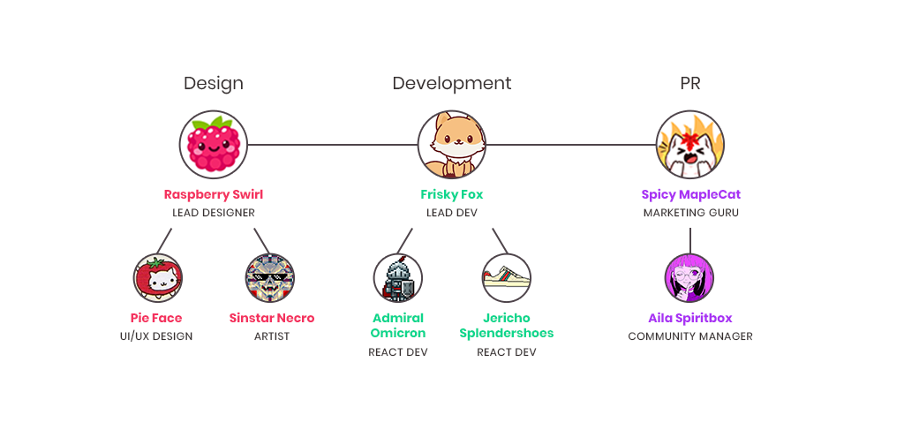
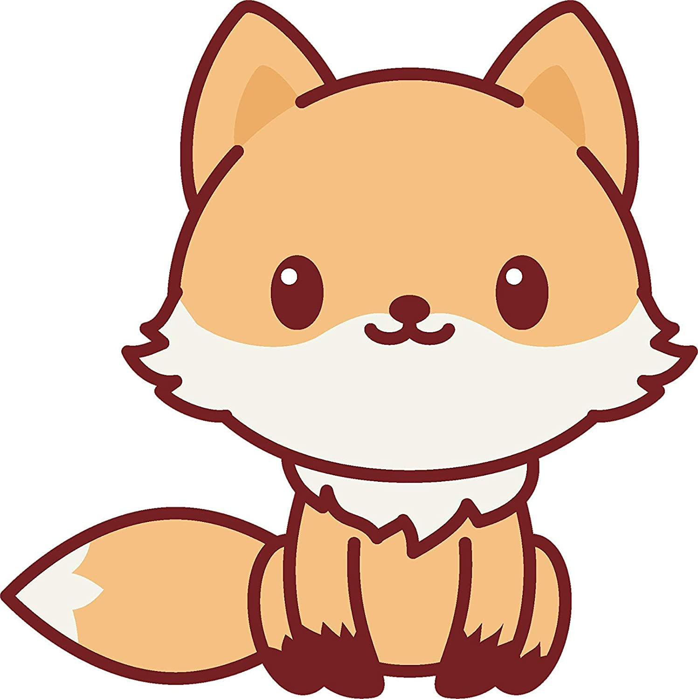
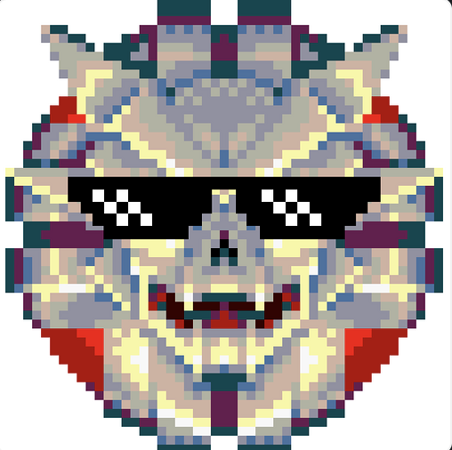
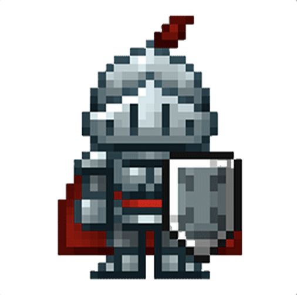

# Meet the Team

\*\*\*\* **Frisky Fox - Solidity and React Developer**

Frisky Fox has been writing and architecting the many smart contracts that will live on the blockchain and run the game. He has also spearheaded the interface, and the analytics and API servers that will support the game and dex. Defi Kingdoms started as his brain-child and he was the driving force behind the game mechanics discussions.

\*\*\*\* **Sinstar Necro - Game Designer and Project Manager**

Sinstar Necro has been working crazy hours to produce production quality pixel art for the heroes and kingdoms, as well as helping to brainstorm the game mechanics and manage the project and team. He is also writing the lore of the game.

 **Jericho Splendershoes - Technical Writer and React Developer**

Jericho has been working hard on the white paper and other documents, as well as helping to brainstorm the Game Mechanics and Tokenomics. He will be transitioning to work on the game application.

\*\*\*\* **Admiral Omicron - React Developer**

Admiral Omicron has been working on the game and dex interface in React. He is newer to the team but has hit the ground running and will continue to be key in the game development of future phases.

\*\*\*\* **Raspberry Swirl - Web Designer and Game Graphics**

Raspberry Swirl designed the amazing website, along with some of the art and marketing graphics. She is also working on hero design and art alongside Necro.

\*\*\*\* **Aila Spiritbox - Community Manager**

Aila Spiritbox manages the discord community and other social media, and she is the first line of support to make sure that the community has everything they need.

\*\*\*\* **Spicy Maplecat - Marketing**

Spicy Maplecat has been running the twitter account and managing and creating the various marketing campaigns now and yet to come.

\*\*\*\* **Pie Face - UI/UX Designer**

Pie Face is also newer to the team. She is focusing on designing the UI/UX of the game to make sure things flow and are easy to use.

