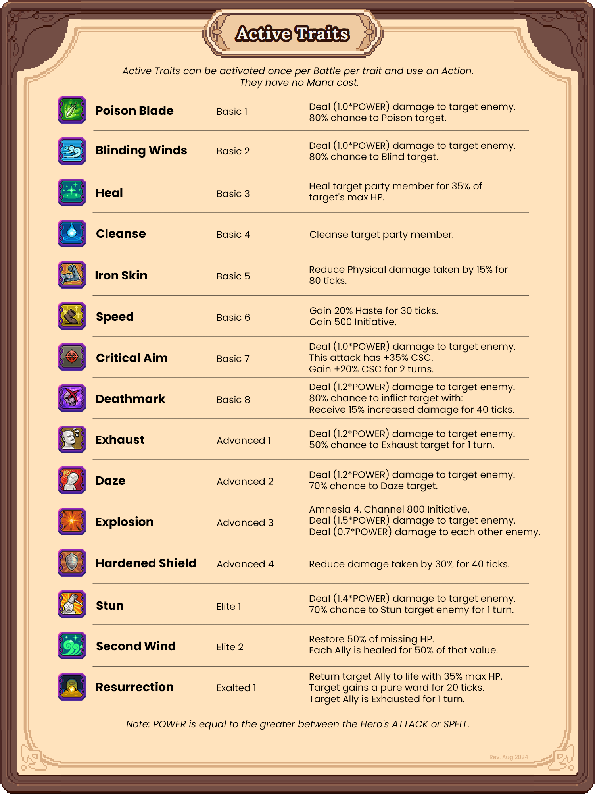
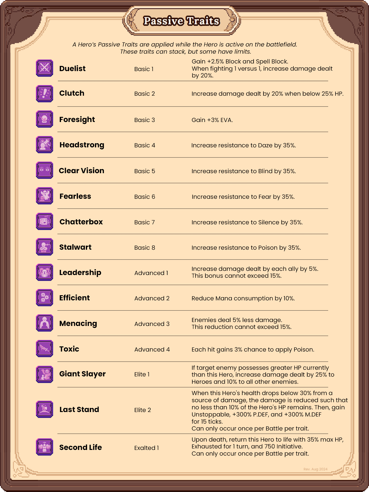

# Combat

This page details information about the upcoming DeFi Kingdoms Hero combat system that will be used in Player-vs-Player (PVP) and Player-vs-Environment (PVE) combat environments.


All information on this page subject to change.

_Last Update: 1/15/2025_


## Combat Keywords

**Keywords** have set meanings and impacts on Combat. They define various portions of actions that can be taken and the effects of **Abilities**. The Keyword itself is used as a shorthand to reference its definition.

<table><thead><tr><th width="177">Keyword</th><th>Definition</th></tr></thead><tbody><tr><td>Action</td><td>A Basic Attack, using an Ability, using a Trait, using an Item, or Repositioning.</td></tr><tr><td>Amnesia X</td><td>
Skills with Amnesia cannot be used again for X turns.

Cannot be cleansed.
</td></tr><tr><td>AOE</td><td>Deal damage to enemies in Position 1, Position 2, and Position 3.</td></tr><tr><td>Backfire</td><td>
If target received Magical damage, mitigate X% of that damage.

The source of the damage receives damage equal to the mitigated value.
</td></tr><tr><td>Banish</td><td>
Target is removed from the battlefield.

Target cannot attack or cast an ability.

Neither ally nor enemy abilities or basic attacks can target this target.

Interrupts.
</td></tr><tr><td>Barrier</td><td>Barriers provide a shield against damage and status effects. Barriers have their own hit points (HP) and will block all negative status effects until their HP is brought to 0 and broken.</td></tr><tr><td>Battle</td><td>A complete PVP/PVE instance.</td></tr><tr><td>Berserk</td><td>
Combatant gains <code>20%</code> Haste and <code>+20%</code> ATTACK.

Combatant loses <code>25%</code> P.DEF and M.DEF.

Combatant cannot be controlled and will perform Basic Attack on its turn.

<code>80%</code> chance to target a random enemy. 

<code>10%</code> chance to target a random ally.

Does not stack and duration refreshes on application (if greater than current).

Cannot be cleansed or dispelled.
</td></tr><tr><td>Bleed</td><td>
Targets inflicted with Bleed damage equal to 2% of their max HP. Bleed lasts for three turns. If inflicted while already bleeding, the duration is reset to three turns and the intensity stacks. The maximum stack size is 5, however, the duration can continue to be reset to 3 turns upon successful application.

Can be cleansed.
</td></tr><tr><td>Blind</td><td>
Hero's accuracy is reduced by 25%.

This status effect persists until removed.
</td></tr><tr><td>Block</td><td>
Negates incoming damage from a Hit.

If an attack has achieved a Hit via Accuracy check, the Block instance reduces that damage to 0%.
</td></tr><tr><td>Burn</td><td>Magical damage that persists over additional Rounds after initial damage instance.</td></tr><tr><td>Channel</td><td>A Hero casts a spell so powerful that it requires a full turn (or more) to charge prior to casting the spell.</td></tr><tr><td>Cleanse</td><td>Removes a random negative status effect from the target.</td></tr><tr><td>Cleave</td><td>Attacks with Cleave hit both the target and the position immediately behind the target.</td></tr><tr><td>Combo</td><td>If a prerequisite action is achieved, a special buff or action can take place upon casting an ability with COMBO.</td></tr><tr><td>Confuse</td><td>
A confused combatant has a 50% chance to perform a basic attack targeting a random combatant (including self) instead of performing their intended action. When inflicted, the duration is randomly determined between 1 to 3 turns.

Cannot Channel while Confused.

Gain Resistance: Gain 50% Confuse resistance for 4 turns. This resistance becomes 100% for 6 turns if Confused again while this resistance is in effect.  Interrupts. Stack Limit: 1
</td></tr><tr><td>Daze</td><td>
Sets the targets turn back by 500 initiative (half of the time it takes to be able to take a turn).

Interrupts Channeling.

Cannot be cleansed.
</td></tr><tr><td>Degree of Difficulty</td><td>An ability so complex that its difficulty results in decreased accuracy.</td></tr><tr><td>Disarm</td><td>
Target is unable to Basic Attack or cast an Ability this Round.

Interrupts.
</td></tr><tr><td>Ethereal</td><td>Target cannot be moved, can only cast Magical Abilities and receive only Magic damage.</td></tr><tr><td>Execute</td><td>When a target has less than X% of remaining HP, kill target.</td></tr><tr><td>Exhaust</td><td>
Exhausted Heroes have 50% slow for one turn, and cannot use any skills their next turn. Can still reposition, basic attack, or use potions.

Interrupts Channeling.

Cannot be cleansed.

Base Duration of 1.
</td></tr><tr><td>Evasion</td><td>
EVA creates a chance for target to avoid an incoming attack, whether it be Magic or Physical.

A 50% EVA would reduce the incoming accuracy of an attack by 50%.
</td></tr><tr><td>Fear</td><td>
If a target is Feared, target is Pushed 1.

Target cannot perform any non-basic ability which deals Physical damage.

Gain Resistance: Gain 50% Fear resistance for 2 Turns. This resistance becomes 100% for 3 Turns if Feared again while this resistance is in effect.

Interrupts.
</td></tr><tr><td>First Strike</td><td>
Target acts first next Round.

If more than one target has First Strike, the target with the highest AGI acts first.
</td></tr><tr><td>Haste</td><td>Increases target's Speed. 50% Haste would result in the Hero's Speed increasing by 50%.</td></tr><tr><td>Interrupt</td><td>An ability that stops a target from Channeling an Ability and resets the Ability and Mana cost.</td></tr><tr><td>Intimidate</td><td>Reduces attack power of target by X% until effect wears off or is cleansed.  Gain Resistance: Gain 50% Intimidate resistance for 2 Turns. This resistance becomes 100% for 3 Turns if Intimidated again while this resistance is in effect.</td></tr><tr><td>Item</td><td>A non-weapon physical object usable in battle. Stored in inventory like Potions and Tinctures.</td></tr><tr><td>Lifesteal</td><td>Each Basic Attack or Ability Damage returns X% of damage dealt as HP.</td></tr><tr><td>Mana Burn</td><td>Damage dealt to target reduces target's Mana.</td></tr><tr><td>Pierce</td><td>If target has damage resistance, deal damage as if that resistance is X% less, where X = the ability's Pierce.</td></tr><tr><td>Poison</td><td>
Physical damage that accelerates over time. 

Deal damage equal to <code>2%</code> of Target’s max HP every 10 ticks.

Each time the damage triggers without the poison being cured, the next poison damage dealt increases by an additional <code>2%</code> of max HP damage, up to a maximum of <code>20%</code> HP damage per trigger.
</td></tr><tr><td>Pull</td><td>
An ability that moves target 1 Position forward.

Interrupts.
</td></tr><tr><td>Push</td><td>
An ability that moves target 1 Position backward.

Interrupts.
</td></tr><tr><td>Reposition</td><td>A Hero can spend its turn moving to a different Position that is one (1) Position away: P1 to P2, P2 to P3, P3 to P2, etc.</td></tr><tr><td>Riposte</td><td>
If target has X% Riposte, when physical damage is received, deal X% of the damage received to the attacker.

This damage cannot be Dodged or Blocked.

This damage is subject to Defense mitigation.
</td></tr><tr><td>Root</td><td>While Rooted, a combatant cannot be pushed, pulled, or reposition, nor can they perform any action that includes them moving to a different position. Rooted combatants also have -10% evasion.</td></tr><tr><td>Round</td><td>Starting with 1 Hero, fully rotating through all Hero turns until the starting Hero is up again.</td></tr><tr><td>Sanjo Hair</td><td>Target Monster with Sanjo Hair cannot be Pushed, Pulled, Dazed, or Stunned.</td></tr><tr><td>Silence</td><td>
Prevents the use of any magical skill until the effect wears off or is cleansed.

Interrupts Channeling.
</td></tr><tr><td>Sleep</td><td>
Target enemy is unable to take actions until targeted by an ability from either an enemy or ally.

Interrupts.
</td></tr><tr><td>Slow</td><td>
Reduces current Speed by X%.

Stacks of slow add together. Maximum combined Slow on a single Hero is 70%.

Gain Resistance: Until Slowed Hero is no longer Slowed, gain 50% resistance to Slow. This resistance stacks.
</td></tr><tr><td>Stacks</td><td>
A value that is additive.

Example, an ability that adds 1% damage over 3 instances, adds 3% damage.
</td></tr><tr><td>Status Effect</td><td>Any lasting ability that buffs or debuffs a target.</td></tr><tr><td>Stun</td><td>
A stunned target will skip taking any actions on its next turn.

Interrupts Channeling.

Can be cleansed.
</td></tr><tr><td>Taunt</td><td>
When a player uses a "Taunt" skill, the target enemy is forced to attack the Taunting Hero for a Duration of X.

The Taunted enemy MUST attack the Taunter for the Duration and can perform only actions that target the Taunter.

If a Taunted enemy is channeling while Taunted and the Taunter is not a target of the channeled skill:
<ul><li>If the Taunter CAN be a target of the skill, the target is changed to the Taunter.</li><li>If the Taunter CANNOT be a target of the skill, the channel is interrupted.</li></ul>
When Taunted, gain resistance: Gain +60% resistance to Taunt for a Duration of 6 turns. This resistance stacks but does not share Duration. When Taunted, gain +25% increase to damage dealt until Taunt is removed.

Taunt CANNOT be Cleansed and Purified.

Taunt has a 50% chance to be removed each time the taunted target suffers HP damage (not barrier) from any source other than the Taunter or DoT effects.  Taunt ignores Barriers, Wards, and status effect resistance from blocking.
</td></tr><tr><td>Turn</td><td>1 Hero Action. 1 round is over after all participants have taken 1 turn.</td></tr><tr><td>Unstoppable</td><td>An unstoppable target cannot be pushed, pulled, or inflicted with any negative status effects.</td></tr><tr><td>Untargetable</td><td>Neither ally nor enemy abilities or basic attacks can target this Hero.</td></tr></tbody></table>

## Genetic Traits

Heroes all have **Genetic Traits**, some of which are **Active** and some **Passive**, all of which are broken down into Basic, Advanced, Elite, and Exalted tiers.&#x20;

### **Active Traits**

A Hero’s **Active Traits** can be activated once per Battle and use an Action. They have no Mana cost.

_Note: `POWER` is equal to the greater between the Hero's `ATTACK` or `SPELL`._

<figure><figcaption></figcaption></figure>

<table><thead><tr><th width="159">Name</th><th width="138.33333333333331">Trait</th><th>Function</th></tr></thead><tbody><tr><td>Poisoned Blade</td><td>Basic 1</td><td>Deal (<code>1.0*POWER</code>) damage to target enemy. 80% chance to Poison target.</td></tr><tr><td>Blinding Winds</td><td>Basic 2</td><td>Deal (<code>1.0*POWER</code>) damage to target enemy. 80% chance to Blind target.</td></tr><tr><td>Heal</td><td>Basic 3</td><td>Heal target party member for 35% of target's max HP.</td></tr><tr><td>Cleanse</td><td>Basic 4</td><td>Cleanse target party member. 50% chance to Cleanse target party member again.</td></tr><tr><td>Iron Skin</td><td>Basic 5</td><td>Reduce Physical damage taken by 15% for 80 ticks.</td></tr><tr><td>Speed</td><td>Basic 6</td><td>
Gain 20% Haste for 30 ticks.

Gain 500 Initiative.
</td></tr><tr><td>Critical Aim</td><td>Basic 7</td><td>
Deal (<code>1.0*POWER</code>) damage to target enemy. This attack has +35% CSC.

Gain +20% CSC for 2 turns.
</td></tr><tr><td>Deathmark</td><td>Basic 8</td><td>
Deal (<code>1.2*POWER</code>) damage to target enemy. 

80% chance to inflict target with: 

Receive 15% increased damage for 40 ticks.
</td></tr><tr><td>Exhaust</td><td>Advanced 1</td><td>Deal (<code>1.2*POWER</code>) damage to target enemy. 50% chance to Exhaust target for 1 turn.</td></tr><tr><td>Daze</td><td>Advanced 2</td><td>Deal (<code>1.2*POWER</code>) damage to target enemy. 70% chance to Daze target.</td></tr><tr><td>Explosion</td><td>Advanced 3</td><td>
Amnesia 4.

Channel 800 Initiative.

Deal (<code>1.5*POWER</code>) damage to target enemy.

Deal (<code>0.7*POWER</code>) damage to each other enemy. This ability has 75% Pierce, +20% CSC, and deals an additional 1.0x damage on critical hits.
</td></tr><tr><td>Hardened Shield</td><td>Advanced 4</td><td>Reduce damage taken by 30% for 40 ticks.</td></tr><tr><td>Stun</td><td>Elite 1</td><td>
Deal (<code>1.4*POWER</code>) damage to target enemy.

70% chance to Stun target enemy for 1 turn.
</td></tr><tr><td>Second Wind</td><td>Elite 2</td><td>
Restore 50% of missing HP.

Each Ally is healed for 50% of that value.
</td></tr><tr><td>Resurrection</td><td>Exalted 1</td><td>
Return target Ally to life with 35% max HP.

Target gains a pure ward for 20 ticks.

Target Ally is Exhausted for 1 turn.
</td></tr></tbody></table>

### **Passive Traits**

A Hero’s **Passive Traits** are applied while the Hero is present on the battlefield. These Traits can stack, but some have limits.

<figure><figcaption></figcaption></figure>

<table data-header-hidden><thead><tr><th width="151">Name</th><th width="141.33333333333331">Trait</th><th>Function</th></tr></thead><tbody><tr><td>Duelist</td><td>Basic 1</td><td>
Gain +2.5% Block and Spell Block.

When fighting 1 versus 1, increase damage dealt by 20%.
</td></tr><tr><td>Clutch</td><td>Basic 2</td><td>Increase damage dealt by 20% when below 25% HP.</td></tr><tr><td>Foresight</td><td>Basic 3</td><td>Gain +3% Evasion.</td></tr><tr><td>Headstrong</td><td>Basic 4</td><td>Increase resistance to Daze by 32.5% Increase Status Effect Resistance by 2.5%</td></tr><tr><td>Clear Vision</td><td>Basic 5</td><td>Increase resistance to Blind by 32.5% Increase Status Effect Resistance by 2.5%</td></tr><tr><td>Fearless</td><td>Basic 6</td><td>Increase resistance to Fear by 32.5% Increase Status Effect Resistance by 2.5%</td></tr><tr><td>Chatterbox</td><td>Basic 7</td><td>Increase resistance to Silence by 32.5% Increase Status Effect Resistance by 2.5%</td></tr><tr><td>Stalwart</td><td>Basic 8</td><td>Increase resistance to Poison by 32.5% Increase Status Effect Resistance by 2.5%</td></tr><tr><td>Leadership</td><td>Advanced 1</td><td>
Increase damage dealt by each ally by 5%.

This bonus cannot exceed 15%.
</td></tr><tr><td>Efficient</td><td>Advanced 2</td><td>Reduce Mana consumption by 10%.</td></tr><tr><td>Menacing</td><td>Advanced 3</td><td>
Enemies deal 5% less damage.

This reduction cannot exceed 15%.
</td></tr><tr><td>Toxic</td><td>Advanced 4</td><td>Each hit gains 3% chance to apply Poison.</td></tr><tr><td>Giant Slayer</td><td>Elite 1</td><td>If target enemy currently possesses more HP than this Hero, increase damage dealt by 10%. If target enemy is a Hero, and currently possesses double or more HP than this Hero, increase damage dealt by 20% instead.</td></tr><tr><td>Last Stand</td><td>Elite 2</td><td>
When this Hero's health drops below 30% from a source of damage, the damage is reduced such that no less than 10% of the Hero's HP remains. Then, gain Unstoppable, +300% P.DEF, and + 300% M.DEF for 15 ticks.

Can only occur once per Battle per trait.
</td></tr><tr><td>Second Life</td><td>Exalted 1</td><td>
Upon death, return this Hero to life with 35% max HP, Exhausted for 1 turn, and 750 Initiative.

Can only occur once per Battle per trait.
</td></tr></tbody></table>
