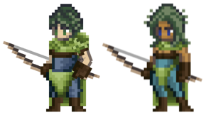

# Archer

<figure><figcaption></figcaption></figure>

This page details information about the Archer class combat skills that will be used in Player-vs-Player (PVP) and Player-vs-Environment (PVE) combat environments.


All information on this page is subject to change.

_Last Update: 3/9/2024. Note that skills beyond Tier 5 have not yet been revised or balanced._


## Class Description

Ah, the **Archer** class.

A formidable choice for those who possess the ability to make swift decisions and strike with deadly precision.

Wary of close-quarters combat, Archers observe their enemies from afar with keen eyes and dexterous fingers, making split-second decisions to help their companions against man or beast. Having an Archer in a party can tilt the odds before the battle begins as they rain arrows on their foes.

Three familiar archetypes guide the class fantasy of the Archer, all of which keep the enemy at a safe distance. The **Flurry** path honors those who seek to deliver death through a thousand cuts, while the **Precision** path speaks to the patient Heroes who wait for the optimal moment to strike. And for those with piercing minds and more than a sprinkle of Luck on their side, the **Marksmanship** path offers unique rewards.

Skill and cunning are required to master the Archer class, whether you prefer to strike quickly or wait for the perfect opportunity.

## Class Skills

<table data-full-width="true"><thead><tr><th width="83">Skill Points</th><th width="145">Discipline</th><th width="149">Ability</th><th width="447">Description</th><th>Range</th><th width="125">Mana Cost / Growth</th><th>DoD</th></tr></thead><tbody><tr><td>1</td><td>Flurry</td><td>Multi-Shot</td><td>
Fire 3 arrows at target enemy.

Each arrow deals (0.7*ATTACK) raw damage.

Each hit has +20% CSC.
</td><td>3</td><td>1.25 / 0.75</td><td>7</td></tr><tr><td>1</td><td>Precision</td><td>Precision Strike</td><td>
Channel for 1 turn.

Deal (2.0*ATTACK + 2.0*DEX) raw damage to target enemy.

(5 + 2.5*DEX.S)% chance to Stun target for 1 turn.

Gain +10% ATTACK Accuracy for 2 turns.
</td><td>3</td><td>2.25 / 0.75</td><td>-5</td></tr><tr><td>1</td><td>Marksmanship</td><td>Piercing Shot</td><td>
Deal (1.5*ATTACK + 1.5*DEX) raw damage to target enemy.

This attack has 40% Pierce.
</td><td>3</td><td>3.25 / 0.75 </td><td>2</td></tr><tr><td>2</td><td>Flurry</td><td>Flurry</td><td>All attacks gain +(1.0*DEX.S)% CSC. Reduces P.DEF and M.DEF by 10%.</td><td>-</td><td>Passive</td><td></td></tr><tr><td>2</td><td>Precision</td><td>Shroud</td><td>While Channeling, this Hero gains +20% EVA.</td><td>-</td><td>Passive</td><td></td></tr><tr><td>2</td><td>Marksmanship</td><td>Marksmanship</td><td>All attacks gain +(15 + 1.5*STR.S)% Pierce.</td><td>-</td><td>Passive</td><td></td></tr><tr><td>3</td><td>Flurry</td><td>Rapid Shot</td><td>
Fire 3 arrows randomly targeting up to 3 enemies. Each arrow deals (1.5*ATTACK) raw damage. For each successful critical hit, (28 + 2.0*LCK.S)% chance to inflict Daze.  Each additional hit on the same target deals 20% less raw damage than the last.

<strong>COMBO</strong>: If this Hero used "Multi-Shot" last turn, each hit has +30% CSC.  Amnesia 2.
</td><td>3</td><td>5.0 / 1.0</td><td>10</td></tr><tr><td>3</td><td>Precision</td><td>Sharpshooter</td><td>
Channel for 1 Turn.

Deal (3.0*ATTACK + 2.0*DEX) raw damage to target enemy.

<strong>COMBO</strong>: If "Shroud" is active, this Hero gains: For 1 turn, Basic Attacks deal (4.0*DEX) additional raw damage.
</td><td>3</td><td>10.0 / 1.0</td><td>-5</td></tr><tr><td>3</td><td>Marksmanship</td><td>Piercing Shot</td><td>
Deal (1.7*ATTACK) raw damage to target enemy in P1.

Deal (1.0*ATTACK) raw damage to target enemy in P2.

Deal (0.7*ATTACK) raw damage to target enemy in P3.

This attack has 40% Pierce.

(40 + 2.0*STR.S + 1.0*LCK.S)% chance to inflict Bleed per hit.

If Blocked, the Arrow stops its trajectory. Amnesia 1.
</td><td>3</td><td>6.0 / 1.0</td><td>5</td></tr><tr><td>4</td><td>Flurry</td><td>Repeating Shot</td><td>
Fire 3 arrows at target enemy.

Each arrow deals (1.4*ATTACK) raw damage to target enemy.

<strong>COMBO</strong>: If "Rapid Shot" was used on this Hero's last turn, deal an additional (1.2*DEX) for each instance of damage dealt.

Exhaust: 1
</td><td>3</td><td>10.0 / 1.0</td><td>10</td></tr><tr><td>4</td><td>Precision</td><td>Dead Aim</td><td>
Channel for 1 turn.

Deal (2.5*ATTACK + 2.0*DEX) raw damage.

<strong>COMBO</strong>: If "Shroud" is active, gain 300 Initiative after channel resolves.
</td><td>3</td><td>2.0 / 1.0</td><td>-5</td></tr><tr><td>4</td><td>Marksmanship</td><td>One Small Stone</td><td>
Deal (0.7*ATTACK + 2.0*LCK) raw damage to target enemy and enemy behind target (if present).

This attack has 40% Pierce, +15% CSC, and deals +130% more damage on critical hits.  Amnesia 2.
</td><td>3</td><td>2.0 / 1.0</td><td>7</td></tr><tr><td>5</td><td>Flurry</td><td>Barrage</td><td>
Fire 6 arrows arching high into the air, hitting all enemy positions randomly.

Each arrow deals (0.7*ATTACK) raw damage.

Each arrow beyond the first to target the same position deals additional damage:
<ul><li>2nd Arrow = 1.5*LCK</li><li>3rd Arrow = 2.0*LCK</li><li>4th Arrow = 3.0*LCK</li><li>5th Arrow = 4.0*LCK</li><li>6th Arrow = 5.0*LCK</li></ul>
Amnesia 1.
</td><td>3</td><td>15.25 / 1.25</td><td>10</td></tr><tr><td>5</td><td>Precision</td><td>Twin Arrows</td><td>
Channel for 1 turn.

Deal (1.5*ATTACK + 1.0*DEX) raw damage to each of the two closest enemies.

<strong>COMBO</strong>: If this Hero used "Dead Aim" in the last 2 turns, deal (3.0*ATTACK + 2.0*DEX) raw damage instead.
</td><td>3</td><td>13.25 / 1.25</td><td>5</td></tr><tr><td>5</td><td>Marksmanship</td><td>Hunter's Mark</td><td>
Target each enemy.

Each target has a 95% chance to be inflicted with the following status effect for 3 turns:
<ul><li>Target suffers (0.5*ATTACK + 0.5*LCK) physical damage at the start of their turn.</li><li>Target has -5% Evasion.</li><li>Target has -15% P.DEF.</li></ul>
Stack Limit: 2
</td><td>3</td><td>10.0 / 1.0</td><td>5</td></tr><tr><td>10+</td><td>Flurry</td><td>Multi-Shot +</td><td>
Fire X arrows at target enemy. Each arrow deals damage equal to (X*Basic).

Each arrow has an independent chance to Critical Strike.
</td><td>3</td><td> </td><td></td></tr><tr><td>10+</td><td>Flurry</td><td>Barrage +</td><td>
Fire a full quiver of arrows arching high into the air, the 6 arrows rain down and deal damage randomly amongst all enemies.

Each arrow deals (X*Basic), however, each additional arrow to strike the same enemy deals additional LCK damage.

<em>Example</em>: 2nd Arrow = X*LCK; 3rd Arrow = X*LCK; 4th Arrow = X*LCK; 5th Arrow = X*LCK.
</td><td>3</td><td> </td><td></td></tr><tr><td>10+</td><td>Precision</td><td>Shroud +</td><td>While Channeling, this Hero gains X% EVA and cannot be Pushed, Pulled, or Stunned.</td><td>-</td><td>Passive</td><td></td></tr><tr><td>10+</td><td>Precision</td><td>Dead Aim +</td><td>
Channel for X Rounds.

Next Round, this Hero must Basic Attack and deals damage equal to (X*Basic).

<strong>COMBO</strong>: If Hero has Shroud active, Daze target and Slow target by X% for X Rounds.
</td><td>3</td><td> </td><td></td></tr><tr><td>10+</td><td>Marksmanship</td><td>One Small Stone +</td><td>
Pick up a stone from the ground and knock it.

Deal damage to X target enemies equal to (X*Basic*(X+(X*LCK)) each.

This attack has X% Pierce.
</td><td>3</td><td> </td><td></td></tr><tr><td>10+</td><td>Marksmanship</td><td>Piercing Arrows +</td><td>
Deal damage to target enemy in P1 equal to (X*Basic).

Deal damage to target enemy P2 equal to (X*Basic).

Deal damage to target enemy in P3 equal to (X*Basic).

This attack has X% Pierce.

If Blocked, the Arrow stops its trajectory.
</td><td>3</td><td> </td><td></td></tr><tr><td>10</td><td>Precision</td><td>Pin</td><td>
Fire a heavy arrow through the foot of target enemy, dealing damage equal to (X*Basic + X*STR + X*DEX).

Slow target by X% for the remainder of Battle.
</td><td>3</td><td> </td><td></td></tr><tr><td>10</td><td>Flurry</td><td>Detonating Arrow</td><td>
Shoot enemy target in P2 dealing damage equal to (X*Basic).

Deal damage to each enemy in P1 and P3 equal to (X*Basic).
</td><td>2</td><td> </td><td></td></tr><tr><td>10</td><td>Precision</td><td>Poison Arrow</td><td>
Deal damage equal to (X*Basic + X*STR + X*DEX).

Poison target enemy.
</td><td>3</td><td> </td><td></td></tr><tr><td>10</td><td>Precision</td><td>Debilitating Shot</td><td>
Deal damage equal to (X*Basic + X*STR + X*DEX).

Daze target enemy.

<strong>COMBO</strong>: If Hero has Shroud active, also Slow target enemy by X%.
</td><td>3</td><td> </td><td></td></tr><tr><td>10</td><td>Marksmanship</td><td>Giant Killer</td><td>If target enemy possess greater current HP than this Hero, deal 100% bonus attack damage.</td><td>3</td><td>Passive</td><td></td></tr><tr><td>10</td><td>Flurry</td><td>Trick Shot</td><td>Deal damage to target enemy in P1 (X*Basic + X*DEX), P2 (X*Basic + X*DEX), P3 (X*Basic + X*DEX).</td><td>3</td><td> </td><td></td></tr><tr><td>10</td><td>Precision</td><td>Swift Quiver</td><td>
Gain effective AGI equal to (X*DEX) in combat.

<strong>COMBO</strong>: If Shroud is active, gain additional AGI equal to (X*END).
</td><td>-</td><td>Passive</td><td></td></tr><tr><td>10</td><td>Marksmanship</td><td>Relentless Volley</td><td>
Activate to put Archer in Turret Mode.

Deal damage equal to (X*Basic) after each Turn to a random enemy for X Rounds.
</td><td>-</td><td>Passive</td><td></td></tr><tr><td>10</td><td>Flurry</td><td>Flick Shot</td><td>Whenever this Hero receives damage, deal damage to source equal to (X*Basic).</td><td>-</td><td>Passive</td><td></td></tr><tr><td>15</td><td>Marksmanship</td><td>Masterful Shot</td><td>
Execute target with less than X% HP.

Degree of Difficulty: -X% Accuracy
</td><td>3</td><td> </td><td></td></tr></tbody></table>

### Notes

* 10+ point skills cost 10 minus the cost of the basic version of the skill and require having the basic version
* 15 point skills are only available to Heroes with a matching Class/Subclass

