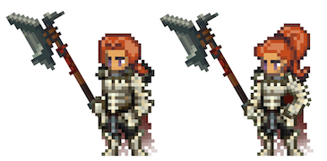

# Berserker

<figure><figcaption></figcaption></figure>

This page details information about the Berserker class combat skills that will be used in Player-vs-Player (PVP) and Player-vs-Environment (PVE) combat environments.


All information on this page is subject to change.&#x20;

_Last Update: 1/30/2025. Note that skills beyond Tier 5 have not yet been revised or balanced._


## Class Description

Unbridled, unrelenting chaos. The **Berserker** wastes no time to claim what is rightfully theirs: everything. Simply put, the Berserker is a champion of chaos, a herald of destruction, and a brutal warrior who embraces the madness deep within. A Berserker as a party member is a thing of beauty as they effortlessly summon forth overwhelming strength to enact pain on any foe, but also upon any friend. In turn, it's easy to mistake the Berserker for a natural catastrophe as they are nearly indistinguishable from a tempest of fury or a storm that tears across the battlefield, leaving naught but devastation in their wake. The very earth quakes beneath their feet.

The power of the Berserker lies in their ability to unleash their rage upon the battlefield, decimating all who dare to stand in their way. They draw forth their primal instincts, tapping into their innermost fury and channeling it through their weaponry. The Berserker is a living weapon, each strike imbued with a deadly ferocity unmatched by any other. But beware, for the untamed rage of the Berserker is not easily contained. They may unleash hell upon their foes, but they also risk losing control of themselves, succumbing to a blood raged craze. In turn, the Berserker is a hero for the bold, a weapon for the daring, and a reminder that in the heat of battle, anything can happen.

Three skill paths are available for the Berserker to tread, each one embracing a different aspect of their inner madness.

The first is the path of the **Bear**, which harkens back to the timeless legend of Bödvar Bjarki, the fabled bear skin clad warrior known for his unbreakable spirit and immense power. Like Bödvar, Berserkers who follow the Bear path embody raw strength and resilience, shrugging off blows that would fell lesser warriors and even growing stronger with each injury they sustain. They are the embodiment of what it means to be fierce and with each blow struck and each wound sustained, the Bear Berserker weaponizes their fury to amplify their strength and steady their feet. The second path of the Berserker is the Wolf, a cunning predator who embodies the fierce savagery of the beast.

The path of the **Wolf** is one of stealth and guile, striking with surprising speed and unleashing their wrath upon their unsuspecting foes. Their rage is fueled by the fear of their enemies, and with each terror-filled howl, they draw upon the strength of their ancestral spirit, the "Evening Wolf" Berserker known as the Kvelduf. As they channel the ferocity of the wolf, they grow stronger still, becoming a force of nature on the battlefield, leaving nothing but destruction in their wake.

The final path of the Berserker is the **Boar**, a whirlwind of senseless destruction. These warriors embody the raw, wild madness of the beast, their very being driven by the desire to cause chaos and mayhem. The Boar path of the Berserker is not for the faint of heart, for it embodies the true essence of the Jöfurr, the most feared warriors known to the lands of old. They were known to habitually partake in the consumption of Henbane mushroom, which further heightened their bloodlust and brought them to the brink of madness and from this madness, the Jöfurr derived great strength and power. The Boar path is for those who seek to harness that power of unbridled chaos and bring it to the battlefield.

No matter the path chosen, the Berserker will make its claim on the battlefield. Their rage is fueled by the thrill of the hunt, the rush of the kill, and the glory of the victory and their abilities reflect the chaos and destruction they bring to battle. They are capable of inflicting massive damage, reducing the power of their enemies, or even turning upon their own party in a blind rage. The Berserker is a weapon of war, a tool of destruction, and a terror to all who face them in battle.

## Class Skills

<table data-full-width="true"><thead><tr><th width="69">Skill Points</th><th width="101">Discipline</th><th width="193">Ability</th><th width="644">Description</th><th width="86">Range</th><th width="108">Mana Cost</th><th>DoD</th></tr></thead><tbody><tr><td>1</td><td>Bear</td><td>Berserkir Mushroom</td><td>
Gain +X% ATTACK, where <code>X = ((50 * (maxHP - currentHP)) / maxHP)</code>.

At the start of this Hero's turn, gain a +Y% chance to be inflicted with Berserk for 25 ticks, where <code>Y = (30 * (1 - (currentHP / maxHP)))</code>.  

Whenever this Hero deals damage to one or more allies during an action, immediately perform Moment of Clarity after the action resolves.

<strong>Moment of Clarity:</strong>
<ul><li>Target random enemy.</li><li><code>(4.0*STR.S + 4.0*LCK.S)%</code> chance to inflict target with Berserker's Mark for 40 ticks. Then, if an enemy is inflicted with Berserker's Mark, this Hero becomes inflicted with Berserk for 30 ticks.</li></ul></td><td>-</td><td>Passive</td><td>-</td></tr><tr><td>1</td><td>Wolf</td><td>Ulfheðnar Mushroom</td><td>
For each instance this Hero deals damage, gain:
<ul><li>+1.5% ATTACK, up to a maximum of +30%</li><li>25% chance to be inflicted with Berserk for 25 ticks</li><li>Whenever this Hero deals damage to one or more allies during an action, gain 10% Haste for 20 ticks.</li></ul></td><td>-</td><td>Passive</td><td>-</td></tr><tr><td>1</td><td>Boar</td><td>Jöfurr Mushroom</td><td>
For each instance this Hero receives damage from an attack or skill, gain:
<ul><li>+2.5% ATTACK, up to a maximum of +30% </li><li>25% chance to be inflicted with Berserk for 25 ticks</li><li>
Whenever this Hero deals damage to one or more allies during an action, gain the following effect:
<ul><li>All attacks gain 25% Lifesteal for 30 ticks.</li></ul></li></ul></td><td>-</td><td>Passive</td><td>-</td></tr><tr><td>2</td><td>Bear</td><td>Bear Skin</td><td>Gain +20% P.DEF and M.DEF.</td><td>-</td><td>Passive</td><td>-</td></tr><tr><td>2</td><td>Wolf</td><td>Wolf Pelt</td><td>Gain +5% EVA.</td><td>-</td><td>Passive</td><td>-</td></tr><tr><td>2</td><td>Boar</td><td>Boar Hide</td><td>Gain +10% ATTACK.</td><td>-</td><td>Passive</td><td>-</td></tr><tr><td>3</td><td>Bear</td><td>Bloodlust</td><td>
Deal X pure damage to this Hero, where X = 10% of this Hero's Max HP.

Gain <code>+(10 + 2.0*VIT.S)%</code> ATTACK for 4 turns.

Stack Limit 1
</td><td>-</td><td>2.0 / 0.75</td><td>-</td></tr><tr><td>3</td><td>Wolf</td><td>Howl</td><td>
Target each enemy. On hit:
<ul><li><code>(25 + 6.0*STR.S)%</code> chance to Intimidate each target by 20% for 4 turns.</li><li><code>(3.0*STR.S + 3.0*LCK.S)%</code> chance to inflict each target with Berserker's Mark for 40 ticks.</li></ul>

Amnesia 2
</td><td>3</td><td>4.0 / 0.75</td><td>5</td></tr><tr><td>3</td><td>Boar</td><td>Blind Rage</td><td>
Perform 4 to 8 attacks (randomly determined) dealing <code>(0.3*ATTACK)</code> damage to random enemies for each attack.

Amnesia 1
</td><td>3</td><td>2.0 / 1.0</td><td>10</td></tr><tr><td>4</td><td>Bear</td><td>Primal Strength</td><td>
Gain +10% ATTACK.

While Berserk, this Hero gains:
<ul><li>+20% additional ATTACK.</li><li>-5% P.ACC. </li><li>Critical Strikes gain a 50% chance to Push 2.</li></ul></td><td>-</td><td>Passive</td><td>-</td></tr><tr><td>4</td><td>Wolf</td><td>Wolf Pack</td><td>
For each living Ally, gain +10% ATTACK.

Whenever an ally suffers damage from an enemy action, 5% chance for this Hero to be inflicted with Berserk for 25 ticks.

Whenever an ally dies, this Hero becomes inflicted with Berserk for 40 ticks.

If the ally died from an enemy action, immediately perform You Are My Enemy on that enemy after the action resolves.

<strong>You Are My Enemy:</strong>
<ul><li>Target enemy.</li><li><code>(5.0*STR.S + 5.0*LCK.S)%</code> chance to inflict target with Berserker's Mark for 50 ticks.</li></ul></td><td>-</td><td>Passive</td><td>-</td></tr><tr><td>4</td><td>Boar</td><td>Wild Frenzy</td><td>
Each time this Hero performs a Basic Attack action, gain <code>+(5 + 2.0*LCK.S)%</code> chance to consume <code>(1 + 0.5 * LVL)</code> MP (rounded up) to perform Wild Frenzy instead.

<strong>Wild Frenzy</strong>: Perform three Basic Attacks on the same target. The damage of each hit is reduced by 30%.
</td><td>-</td><td>Passive</td><td>-</td></tr><tr><td>5</td><td>Bear</td><td>Spore-Coated Blade</td><td>
Deal <code>(1.2*ATTACK + 0.8*STR)</code> damage to target enemy.

If damage was dealt to an enemy: 
<ul><li><code>(70 + 2.0*DEX.S)</code><em>%</em> chance to Poison target enemy. </li><li><code>(40 + 2.0*STR.S)%</code> chance to cause target to receive 20% additional damage from this Hero for 4 turns.</li><li><code>(95 - 2.0*DEX.S)%</code> chance to Poison this Hero, ignoring Barrier and Ward effects.</li></ul>
Amnesia 4
</td><td>1</td><td>4.0 / 1.0</td><td>X</td></tr><tr><td>5</td><td>Wolf</td><td>Brutal Act</td><td>
Deal <code>(1.5*ATTACK + 2.0*STR)</code> damage to a random enemy.

If damage was dealt to an enemy, deal <code>(1.0*ATTACK + 1.0*STR)</code> raw damage to a random party member.

Amnesia 4
</td><td>2</td><td>4.0 / 1.0</td><td>X</td></tr><tr><td>5</td><td>Boar</td><td>Blood Rage</td><td>
Channel 500 Initiative.

Reposition to P1.

Deal <code>(1.0*ATTACK + 1.0*STR + 0.5*LCK)</code> damage to each enemy.

Deal <code>(0.5*ATTACK + 1.0*STR - 0.5*LCK)</code> damage to each Ally.

Gain Berserk for 40 ticks.
</td><td>3</td><td>2.25 / 1.25</td><td>X</td></tr><tr><td>10+</td><td>Bear</td><td>Bear Skin +</td><td>X% effective P.DEF increase in combat. Increase EVA by X%.</td><td>-</td><td>Passive</td><td>-</td></tr><tr><td>10+</td><td>Bear</td><td>Bloodlust +</td><td>Self-inflict damage equal to (X*Basic + X*VIT). Gain increased Basic Attack damage equal to X% (X = X + X*VIT) for a Duration of X. (X + X*END) chance to Silence a random enemy.</td><td>-</td><td>X</td><td>-</td></tr><tr><td>10+</td><td>Wolf</td><td>Wolf Pack +</td><td>For each dead ally, gain X% increased damage.</td><td>-</td><td>Passive</td><td>-</td></tr><tr><td>10+</td><td>Wolf</td><td>Howl +</td><td>Unleash a furious howl that terrifies all enemies. Reduce damage dealt by all enemies by X% for a Duration of X. (X + X*STR) chance to Fear a random enemy.</td><td>3</td><td>X</td><td>X</td></tr><tr><td>10+</td><td>Boar</td><td>Blood Rage +</td><td>Unleash hell, swirling and swinging axes in all directions dealing AOE damage to both teams equal to (X*Basic + X*STR + X*LCK). If target is inflicted with Bleed, increase CSC by X%. Become Exausted.</td><td>3</td><td>-</td><td>X</td></tr><tr><td>10+</td><td>Boar</td><td>Blind Rage +</td><td>Enter a blind rage and slash X times, hitting all enemies randomly and dealing damage equal to (X*Basic) per slash. If a target is hit at least X times, X% chance to Blind target for a Duration of X. Become Exhausted.</td><td>3</td><td>X</td><td>X</td></tr><tr><td>10</td><td>Bear</td><td>Blood of Our Enemies</td><td>Activate to Basic Attack target Hero. If target is inflicted with Bleed, increase CSC by X%.  <strong>COMBO</strong>: If X or more Bear abilities have been cast by this Hero this battle, this attack gains 30% Lifesteal.</td><td>1</td><td>-</td><td>X</td></tr><tr><td>10</td><td>Bear</td><td>Living Rage</td><td>Activate to reduce this hero's HP to 1. This Hero cannot die for a Duration of X and deals X% additional damage. Amnesia X: Living Rage</td><td>-</td><td>X</td><td>-</td></tr><tr><td>10</td><td>Bear</td><td>Decimation</td><td>Deal damage to enemies in P1 and P2 equal to (X*Basic + X*STR + X*DEX). (X + X*STR)% chance to Slow each target by X% for a Duration of X.  <strong>COMBO</strong>: if "Blood Rage" was cast in the last X Durations, (X + X*STR)% chance to Stun both targets.</td><td>2</td><td>X</td><td>X</td></tr><tr><td>10</td><td>Wolf</td><td>Primal Rend</td><td>Deal damage equal to (X*Basic + X*STR). If target is inflicted with Bleed, increase CSC by X%.  <strong>COMBO</strong>, Decimation: If target enemy has less than X% HP. Deal additional damage equal to (X*Basic + X*STR).</td><td>2</td><td>-</td><td>X</td></tr><tr><td>10</td><td>Wolf</td><td>Kveldulf Blow</td><td>Deal damage equal to (X*Basic + X*STR) to target Hero in P1.  (X + X*STR)% chance to Stun target for a Duration of X. (X + X*STR)% chance to Stun target for an additional Duration of X. (X + X*STR)% chance to Stun target for an additional Duration of X. Become Exhausted for a Duration of X (X = number of Durations target was Stunned).</td><td>1</td><td>X</td><td>X</td></tr><tr><td>10</td><td>Wolf</td><td>Wood Ear Extract</td><td>Whenever this Hero deals Basic Attack damage, target Hero has a X% chance to receive X% less healing for a Duration of X. Can refresh, does not stack.</td><td>-</td><td>Passive</td><td>-</td></tr><tr><td>10</td><td>Boar</td><td>Dragonslayer</td><td>Deal damage to target enemy in equal to (X*Basic). (X + X*STR)% chance to Daze target. (X + X*STR)% chance to Stun target. (X + X*STR)% chance to Banish target.  If target enemy is a Dragoon, deal additional damage equal to (X*Basic + X*STR). Become Exhausted.</td><td>3</td><td>-</td><td>X</td></tr><tr><td>10</td><td>Boar</td><td>Henbane Spores</td><td>At the end of each of this Hero's Turns, this Hero has a chance equal to X% (X = X*LCK) to expell mushroom spores. If spores are expelled, (X + X*END) chance to inflict a random enemy with Berserk for a Duration of X.</td><td>-</td><td>Passive</td><td>-</td></tr><tr><td>10</td><td>Boar</td><td>Bödvar's Mushroom</td><td>This Hero ate the wrong mushroom and cannot be controlled for the remainder of Battle. This Hero deals damage equal to (X*Basic) to a random target: X% Enemies X% Allies If no allies remain, X% enemies.</td><td>3</td><td>Battle -</td><td>-</td></tr><tr><td>15</td><td>Wolf</td><td>Funeral Rites</td><td>Upon death, this Hero may make X additional actions as if they haven't died. They recover 0 HP from healing while in this state.</td><td>-</td><td>Passive</td><td>-</td></tr></tbody></table>

### Notes

* \*DoD: Degree of Difficulty
* 10+ point skills cost 10 minus the cost of the basic version of the skill and require having the basic version
* 15 point skills are only available to Heroes with a matching Class/Subclass

