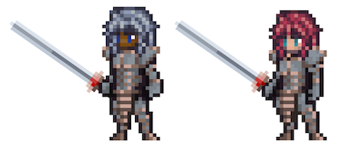

# Knight

<figure><figcaption></figcaption></figure>

This page details information about the Knight class combat skills that will be used in Player-vs-Player (PVP) and Player-vs-Environment (PVE) combat environments.


All information on this page is subject to change.

_Last Update: 8/29/2024. Note that skills beyond Tier 5 have not yet been revised or balanced._


## Class Description

The trust of the people is earned, not granted, and no class bears this stark truth with greater resolve than the brave and honorable **Knight**. Dedicated to upholding justice and protecting the innocent, such valiant heroes are truly a sight to behold, for they are the shield of the people, trained in the art of combat to become the ultimate protectors.

While Knights share the battle prowess and discipline of their Warrior counterparts, what sets Knights apart is their perennial loyalty to a strict code of chivalry, often in servitude to a Lord or individual holding great power. Knights never abandon their calling to aid, even if they face overwhelming odds.

For a Knight, a skill forged in relentless training is a power waiting to be wielded instinctively in battle. In turn, the Knight works tirelessly from squirehood to become a master of close quarters combat. Expertly trained in the art of standing in the way of big, scary things, the Knight is always the first across the line. Clad head-to-toe in sturdy armor and complete with a mighty appetite for the fray, the Knight deflects the attacks of their foes and protects those for whom they care.

But the Knight is not just a skilled fighter--nay, they are also driven by a strong sense of honor and duty, which guides their every action. Their abilities reflect this loyalty, focusing on reducing damage taken, redirecting attacks away from the weak, and granting protection to their trusted party. On the offensive, Knights strike hard to debilitate their foes, stunning or silencing them to give their team an advantage in battle or simply room to breathe.

Three paths lead a squire to Knighthood: the path of **Honor**, which emphasizes defense and protecting allies; the path of **Valor**, which focuses on strength and vigilance; and the path of **Iron**, which emphasizes debuffing and disrupting the enemy.

On the battlefield, the Knight is a formidable force, inspiring their allies to fight alongside them with courage and determination. Respected and admired by all who know them, their name is synonymous with honor and duty, none more so than Sir Robby Footly, the Knightliest of Knights.

## Class Skills

<table data-full-width="true"><thead><tr><th width="96">Skill Points</th><th width="99">Discipline</th><th width="168">Ability</th><th width="422">Description</th><th width="114">Range</th><th width="126">Mana Cost / Growth</th></tr></thead><tbody><tr><td>1</td><td>Honor</td><td>Challenge</td><td>
Target enemy. On hit:
<ul><li>(<code>50 + 2.0*STR.S</code>)% chance to Taunt target for 2 turns.</li><li>(<code>40 + 4.0*STR.S</code>)% chance to Intimidate target by 10% for 2 turns.</li></ul>
If target is Taunted by this skill, cancel any Taunt effects the target inflicted on all allies.  Amnesia 2
</td><td>3</td><td>1.25 / 0.75</td></tr><tr><td>1</td><td>Valor</td><td>Mighty Strike</td><td>
Deal (<code>1.4*ATTACK + 1.0*STR</code>) raw damage to target enemy.

(<code>60 + 2.0*STR.S</code>)% chance to reduce target's P.DEF by 25% for 2 turns.

Stack Limit: 2
</td><td>1</td><td>3.25 / 0.75</td></tr><tr><td>1</td><td>Iron</td><td>Shield Up</td><td>
Gain +10% Block for 3 turns.

Gain +50% P.DEF for 3 turns.

Reduce damage dealt by 20% for 3 turns.

Amnesia: 2
</td><td>1</td><td>1.25 / 0.75</td></tr><tr><td>2</td><td>Honor</td><td>For Honor</td><td>Increase P.DEF of allies behind this Hero by (<code>20 + 2.0*END.S)</code>% of this Hero's P.DEF.</td><td>-</td><td>Passive</td></tr><tr><td>2</td><td>Valor</td><td>For Valor</td><td>Increase P.DEF by X% (<code>X = 10 + 3.0*END.S</code>).</td><td>-</td><td>Passive</td></tr><tr><td>2</td><td>Iron</td><td>For the King</td><td>
Increase effective STR by X (<code>X = 3 + 0.15*STR</code>, rounded up).

Increase effective END by X (<code>X = 3 + 0.15*END</code>, rounded up).
</td><td>-</td><td>Passive</td></tr><tr><td>3</td><td>Honor</td><td>Forever Vigilant</td><td>
Deal (<code>1.4*ATTACK</code>) raw damage to target enemy.

(<code>30 + 2.0*STR.S + 2.0*END.S</code>)% chance to Daze target.

Allies behind this Hero gain +40% resistance to Daze for 3 turns.

Stack Limit: 1

<strong>COMBO</strong>: If "For Honor" is active, the Daze resistance is +60% instead.  Amnesia 3
</td><td>2</td><td>6.5 / 0.75</td></tr><tr><td>3</td><td>Valor</td><td>Hold the Line</td><td>
Deal (<code>1.4*ATTACK</code>) raw damage to target enemy.

(<code>30 + 4.0*STR.S</code>)% chance to Push target 1.

Allies behind this Hero gain +40% resistance to Push and Pull for 3 turns.

Stack Limit: 1

<strong>COMBO</strong>: If "For Valor" is active, the Push/Pull resistance is +60% instead.  Amnesia 3
</td><td>2</td><td>6.5 / 0.75</td></tr><tr><td>3</td><td>Iron</td><td>Iron Will</td><td>
Deal (<code>1.4*ATTACK</code>) raw damage to target enemy.

(<code>30 + 4.0*END.S</code>)% chance to Silence target for 1 turn.

Allies behind this Hero gain +40% resistance to Silence for 3 turns.

Stack Limit: 1

<strong>COMBO</strong>: If "For the King" is active, the Silence resistance is +60% instead.  Amnesia 3
</td><td>1</td><td>6.5 / 0.75</td></tr><tr><td>4</td><td>Honor</td><td>Interception</td><td>
Deal (<code>1.3*ATTACK</code>) raw damage to target enemy.

This Hero gains:
<ul><li>Redirect 50% of all physical damage dealt to the ally directly behind this Hero to this Hero for a 40 ticks.</li></ul>
Stack Limit: 1

<strong>COMBO</strong>: If "Forever Vigilant" was used last turn, gain +50% P.DEF for 40 ticks.
</td><td>1</td><td>10.5 / 0.75</td></tr><tr><td>4</td><td>Valor</td><td>Shield Smash</td><td>
Deal (<code>0.7*ATTACK</code>) raw damage to target enemy.

(<code>15 + 3.0*STR.S</code>)% chance to Stun target for 1 turn.

(<code>60 + 2.0*STR.S</code>)% chance to Push target 1.

<strong>COMBO</strong>: If "Hold the Line" was used last turn, successful Push attempts from this skill Push target 2 instead.  Amnesia 1
</td><td>1</td><td>15.0 / 1.0</td></tr><tr><td>4</td><td>Iron</td><td>Ironclad Defense</td><td>
Damage this Hero receives from sources in P2 and P3 is reduced by X% (<code>X = 3 + 1.0*END.S</code>).

<strong>COMBO</strong>: If another "Iron" discipline passive skill is active, increase X by an additional (X = 4 + 0.5*END.S).
</td><td>-</td><td>Passive</td></tr><tr><td>5</td><td>Honor</td><td>Royal Guard</td><td>
Increase P.DEF by (<code>30 + 3.0*END.S</code>)% for 4 turns.

Redirect all negative Status Effects targeting Ally directly behind this Hero to this Hero for 40 ticks.

Amnesia 3
</td><td>1</td><td>17.75 / 0.75 </td></tr><tr><td>5</td><td>Valor</td><td>Battle Ready</td><td>
Gain 5% Block.

Gain 5% Spell Block.

Increase Basic Attack damage by 20%.
</td><td>-</td><td>Passive</td></tr><tr><td>5</td><td>Iron</td><td>Iron Shield</td><td>
Increase P.DEF by (<code>30 + 4.0*END.S</code>)% for 4 turns.

Gain +(<code>1.0*END.S</code>)% Block for 40 ticks.

<strong>COMBO</strong>: If an "Iron" discipline passive skill is active, this Hero gains 75% resistance to Push and Pull for 40 ticks.

Amnesia 3
</td><td>-</td><td>14.0 / 1.0</td></tr><tr><td>10+</td><td>Honor</td><td>Forever Vigilant +</td><td>
Deal damage to target enemy equal to (X*Basic).

Daze target enemy.

Allies gain X% resistance to Daze for X Rounds.

<strong>COMBO</strong>: If "For Honor" is active, allies gain X% resistance to Daze for X Rounds.
</td><td>-</td><td>Passive</td></tr><tr><td>10+</td><td>Honor</td><td>Interception +</td><td>
Deal damage equal to (X*Basic) to target enemy in P1.

Redirect X% of all Physical damage from enemies in P1 and P2 to this Hero for X Rounds.
</td><td>-</td><td> </td></tr><tr><td>10+</td><td>Valor</td><td>Battle Ready +</td><td>
Gain X% Block.

Increase Basic Attack damage by X%.
</td><td>-</td><td>Passive</td></tr><tr><td>10+</td><td>Valor</td><td>Shield Smash +</td><td>
Deal damage to target enemy equal to (X*Basic).

Stun enemy target.

Push target X.
</td><td>1</td><td> </td></tr><tr><td>10+</td><td>Iron</td><td>For the King +</td><td>
Increase effective STR by X%.

Increase effective END by X%.

Gain X% Riposte.
</td><td>-</td><td>Passive</td></tr><tr><td>10+</td><td>Iron</td><td>Iron Shield +</td><td>
Activate to reduce Physical damage taken by X% for X Rounds.

<strong>COMBO</strong>: If another Iron abilitiy is active, allies gain X% resistance to Daze for X Rounds.
</td><td>-</td><td> </td></tr><tr><td>10</td><td>Valor</td><td>Inspirational Words</td><td>All allies gain effective STR equal to X% (X = X*END) for X Rounds.</td><td>-</td><td> </td></tr><tr><td>10</td><td>Iron</td><td>Cloak of Iron</td><td>If X Iron abilities are active, this Hero gains effective END equal to X% (X = X*VIT + X*STR).</td><td>-</td><td>Passive</td></tr><tr><td>10</td><td>Valor</td><td>Commanding Presence</td><td>All allies gain effective AGI equal to X% (X = X*STR) for X Rounds.</td><td>-</td><td> </td></tr><tr><td>10</td><td>Honor</td><td>Superior Technique</td><td>
Increase effective DEX equal to X% 

(X = X*END).
</td><td>-</td><td>Passive</td></tr><tr><td>10</td><td>Honor</td><td>True Strike</td><td>Deal Physical damage to target enemy equal to (X*Basic) with X% Pierce.</td><td>1</td><td> </td></tr><tr><td>10</td><td>Valor</td><td>One for All</td><td>All Allies behind this Hero gain X% Physical damage reduction while this Hero lives.</td><td>-</td><td>Passive</td></tr><tr><td>10</td><td>Iron</td><td>Shield of the People</td><td>Reduce damage taken by allies in P2 and P3 by X% for X rounds.</td><td>-</td><td> </td></tr><tr><td>10</td><td>Honor</td><td>A Knight to Remember</td><td>When below X% HP, all Basic Attacks and Abilities gain X% increased critical strike chance.</td><td>-</td><td>Passive</td></tr><tr><td>10</td><td>Valor</td><td>Live to Serve</td><td>Redirect all Status Effects targeting allies to this Hero.</td><td>-</td><td>Passive</td></tr><tr><td>15</td><td>Honor</td><td>Knight King</td><td>
Deal damage to P1 equal to ((X*Basic)+(X*STR + X*DEX)) and X% of that value to P2 and P3.

Push P1 to P2, Pull P2 to P1, and Stun P3.

Become Exhausted.
</td><td>3</td><td> </td></tr></tbody></table>

### Notes

* 10+ point skills cost 10 minus the cost of the basic version of the skill and require having the basic version
* 15 point skills are only available to Heroes with a matching Class/Subclass

