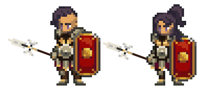

# Legionnaire

<figure><figcaption></figcaption></figure>

This page details information about the Legionnaire class combat skills that will be used in Player-vs-Player (PVP) and Player-vs-Environment (PVE) combat environments.


All information on this page is considered "Pre-Alpha" and preliminary, and is therefore subject to change.

_Last Update: 4/10/2023_


## Class Description

When all seems lost and darkness stretches across the field of battle, the **Legionnaire** emerges as a pillar of unwavering might and steadfastness. As a martial exemplar, the Legionnaire embodies the cardinal virtues of valor, self-sacrifice, and unswerving fealty. Their imposing presence upon the battlefield serves as a harbinger of security and conviction, infusing their brethren with courage and striking terror into the hearts of their adversaries.

As long as the Legionnaire stands tall, the flame of victory shall never be extinguished.

The Legionnaire is a frontline warrior that excels in both offensive and defensive engagements. They are the vanguard of the fellowship, bearing the brunt of enemy onslaughts and shielding their comrades with their robust aegis and matchless fortitude. Through their stable of skills and abilities, the Legionnaire adapts to the ever-shifting maelstrom of battle, whether it requires delivering crippling blows to their foes, dictating the tide of combat, or rallying their allies to seize victory against insurmountable odds.

The Legionnaire’s skill codex stands as a testament to their adaptability and resourcefulness, melding the arts of spear and shield warfare with the capacity to lead and elevate others to new heights. The Legionnaire’s influence is felt with each resolute stride, whether they choose to Live by the Shield, Die by the Spear, or embrace the mantle of the Born Leader.

The stalwart protectors who **Live by the Shield** stand as bastions of defense and unyielding resolve. These unyielding anchors deftly wield their trusted shields to defend their allies and themselves from perils both mundane and arcane. Live by the Shield concentrates on the Legionnaire’s defensive aptitude, enhancing their ability to deflect, parry, and withstand the relentless assaults of their enemies. The path of the Shielded Hero proffers heightened protection for both the Legionnaire and their brethren, rendering them nigh impervious to harm. As they refine their prowess, they evolve into towering citadels, poised to shift the balance of battle and endure the fiercest of onslaughts.

Within the venerable and mystical discipline of the spear, those who **Die by the Spear** unearth their true purpose. Die by the Spear accentuates the Legionnaire’s offensive capabilities, sharpening their mastery of the spear to deliver ruinous blows upon their adversaries. These ferocious combatants brandish the spear with elegance and precision, felling their enemies with the fluidity of a coursing river and the fury of a tempest unleashed. As the Legionnaire’s skills with the spear evolve, the spear itself transmutes into an extension of their very essence, a conduit for their indomitable spirit. These adept warriors invoke both intimidation and reverence for their ability to penetrate enemy lines and scatter the ranks of their foes. With each attainment of spear mastery, they unlock devastating techniques, empowering them to strike from afar, unleash maelstroms of devastation, and cleave multiple adversaries asunder with a singular, well-aimed thrust.

Upon these blood-drenched fields of battle, a true leader’s value is beyond measure. The **Born Leader** discipline path molds its disciples into rousing figures, capable of marshaling their comrades and commanding their forces with sagacity, audacity, and unwavering resolve. These individuals possess an innate gift for stratagem, discerning the strengths and vulnerabilities of their allies and enemies alike. As their mastery of this discipline flourishes, so too does their ability to embolden and fortify their comrades. Their mere presence emerges as a beacon of hope amidst the heat of battle, raising the spirits of their allies and instilling terror in the hearts of their enemies. Born Leaders harness the might of their charisma and conviction to bolster the defenses of their brethren and even alter the course of battle through sheer force of will. Ultimately, Born Leaders ascend to the heights of virtue, rallying their forces from the precipice of defeat and guiding them to resplendent victory. Through their unyielding devotion to their comrades and their cause, these individuals truly embody the essence of leadership, proving that even in the darkest of times, hope shall never falter.

In the hands of the Legionnaire, the spear and shield become instruments of unrivaled skill and precision. The spear empowers them to strike from a distance, piercing through the defenses of their adversaries with lethal accuracy. The shield, meanwhile, serves not only as a bulwark against incoming assaults but also as a formidable weapon in its own right. The Legionnaire’s consummate mastery of these weapons is manifested through their unique abilities, blending offensive and defensive techniques to forge a versatile and fearsome fighting style.

## Class Skills

<table><thead><tr><th>Skill Points</th><th width="81">Range</th><th width="167">Discipline</th><th width="91">DoD*</th><th width="192">Ability</th><th width="704">Description</th></tr></thead><tbody><tr><td>1</td><td>1</td><td>Live by the Shield</td><td>X</td><td>Get Even</td><td>
<em>A tax for every insult.</em> 

Activate for a Duration of X. 

All physical damage dealt by this Hero is decreased by X%.

Gain X% Riposte.
</td></tr><tr><td>1</td><td>2</td><td>Die by the Spear</td><td>X</td><td>Thrust</td><td>
<em>Ready your spear.</em>

Deal physical damage to target enemy equal to (X*BASIC + X*STR + X*DEX).

This attack has X% Pierce.

For a Duration of X, gain (X + X*END)% chance to Retaliate X.
</td></tr><tr><td>1</td><td>1</td><td>Born Leader</td><td>X</td><td>Inspire</td><td>
<em>As long as the party can see you fighting, they'll never lose heart.</em>

Deal physical damage to target enemy equal to (X*BASIC + X*DEX).

If this attack is successful, Allies gain (X + X*VIT)% EVA for a Duration of X.
</td></tr><tr><td>2</td><td>-</td><td>Live by the Shield</td><td>Passive</td><td>Live by the Shield</td><td>
<em>You've chosen to become the wall between your foes and those standing alone.</em>

While in combat, gain:
<ul><li>X% BLK</li><li>X% P.DEF</li><li>X% HP</li></ul></td></tr><tr><td>2</td><td>-</td><td>Die by the Spear</td><td>Passive</td><td>Die by the Spear</td><td>
<em>You've chosen to become the spear that fights for those who cannot.</em>

Each successful attack by this Hero gains a (X + X*DEX)% chance to inflict target enemy with Bleed.

For each active stack of Bleed on the Battlefield, this Hero gains X% P.ACC to a max of X%.
</td></tr><tr><td>2</td><td>-</td><td>Born Leader</td><td>Passive</td><td>Born Leader</td><td>
<em>Vision. Clarity. Foresight. Preparation leads to victory.</em>

Your Party gains X% resistance to Sabotage.

This effect can be stacked.

When a consumable is used on this Hero's Turn, gain a X% chance to gain the effect without reducing the Battle Budget.
</td></tr><tr><td>3</td><td>1</td><td>Live by the Shield</td><td>X</td><td>Scutum Shove</td><td>
<em>Nothing beats a strong shoulder to the chest. The shield helps a bit.</em>

Deal physical damage to target enemy equal to (X*BASIC + X*STR).

(X + X*STR)% chance to Daze target enemy for a Duration of X.

(X + X*STR)% chance to Disarm target enemy for a Duration of X.
</td></tr><tr><td>3</td><td>P2</td><td>Die by the Spear</td><td>X</td><td>Herculean Heave</td><td>
<em>Your helmet is stifling. Your shield is heavy. Drop your shield, throw your spear.</em>

Channel for a Duration of X.

Deal physical damage to target enemy in P2 equal to (X*BASIC + X*DEX + X*STR).

(X + X*DEX)% chance to inflict target enemy with Bleed.

(X + X*DEX)% chance to Stun target enemy.
</td></tr><tr><td>3</td><td>1</td><td>Born Leader</td><td>X</td><td>The Boot</td><td>
<em>This. Is. Serendale!</em>

Deal physical damage to target enemy equal to (X*BASIC + X*STR + X*DEX).

(X + X*END + X*STR)% chance to Push target enemy X.

If successful, gain (X + X*END + X*STR)% chance to Push target enemy an additional X.
</td></tr><tr><td>4</td><td>3</td><td>Live by the Shield</td><td>X</td><td>Look at Me</td><td>
<em>The sound of your spear smashing into your shield cannot be ignored.</em>

Redirect X% of all attacks targeting Allies to this Hero for a Duration of X.

Gain X% Riposte for a Duration X.

<strong>COMBO</strong>: If "Scutum Shove" was used on this Hero's last Turn, gain an additional X% Riposte for a Duration of X. 

Amnesia X.
</td></tr><tr><td>4</td><td>2</td><td>Die by the Spear</td><td>X</td><td>Leg Sweep</td><td>
<em>If you take their feet out from underneath them, they can't run away as easily.</em>

Deal physical damage to target enemies in P1 and P2 for (X*BASIC + X*DEX) each.

(X + X*DEX)% chance to Daze target in P1.

(X + X*DEX)% chance to Daze target in P2.

For a Duration of X, gain (X + X*END)% chance to Retaliate X. 

<strong>COMBO</strong>: If this Hero used "Thrust" last Turn, gain a (X + X*DEX)% chance to Stun target hero in P1 for a Duration of X.
</td></tr><tr><td>4</td><td>1</td><td>Born Leader</td><td>X</td><td>On Me</td><td>
<em>Your spear marks our priority target.</em> 

Deal physical damage to target enemy equal to (X*BASIC + X*STR).

(X + X*DEX + X*INT)% chance to Mark target enemy for a Duration of X.

Allies deal X% additional damage to target marked enemy for a Duration of X.

Allies gain (X + X*STR)% resistance to Push and Pull for a Duration of X.

<strong>COMBO</strong>: If a "Born Leader" Discipline skill was used on this Hero's last Turn, gain X% Riposte for a Duration of 2.
</td></tr><tr><td>5</td><td>Allies</td><td>Live by the Shield</td><td>-</td><td>Shield Wall</td><td>
<em>Many shields become one.</em>

Gain X% Riposte for a Duration of X.

All damage that is taken by Allies is spread evenly amongst all living party members for a Duration of X.

All Party Members gain (X + X*STR)% resistance to Push and Pull for a Duration of X. 

<strong>COMBO</strong>: If a "Live by the Shield" Discipline skill was used on this Hero's last Turn, each Ally gains:
<ul><li>X% Riposte for a Duration of X.</li><li>X% Backfire for a Duration of X.</li></ul></td></tr><tr><td>5</td><td>2</td><td>Die by the Spear</td><td>X</td><td>Charge</td><td>
<em>Just run at 'em.</em>

Deal physical damage to target enemy equal to [X*(Y*BASIC + Y*DEX)].

The value of X is dependent on the Position of the acting Hero:
<ul><li>P1: X = 1.0</li><li>P2: X = 1.2</li><li>P3: X = 1.4</li></ul>
If this Hero is not in P1, reposition this Hero to P1.

Become Exhausted. Amnesia X. 

<strong>COMBO</strong>: If the target is inflicted with Bleed, gain a (X + X*DEX)% chance to Pull target X.
</td></tr><tr><td>5</td><td>3</td><td>Born Leader</td><td>X</td><td>Heroic Roar</td><td>
<em>You give hope to your party. Keep none for yourself.</em>

Deal physical damage to all target enemies equal to (0).

(X + X*STR)% chance to Intimidate all enemies for X% for a Duration of X.

Allies gain AGI equal to (X*VIT) for a Duration of X.

<strong>COMBO</strong>: If a "Born Leader" Discipline skill was used on this Hero's last Turn, Allies gain (X + X*AGI)% EVA for a Duration of X.
</td></tr><tr><td>10+</td><td>3</td><td>Live by the Shield</td><td>-</td><td>Get Even +</td><td>
<em>An insult for every tax.</em>

Activate for a Duration of X. 

All physical damage dealt is decreased by X%.

Gain X% Riposte.

Retaliate attacks gain a X% chance to inflict X% Slow to target enemy for a Duration of X.
</td></tr><tr><td>10+</td><td>1</td><td>Live by the Shield</td><td>X</td><td>Scutum Shove +</td><td>
<em>Nothing beats a strong shoulder to the chest. The shield helps a bit.</em>

Deal physical damage to target enemy equal to (X*BASIC + X*STR).

(X + X*STR)% chance to Exhaust target enemy for a Duration of X.

(X + X*STR)% chance to Stun target enemy for a Duration of X.

<strong>COMBO</strong>: If this Hero successfully Blocked since its last Turn, this skill gains a 

(X + X*END + X*STR)% chance to Push target enemy X.
</td></tr><tr><td>10+</td><td>P2+P3</td><td>Die by the Spear</td><td>X</td><td>Herculean Heave +</td><td>
<em>Your helmet is stifling. Your shield is heavy. Drop your shield, throw your spear.</em>

Channel for a Duration X.

Deal physical damage to target enemy in P2 equal to (X*BASIC + X*DEX + X*STR).

This attack has X% Pierce.

(X + X*DEX)% chance to inflict target P2 enemy with Bleed.

(X + X*DEX)% chance to Stun target P2 enemy. 

Deal physical damage to target enemy in P3 equal to (X*BASIC + X*DEX + X*STR).

(X + X*DEX)% chance to Silence target P3 enemy.
</td></tr><tr><td>10+</td><td>2</td><td>Die by the Spear</td><td>X</td><td>Charge +</td><td>
<em>You heard me.</em>

Deal physical damage to target enemy equal to [X*(Y*BASIC + Y*DEX)].

This attack has Y% Pierce.

The value of X is dependant on the Position of the acting Hero:
<ul><li>P1: X = 1.0</li><li>P2: X = 1.2</li><li>P3: X = 1.4</li></ul>
If this Hero is not in P1, reposition this Hero to P1.

Become Exhausted. 

Amnesia Y.

<strong>COMBO</strong>: If the target is inflicted with Bleed, gain a (Y + Y*DEX)% chance to Pull target Y.
</td></tr><tr><td>10+</td><td>1</td><td>Born Leader</td><td>X</td><td>Inspire +</td><td>
<em>Your words carry great weight amongst the young ones.</em>

Deal physical damage to target enemy equal to (0).

Taunt target enemy for a Duration of X.

Gain X% BLK for a Duration of X.

Allies gain (X + X*VIT)% EVA for a Duration of X.
</td></tr><tr><td>10+</td><td>1</td><td>Born Leader</td><td>X</td><td>On Me +</td><td>
<em>Your spear will mark our priority target.</em>

Deal physical damage to target enemy equal to (X*BASIC + X*STR).

(X + X*DEX + X*INT)% chance to Mark target enemy for a Duration of X.

Allies deal X% additional damage to Marked enemies for a Duration of X.

Allies gain (X + X*STR)% resistance to Push and Pull for a Duration of X.

<strong>COMBO</strong>: If a "Born Leader" Discipline skill was used on this Hero's last Turn, gain X% Riposte for a Duration of X.
</td></tr><tr><td>10</td><td>Party</td><td>Live by the Shield</td><td>Passive</td><td>Parry and Protect</td><td>
<em>Parry an incoming attack, throw your shield to your buddy. Let's hope they give it back.</em>

Gain X% EVA.

Each instance this Hero successfully Blocks, Parries, or Dodges an incoming attack, gain:

(X + X*LCK)% chance to give a random Party Member a Physical Barrier with HP equal to (X*END + X*VIT + X*WIS).
</td></tr><tr><td>10</td><td>-</td><td>Live by the Shield</td><td>X</td><td>Walking Fortress</td><td>
<em>Your reputation precedes you.</em>

Activate to gain a Physical Barrier with HP equal to (X*STR + X*END + X*VIT).

Gain (X + X*END)% P.DEF for a Duration of X.

Gain X% Riposte for a Duration of X.

Gain (X + X*STR)% resistance to Push and Pull for a Duration of X.

Amnesia X.

<strong>COMBO</strong>: If this Hero successfully Blocked since its last Turn, this skill gains:

(X + X*END + X*STR)% chance to Push target enemy X.
</td></tr><tr><td>10</td><td>P2+P3</td><td>Live by the Shield</td><td>X</td><td>Shield Ramp</td><td>
<em>Hold your shield at this angle, like so. Okay, they're gonna run at you now. Launch them when they get here.</em> 

Activate to target an Ally that is in a Position behind this Hero. 

Ally deals physical damage divided evenly amongst enemies in P2 and P3 equal to [(X*Ally_BASIC + X*Ally_VIT + X*Ally_END) + (X*STR)]. 

(X + X*LCK)% chance to Push target in P2 to P3. 

Ally repositions to P1 and becomes Exhausted. 

<strong>COMBO</strong>: If any "Born Leader" Discipline skill was used last Turn by this Hero, gain:

(X + X*LCK)% chance to Stun target in P3.
</td></tr><tr><td>10</td><td>P2 Ally</td><td>Die by the Spear</td><td>Passive</td><td>On Your Six</td><td>
<em>When I say duck, duck.</em>

Party Members in P2 gain:
<ul><li>X% REC</li><li>X% EVA</li><li>(X + X*STR)% Resistance to Fear.</li><li>(X + X*STR)% Resistance to Push and Pull.</li></ul></td></tr><tr><td>10</td><td>3</td><td>Die by the Spear</td><td>X</td><td>Spear from the Gods</td><td>
<em>Point your spear to the skies. The gods grant you a gift of lightning. Leap into the air and hurl it at the enemy.</em>

Channel for a Duration of X.

Deal physical damage equal to (X*BASIC + X*DEX) to target enemy.

(X + X*DEX)% chance to Silence target enemy for Duration of X.

(X + X*DEX)% chance to Stun target Enemy for Duration of X.

Deal physical damage equal to (X*BASIC + X*DEX) to each adjacent enemy.
</td></tr><tr><td>10</td><td>1</td><td>Die by the Spear</td><td>X</td><td>Press the Advantage</td><td>
<em>Strike hard and show no mercy.</em>

Deal physical damage to target enemy equal to (X*BASIC + X*STR + X*DEX).

(X + X*END)% chance to Retaliate X for a Duration of X.

If the target is inflicted with Bleed, gain:

(X + X*DEX)% chance to Stun target for a Duration of X.

<strong>COMBO</strong>: If a "Live by the Shield" Discipline skill was used on this Hero's last Turn, gain:

(X + X*DEX)% to Push target enemy X.
</td></tr><tr><td>10</td><td>-</td><td>Born Leader</td><td>Passive</td><td>Hold Steady</td><td>
<em>Steady your feet now. You lead by example.</em>

This Hero gains:

X% chance to gain Retaliate X on successful incoming attacks targeting Allies.

Allies gain:

X% P.DEF.

(X + X*END)% Resistance to Push and Pull.

The END listed here is the Legionnaire's END, not the target's.
</td></tr><tr><td>10</td><td>Allies</td><td>Born Leader</td><td>X</td><td>Take the Point</td><td>
<em>Switch!</em>

Reposition this Hero.

Gain X% BLK for a Duration of X.

Allies behind this Hero gain (X + X*END)% chance to Retaliate X for a Duration of X. 

Amnesia X.

<strong>COMBO</strong>: If any "Live by the Spear" Discipline skill was used on this Hero's last Turn, gain:

(X + X*END)% resistance to Push and Pull for a Duration of X.
</td></tr><tr><td>10</td><td>Allies</td><td>Born Leader</td><td>-</td><td>Fall Back</td><td>
<em>It's time to regroup and reassess.</em>

Gain X% EVA for a Duration of X.

Reposition target Ally.

Target Allied Hero gains a Physical Barrier with HP equal to (X*Max_HP).

<strong>COMBO</strong>: If "Heroic Roar" was used on this Hero's last Turn, target Ally gains X% increased damage dealt for a Duration of X.
</td></tr><tr><td>15</td><td>Party</td><td>Born Leader</td><td>Passive</td><td>Coordinated Attack</td><td>
<em>Turn the tide of battle with one perfect move.</em>

Every X Durations, all party members gain X% P.ACC and Focus for a Duration of X.

Every X Durations, all party members gain X% CSC for a Duration of X.

Every X Durations, all party members gain X% Pierce for a Duration of X.

Every X Durations, all party members gain X% Attack Damage for a Duration of X.
</td></tr></tbody></table>

### Notes

* \*DoD: Degree of Difficulty
* 10+ point skills cost 10 minus the cost of the basic version of the skill and require having the basic version
* 15 point skills are only available to Heroes with a matching Class/Subclass

