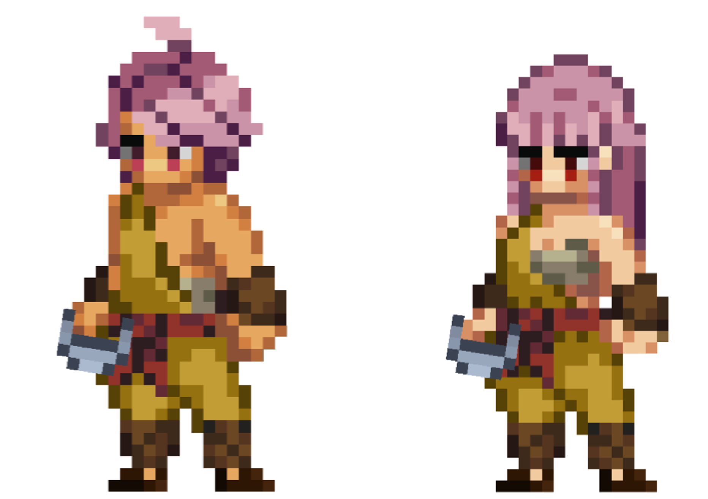

# Monk

<figure><figcaption></figcaption></figure>

This page details information about the Monk class combat skills that will be used in Player-vs-Player (PVP) and Player-vs-Environment (PVE) combat environments.


All information on this page is considered "Pre-Alpha" and preliminary, and is therefore subject to change.

_Last Update: 6/5/2023_


## Class Description

In the midst of a battlefield wrought with sword, shield, and the arcane, the **Monk** strides forth, a harmonious convergence of mind, body, and spirit. These unique pilgrims traverse a path woven from the cloth of internal reflection and martial prowess, emerging as living manifestations of transcendent power.

In the great tapestry of existence, Monks are the meticulously woven threads of enlightened energy. These dedicated souls have become master manipulators of "ki", the energy inherent in all life, granting them abilities that defy the mundane and leap into the extraordinary. With disciplined minds and potent fists, Monks etch the testament of their will upon the world, proving that the voyage towards enlightenment is not merely a personal quest, but a beacon of hope for the afflicted and an unyielding bulwark against the forces of chaos.

A Monk's journey is painted with strokes of three distinctive disciplines, each illuminating a unique facet of their identity. Each path demonstrates the versatility of the Monk, showcasing the multitude of ways their powers can manifest.

Those who walk the way of the **Closed Fist** are artisans of unyielding force. These Monks transcribe their tale with devastating strikes and unassailable defenses, each impact a stanza of power that resonates across the battlefield. They channel their ki to withstand onslaughts, and with a single, focused strike, they can topple even the mightiest foe. This discipline enables Monks to stand firm in the frontlines, an unyielding force of strength amidst the fires of combat.

In stark contrast, followers of the way of the **Open Palm** weave their tale with gentler, yet equally potent strokes. They master the ebb and flow of energy, their martial gifts are leveraged to redirect hostile forces and send adversaries tumbling. Utilizing their ki as both a shield and a spring, they defend and deflect with an ease that belies their profound skill. This path allows Monks to dictate the rhythm of battle, a dance in which they are both the choreographer and the lead.

Lastly, the way of the **Drunken Sway** is an esoteric verse in the Monk's saga. These seemingly unsteady warriors find harmony in imbalance, their movements unpredictable and yet purposeful. They channel their ki to mimic the unpredictable sway of the inebriated, causing their enemies to misjudge their movements and falter. This path transforms the Monk into an elusive enigma on the battlefield, seemingly stumbling yet always a step ahead.

The Monk, in all its mystical grandeur, challenges the traditional paradigms of physical might and arcane power. By intertwining the strength of body, the resolve of mind, and the energy of the spirit, Monks offer a testament to the power of internal balance and self-awareness. Whether they are the implacable warriors of the Closed Fist, the graceful defenders of the Open Palm, or the controlled chaos of the Drunken Sway, they serve as a reminder that the most profound power often emanates from within, cultivated through wisdom, discipline, and the endless pursuit of enlightenment. This is where the Monk thrives - a symbol of grace, strength, and wisdom, perfectly in sync with the eternal rhythm of the cosmos.

## Class Skills

<table data-full-width="true"><thead><tr><th width="92">Skill Points</th><th width="95">Range</th><th width="164">Discipline</th><th width="95">DoD</th><th width="186">Skill</th><th width="532">Description</th></tr></thead><tbody><tr><td>1</td><td>1</td><td>Closed Fist</td><td>X</td><td>Crippling Strike</td><td>Deal physical damage to target enemy equal to (X*BASIC + X*STR + X*DEX).  (X + X*STR + X*DEX)% chance to Daze target enemy.</td></tr><tr><td>1</td><td>1</td><td>Open Palm</td><td>X</td><td>Blinding Weave</td><td>Deal physical damage to target enemy equal to (X*BASIC + X*DEX + X*WIS).  (X + X*DEX + X*WIS)% chance to Blind target enemy.</td></tr><tr><td>1</td><td>Self</td><td>Drunken Sway</td><td>-</td><td>Swig</td><td><em>Here, drink this. It, uhh, helps.</em>  Channel for a Duration of X. Gain (X + X*END)% P.DEF for a Duration of X. Gain (X + X*DEX)% EVA for a Duration of X.</td></tr><tr><td>2</td><td>Passive</td><td>Closed Fist</td><td>Passive</td><td>Closed Fist</td><td>All successful attacks by this Hero gain a (X + X*STR)% chance to Push target enemy 1.</td></tr><tr><td>2</td><td>Passive</td><td>Open Palm</td><td>Passive</td><td>Open Palm</td><td>While in battle, this Hero gains a (X + X*DEX)% chance to Retaliate X.</td></tr><tr><td>2</td><td>Passive</td><td>Drunken Sway</td><td>Passive</td><td>Drunken Sway</td><td>While Channeling, this Hero gains a Physical Barrier equal to (X + X*END)% of this Hero's current HP. When Channel is complete, the Physical Barrier is destroyed.</td></tr><tr><td>3</td><td>1</td><td>Closed Fist</td><td>X</td><td>Five Fists</td><td><em>Strength is great and all, but hitting them in just the right spot at just the right time does wonders.</em>  Reposition to P1.  Deal X instances of physical damage to target enemy, each instance is equal to (X*BASIC + X*STR + X*DEX).  For each successful Critical Strike, each instance gains a (X + X*STR)% chance to Daze target enemy.  <strong>COMBO</strong>: If "Power Stance" is active, gain: (X + X*STR)% chance to Push target enemy 1.  Amnesia X.</td></tr><tr><td>3</td><td>3</td><td>Open Palm</td><td>X</td><td>Soothing Palm</td><td>Reposition to P1.  Deal physical damage to each target enemy equal to (X*BASIC + X*DEX + X*STR).  (X + X*DEX + X*WIS)% chance to Disarm target enemy in P1 for a Duration of X. (X + X*DEX + X*WIS)% chance to Disarm target enemy in P2 for a Duration of X. (X + X*DEX + X*WIS)% chance to Disarm target enemy in P3 for a Duration of X.  <strong>COMBO</strong>: If "Ready Stance" is active, gain: Cleanse all Party Members.  Amnesia X.  ------  "Disarm" Definition: Target's current weapon set is unusable next Turn. Target automatically swaps to its alternative weapon set. Target gains 100% resistance to Disarm until target's next Turn. Interrupts.</td></tr><tr><td>3</td><td>3</td><td>Drunken Sway</td><td>X</td><td>Stumble</td><td><em>Trip and fall into your enemies. It happens.</em>  Reposition to P1.  Deal physical damage equal to each enemy equal to (X*BASIC + X*STR + X*END).  (X + X*LCK) chance to Taunt P1 enemy for a Duration of X. (X + X*LCK) chance to Taunt P2 enemy for a Duration of X. (X + X*LCK) chance to Taunt P3 enemy for a Duration of X.  <strong>COMBO</strong>: If "Flow Stance" is active, gain a Physical Barrier equal to X% of this Hero's current HP.  Become Exhausted.  Amnesia X.</td></tr><tr><td>4</td><td>Self</td><td>Closed Fist</td><td>-</td><td>Power Stance</td><td>Activate to gain "Power Stance" for a Duration of X. Reposition this Hero 1. While active, gain the below effects:  +X% AGI. +X% BLK. +(X + X*DEX)% CSC. Each instance this Hero successfully hits a Critical Strike, gain: (X + X*STR)% chance to Push target enemy 1.  Refreshes and does not stack.</td></tr><tr><td>4</td><td>Self</td><td>Open Palm</td><td>-</td><td>Ready Stance</td><td>Activate to gain "Ready Stance" for a Duration of X. Reposition this Hero 1. While active, gain the below effects:  +X% EVA. +(X + X*WIS)% BLK. (X + X*DEX)% chance to Retaliate X. Each instance this Hero Blocks an incoming attack, gain a (X + X*WIS)% chance to Disarm attacking target enemy for a Duration of X.  Refreshes and does not stack.</td></tr><tr><td>4</td><td>Self</td><td>Drunken Sway</td><td>-</td><td>Flow Stance</td><td><em>Simply avoiding damage is not enough. You must know when to strike back.</em>  Activate to gain "Flow Stance" stance for a Duration of X. Reposition this Hero 1. While active, gain the below effects:  +(X + X*LCK)% EVA. +(X + X*END)% P.DEF. Each instance this Hero Evades an attack, gain a (X + X*LCK)% chance to Taunt a random enemy for a Duration of X.  Refreshes and does not stack.</td></tr><tr><td>5</td><td>2</td><td>Closed Fist</td><td>X</td><td>Grand Slam</td><td><em>Harness your inner life energy. Now, project it outward.</em>  Channel for a Duration of 1.  Deal physical damage equal to (X*BASIC + X*STR) to target enemy in P1. (X + X*DEX)% chance to Push target enemy in P1 to P2.  If Push is successful, deal physical damage equal to (X*BASIC + X*STR) to target enemy that has now moved to P1.  <strong>COMBO</strong>: If this Hero used "Five Fists" on this Hero's last Turn, gain: (X + X*DEX)% chance to Exhaust target enemy in P1.  Amnesia X.</td></tr><tr><td>5</td><td>3</td><td>Open Palm</td><td>X</td><td>Ki Blast</td><td>Channel for a Duration of 1.  Deal physical damage equal to (X*BASIC + X*VIT + X*WIS) to target enemy. (X + X*DEX)% chance to Banish target enemy in P1 for Duration X.  <strong>COMBO</strong>: If this Hero used "Soothing Palm" on its last Turn, gain: While Channeling, Heal for (X*VIT) on each enemy Turn.  Amnesia X.</td></tr><tr><td>5</td><td>3</td><td>Drunken Sway</td><td>X</td><td>Stagger</td><td>Reposition to P1.  (X + X*LCK)% chance to Taunt each enemy.  <strong>COMBO</strong>: If this Hero used "Stumble" on this Hero's last Turn, gain: X% P.DEF for a Duration of X.  Channel for a Duration of X.  At the end of the Channel, deal damage equal to X% of damage received during Channel to target enemy in P1.  Amnesia X.  ------  <em>Note: Effects occur in the order written.</em></td></tr><tr><td>10+</td><td>1</td><td>Closed Fist</td><td>X</td><td>Crippling Strike +</td><td>Deal physical damage to target enemy equal to (X*BASIC + X*STR + X*DEX).  (X + X*STR + X*DEX)% chance to Daze target enemy.  <strong>COMBO</strong>: If this Hero used "Basic Attack" on its last Turn, immediately cast "Crippling Strike" again on the same target.</td></tr><tr><td>10+</td><td>-</td><td>Closed Fist</td><td>-</td><td>Power Stance +</td><td>Activate to gain "Power Stance" for a Duration of X. Reposition this Hero 1. While active, gain the below effects:  +X% AGI. +X% BLK. +(X + X*DEX)% CSC. Each instance this Hero successfully hits a Critical Strike, gain: (X + X*STR)% chance to Push target enemy 1.  Refreshes and does not stack.</td></tr><tr><td>10+</td><td>1</td><td>Open Palm</td><td>X</td><td>Blinding Weave +</td><td>Deal physical damage to target enemy equal to (X*BASIC + X*DEX + X*WIS).  (X + X*STR + X*DEX)% chance to Blind target enemy.  <strong>COMBO</strong>: If target is inflicted with Blind, gain: (X + X*INT)% chance to Disarm target enemy for a Duration of X.</td></tr><tr><td>10+</td><td>-</td><td>Open Palm</td><td>-</td><td>Ready Stance +</td><td>Activate to gain "Ready Stance" for a Duration of X. Reposition this Hero 1. While active, gain the below effects:  +X% EVA. +(X + X*WIS)% BLK. (X + X*DEX)% chance to Retaliate X. Each instance this Hero Blocks an incoming attack while "Ready Stance" is active, gain a (X + X*WIS)% chance to Disarm attacking target enemy for a Duration of X.  Refreshes and does not stack.</td></tr><tr><td>10+</td><td>-</td><td>Drunken Sway</td><td>-</td><td>Swig +</td><td><em>Here, drink this. It, uhh, helps.</em>  Channel for a Duration of X. Gain (X + X*END)% P.DEF for a Duration of X. Gain (X + X*DEX)% EVA for a Duration of X.  <strong>COMBO</strong>: If this Hero used "Basic Attack" on its last Turn, gain an additional X% P.DEF for a Duration of X.</td></tr><tr><td>10+</td><td>-</td><td>Drunken Sway</td><td>-</td><td>Flow Stance +</td><td><em>Simply avoiding damage is not enough. You must know when to strike back.</em>  Activate to gain Sway for a Duration of X. Reposition this Hero 1. While active, gain the below effects:  (X + X*LCK)% EVA. (X + X*END)% P.DEF. Each instance this Hero Evades an attack while Sway is active, gain a (X + X*LCK)% chance to Taunt a random enemy for a Duration of X.  Refreshes and does not stack.</td></tr><tr><td>10</td><td>Passive</td><td>Closed Fist</td><td>Passive</td><td>Unwavering Resolve</td><td>While in "Power Stance", gain:  X% P.DEF. X% M.DEF. X% resistance to all Status Effects. X% BLK.</td></tr><tr><td>10</td><td>3</td><td>Closed Fist</td><td>X</td><td>Disrupt Ki</td><td>This Skill is only available while in "Power Stance".  Deal physical damage to target enemy equal to (X*BASIC + X*STR + X*DEX).  (X + X*WIS)% chance to inflict Amnesia X on a random Target Hero skill.  <strong>COMBO</strong>: If this Hero used "Meditate" on its last Turn, gain: (X + X*WIS)% chance to Silence target enemy for a Duration of X.</td></tr><tr><td>10</td><td>1</td><td>Closed Fist</td><td>X</td><td>One Punch</td><td>Channel for a Duration of X.  Deal physical damage to target enemy equal to (X*BASIC + X*STR + X*DEX)  (X + X*STR)% chance to Banish target enemy for a Duration of X.  Become Exhausted.  Amnesia X.</td></tr><tr><td>10</td><td>Passive</td><td>Open Palm</td><td>Passive</td><td>Guide Momentum</td><td>While in "Ready Stance", each instance this Hero Evades, Blocks, or Retaliates an incoming attack, gain:  X% chance to Daze attacker. X% chance to Pull attacker 1. X% chance to Exhaust attacker for a Duration of X.</td></tr><tr><td>10</td><td>3</td><td>Open Palm</td><td>X</td><td>Shatter</td><td>This Skill is only available while in "Ready Stance".  Deal physical damage to target enemy equal to (0).  (X + X*WIS)% chance to destroy target Barriers on target enemy.  For each Barrier destroyed, deal physical damage to target enemy equal to X% of the current HP value of each Barrier destroyed.</td></tr><tr><td>10</td><td>Self</td><td>Open Palm</td><td>-</td><td>Meditate</td><td><em>Take a moment for yourself. Clear your mind.</em>  Reposition up to 2 Positions.  Channel for a Duration of X.  Heal this Hero equal to (X*WIS + X*VIT). Purify this Hero. Gain X% P.ACC for a Duration of X. Gain X% EVA for a Duration of X.</td></tr><tr><td>10</td><td>Passive</td><td>Drunken Sway</td><td>Passive</td><td>Liquid Courage</td><td>While in "Flow Stance" and at the start of each enemy's Turn, gain a (X + X*LCK)% chance to Taunt enemy for its current Turn.</td></tr><tr><td>10</td><td>1</td><td>Drunken Sway</td><td>X</td><td>Stunning Momentum</td><td>This Skill is only available while in "Flow Stance".  Become Unstoppable for a Duration of X.  Deal physical damage to target enemy equal to (X*BASIC + X*END). (X + X*LCK)% chance to Stun target enemy.  <strong>COMBO</strong>: If this Hero used "Meditate" on its last Turn, gain: (X + X*LCK)% chance to Repeat X, up to a Max of X.  Amnesia X.</td></tr><tr><td>10</td><td>3</td><td>Drunken Sway</td><td>X</td><td>Into the Fray</td><td>
Channel for a Duration of X.

During Channel, gain:
<ul><li>+(X + X<em>LCK)% EVA</em></li><li><em>+(X + X</em>LCK)% BLK</li><li>-X% P.DEF</li><li>Whenever this Hero receives damage, gain a X% chance to Retaliate X.</li><li>Whenever this Hero Retaliates, gain a X% chance to Confuse target enemy.</li><li>Whenever this Hero Evades an attack, gain a X% chance to Blind attacking enemy.</li><li>Whenever this Hero Blocks an attack, gain a X% chance to Pull attacking enemy 1.</li></ul>
When the Channel is successfully completed, deal physical damage equal to (X<em>BASIC + X</em>STR + X*LCK) to each enemy.

<strong>COMBO</strong>: If target enemy is Confused or inflicted with Blind, deal additional physical damage equal to (X<em>BASIC + X</em>STR + X*LCK).
</td></tr><tr><td>15</td><td>Passive</td><td>Open Palm</td><td>Passive</td><td>Sleeping Dragon</td><td>
Whenever this Hero's HP would be reduced to 0 for the first time in Battle, prevent that damage and immediately gain an array of effects:
<ul><li>Heal this Hero equal to (X*WIS + X*VIT).</li><li>Purify this Hero.</li><li>Gain X% EVA for a Duration of X.</li><li>Become Exhausted for a Duration of X.</li></ul></td></tr></tbody></table>

### Notes

* \*DoD: Degree of Difficulty
* 10+ point skills cost 10 minus the cost of the basic version of the skill and require having the basic version
* 15 point skills are only available to Heroes with a matching Class/Subclass

