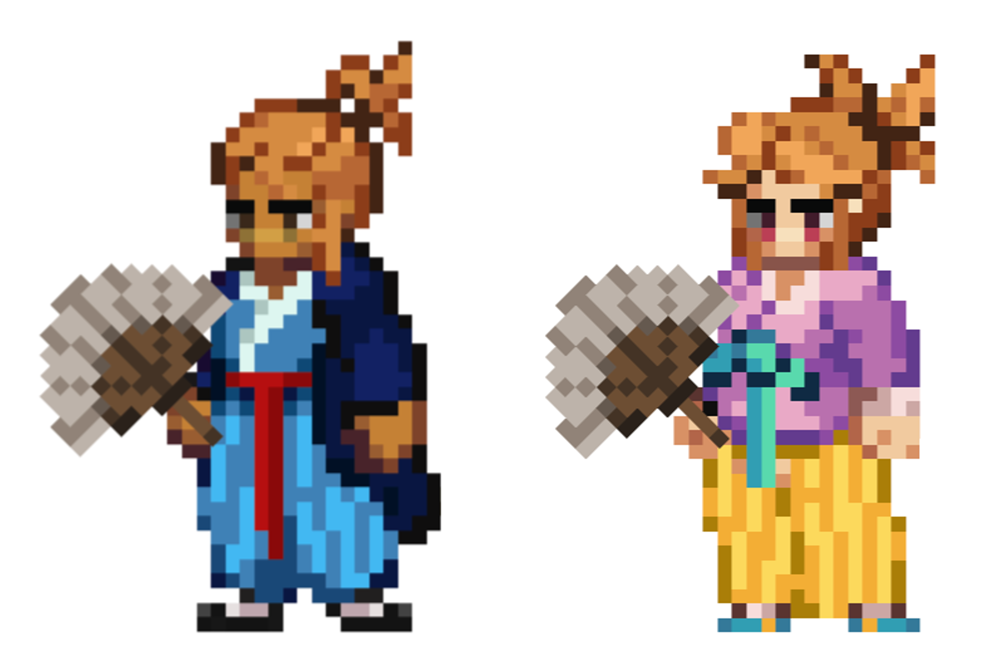

# Scholar

<figure><figcaption></figcaption></figure>

This page details information about the Scholar class combat skills that will be used in Player-vs-Player (PVP) and Player-vs-Environment (PVE) combat environments.


All information on this page is considered "Pre-Alpha" and preliminary, and is therefore subject to change.

_Last Update: 8/31/2023_


## Class Description

In a world where swords clash and spells sear the skies, where dungeons hide treasures and forests house mythical creatures, the **Scholar** finds its power in the unyielding realms of the mind. Scholars are not just humble book-keepers or simple scroll-readers. Nay, they are sagacious adventurers, ever vigilant in their quest for enlightenment — and truth.

As Wizards harness the elements, Warriors wield weapons of steel, and Archers let loose death from above, the Scholar holds the realm of the mind as its domain. As keepers of ancient knowledge, unriddlers of arcane mysteries, and weavers of scholarly magic both subtle and profound, the Scholar’s gifts come in the form of truths, and those truths can be deadly.&#x20;

With a whispered phrase or a calculated theorem, the Scholar is capable of not only manipulating arcane energies but also weaving spells of persuasion, or deciphering codes that have baffled lesser minds for centuries through steady and stoic study: **Observation**, **Investigation**, and **Experimentation**. These are not just pathways to mastery; they are the quintessence of the Scientific Method.

The first of these sacred avenues is **Observation**. Scholars who walk this path embody the primal step of any scientific endeavor: to observe the world in unerring detail. Yet Observation isn’t mere idle watching; it is an active, tactile skill. These are the keen minds who gaze upon a battlefield and discern the invisible patterns of enemy formations or scrutinize the gentle eddies in a spellcaster’s aura to foretell which incantation will be invoked next. They see the hidden runes in ancient architecture, the infinitesimal twitch that betrays a liar, and the telltale signs of a trap-laden corridor. To an Observation Scholar, the rules of nature and magic exist for a reason. It is their solemn duty to understand those rules deeply and effect change within their confines. When an Observation Scholar raises their quill, it’s not merely to document but to set the stage for transformation, all within the bounds of cosmic law.

Second, there stands the path of **Investigation**. While Observers are the gatherers of data, Investigators are its interpreters, the ones who ask the perilous ‘why’ and ‘how.’ Investigators will ask questions, even when conventional wisdom or taboos suggest they shouldn’t. Every page turned, every inquiry made, is a stride closer to decoding the world’s most labyrinthine enigmas. Yet caution is their constant companion. A Scholar who asks too many questions may unsettle powers that are best left undisturbed. After all, to look behind certain veils may be to never see the world the same way again. The allure of the forbidden is strong, but every Investigation Scholar must ask: Is it worth it?

For those who say “yes”, there is but only one discipline. The tempestuous discipline of **Experimentation** beckons those Scholars insatiable in their quest for truth. They are the avant-garde architects of intellectual landscapes, unafraid to challenge established facts and paradigms. Building upon the sturdy foundations laid by Observation and Investigation, they push the boundaries of knowledge into uncharted terrains — often heedless of the risks involved. It’s not enough for these Scholars to understand the natural order; they aim to stretch, subvert, and redefine it. Consequences be damned; if a veil exists, they shall pierce it, if a stone lies unturned, they shall flip it. For them, the thrill of intellectual achievement often transcends prudence and caution. The allure of forbidden or hidden truths is almost irresistible, and many are those who have paid the price for such reckless thirst. Yet, without these brave — or perhaps foolhardy — souls, the realm of knowledge would be a stagnant pool rather than a raging river.

Though each discipline embodies a unique part of the Scientific Method and unique viewpoint on how science, knowledge, and magic collide, a true Scholar often finds a synergetic dance amongst them all. The Observation discipline feeds into Investigation, honing questions into sharpened theories. Investigation, in turn, inspires new routes for Experimentation, pushing the boundaries of what is known. And Experimentation loops back, creating new phenomena for Observation, enriching the never-ending cycle of inquiry and discovery.

Navigating this labyrinthine path of the intellect is no simple task. It is a journey whose daily companions are cerebral challenges, mental melees, and snares of sophistry. Those who step onto this path must know that intellect is both sword and shield in the Scholar’s arsenal, and it cuts both ways.

## Class Skills

<table data-full-width="true"><thead><tr><th width="110">Skill Points</th><th width="105">Range</th><th width="156">Discipline</th><th width="78">DoD</th><th width="175">Ability</th><th width="549">Description</th></tr></thead><tbody><tr><td>1</td><td>3</td><td>Observation</td><td>X</td><td>Test</td><td>
<em>This will only hurt for a moment.</em> 

Deal magical damage to target enemy equal to (X*SPELL + X*INT + X*WIS).

Heal a random ally equal to (X%) of the damage dealt. 

Generate X charges of Arcane Power.

<strong>COMBO</strong>: If this skill successfully deals Critical Strike damage, generate X additional Arcane Power.
</td></tr><tr><td>1</td><td>3</td><td>Investigation</td><td>X</td><td>Measure</td><td>
<em>There is always more to a spell than what is inferred at first blush.</em>

Deal magical damage to target enemy equal to (X*SPELL + X*INT). 

(X + X*INT)% chance to reduce target's M.DEF by X% for a Duration of X.

Generate X charges of Arcane Power.

<strong>COMBO</strong>: If this skill successfully deals Critical Strike damage, generate X additional Arcane Power.
</td></tr><tr><td>1</td><td>Party Members</td><td>Experimentation</td><td>-</td><td>Practice</td><td>
<em>I wonder what would happen if I did this?</em> 

Heal target party member equal to (X*SPELL + X*WIS). 

X% chance to apply a magical Ward to targeted party member for a Duration of X

Generate X charges of Arcane Power.

<strong>COMBO</strong>: If this skill successfully Critical heals, generate X additional Arcane Power.
</td></tr><tr><td>2</td><td>Passive</td><td>Observation</td><td>-</td><td>Observation</td><td>
<em>Test. Measure. Act.</em> 

Each instance an ally falls below X% HP in battle, gain a X% chance to automatically spend (X + X*LVL) Mana to heal ally for (X*SPELL). 

If successful, generate X charge of Arcane Power.
</td></tr><tr><td>2</td><td>Passive</td><td>Investigation</td><td>-</td><td>Investigation</td><td>
<em>You've spent your whole life being told you ask too many questions, as if that's somehow a bad thing.</em> 

At the beginning of each ally's Turn, ally gains a X% chance to increase BASIC and SPELL by X% for that Turn. 

If successful, generate X charge of Arcane Power.
</td></tr><tr><td>2</td><td>Passive</td><td>Experimentation</td><td>-</td><td>Experimentation</td><td>
<em>Your inquisitive nature guides every decision you make. Embrace it.</em> 

At the beginning of each ally's Turn, ally gains a X% chance to reduce the mana cost of its next action by X%. 

If successful, generate X charge of Arcane Power.
</td></tr><tr><td>3</td><td>3</td><td>Observation</td><td>X</td><td>Notion</td><td>
<em>A little extra arcane energy here can pay dividends down the line.</em> 

Empower this skill by consuming X charges of Arcane Power (AP). 

Deal magical damage to each enemy equal to (X*SPELL + X*INT). 

(X + X*INT)% chance to reduce all damage that each target enemy deals by X% (X = X + X*AP) for a Duration of X. 

<strong>COMBO</strong>: If "Observation" is active, increase the damage dealt by an additional (X*AP)%. 

<strong>UNLOCK</strong> X: All Party Members gain X charge of Arcane Power.
</td></tr><tr><td>3</td><td>3</td><td>Investigation</td><td>X</td><td>Questionable Legitimacy</td><td>
<em>If you attack their research, then they have nothing to build on.</em> 

Empower this skill by consuming X charges of Arcane Power (AP). 

Deal magical damage to target enemy equal to (X*SPELL + X*INT). 

(X + X*INT)% chance to reduce target's M.DEF by X% (X = X + X*AP) for a Duration of X.

<strong>COMBO</strong>: If "Experimentation" is active, increase the damage dealt by an additional (X*AP)%. 

<strong>UNLOCK</strong> X: Target enemy loses up to X charges of Arcane Power.
</td></tr><tr><td>3</td><td>Party Members</td><td>Experimentation</td><td>-</td><td>Preparation</td><td>
<em>A heal can become more than just a heal.</em>

Empower this skill by consuming X charges of Arcane Power (AP). 

Heal each party member equal to (X*SPELL + X*WIS).

Each party member gains X% M.DEF( X = X + X*AP) for a Duration of X. 

<strong>COMBO</strong>: If "Investigation" is active, increase heal potency by an additional (X*AP)%. 

<strong>UNLOCK</strong> X: Generate X charges of Arcane Power.
</td></tr><tr><td>4</td><td>3</td><td>Observation</td><td>X</td><td>Systematic Observation</td><td>
<em>Take a good, hard look. You can predict their movements so they essentially have none.</em>

Deal magical damage to each enemy equal to (X*SPELL + X*INT). 

X% chance to Root each target enemy for a Duration of X.

Generate X charge of Arcane Power for each enemy that becomes Rooted.

<strong>COMBO</strong>: If this spell successfully critical strikes, generate X additional Arcane Power per critical strike.

Amnesia X. 

<strong>UNLOCK</strong> X:

Each party member gains a magical barrier with HP equal to X% of the damage that is dealt.
</td></tr><tr><td>4</td><td>3</td><td>Investigation</td><td>X</td><td>Fringe Research</td><td>
<em>Well, what did you find there?</em>

Channel for a Duration of X.

Deal magical damage to target enemy equal to (X*SPELL + X*INT). 

Heal this Hero for X% of the damage dealt.

Generate X charges of Arcane Power. 

<strong>COMBO</strong>: If this spell successfully critical strikes, generate X additional Arcane Power. 

Amnesia X. 

<strong>UNLOCK</strong> X: Each ally is healed for X% of the damage dealt.
</td></tr><tr><td>4</td><td>Party Member</td><td>Experimentation</td><td>-</td><td>Promising Results</td><td>
<em>If you can't find a good test subject, there is only one option.</em> 

Deal damage to target ally equal to (X*SPELL - X*INT). 

Targeted party member gains:

(X + X*INT)% chance to increase BASIC by X% for a Duration of X.

(X + X*INT)% chance to increase SPELL by X% for a Duration of X.

(X + X*INT)% chance to increase Range by X for a Duration of X.

(X - X*INT)% chance to Blind target ally.

(X - X*INT)% chance to Confuse target ally.

<strong>COMBO</strong>: Gain X charges of Arcane power for each successful effect.

Amnesia X.
</td></tr><tr><td>5</td><td>Party Members</td><td>Observation</td><td>-</td><td>Catalyze</td><td>
<em>Learn from previous studies to predict all potential outcomes.</em>

Empower this skill by consuming X charges of Arcane Power (AP). 

Target party member gains (X*AP)% CSC for a Duration of X.

Targeted Party Member's next attack gains Repeat (X*AP rounded down). 

<strong>UNLOCK</strong> X:

Targeted Party Member's attacks gain (X*AP rounded down) range for a Duration of X. 

Amnesia X.
</td></tr><tr><td>5</td><td>1</td><td>Investigation</td><td>X</td><td>Glimpse the Void</td><td>
<em>All that matters is ambition.</em>

Empower this skill by consuming X charges of Arcane Power (AP).

Channel for a Duration of X. During Channel, gain X% EVA.

Deal magical damage to target enemy in P1 equal to [(X*AP)*SPELL + X*INT)].

(X + X*AP)% chance to Fear target enemy for a Duration of X.

(X + X*AP)% chance to Exhaust this Hero for a Duration of X. 

<strong>UNLOCK</strong> X:

(X + X*AP)% chance to Stun target enemy in P1 for a Duration of X.

<strong>UNLOCK</strong> X:

(X + X*AP)% chance to deal magical damage equal to [(X*AP)*SPELL + X*INT)] to target enemy in P2.

Amnesia X.
</td></tr><tr><td>5</td><td>Party Members</td><td>Experimentation</td><td>-</td><td>Side Effects</td><td>
<em>All that matters is progress.</em>

Empower this skill by consuming X charges of Arcane Power (AP). 

Target party member gains a pure barrier with HP equal to [(X*AP)*SPELL + X*INT + X*WIS]. 

(X - X*INT)% chance to Poison targeted party member.

<strong>UNLOCK</strong> X: Delay X, Cleanse targeted party member. 

<strong>UNLOCK</strong> X: Delay X, Heal targeted party member for [(X*AP)*SPELL + X*WIS].

Amnesia X.
</td></tr><tr><td>10+</td><td>Passive</td><td>Observation</td><td>-</td><td>Observation +</td><td>
Each instance an ally is healed to a full 100% HP in battle, gain a X% chance to automatically spend (X + X*LVL) Mana to increase ally's AGI by (X*WIS) for a Duration of X.

When successful, generate X charge of Arcane Power.
</td></tr><tr><td>10+</td><td>3</td><td>Observation</td><td>X</td><td>Notion +</td><td>
Empower this skill by consuming X charges of Arcane Power (AP).

Deal magical damage to each enemy equal to [(X*AP)*SPELL + (X*AP)*INT]. 

(X + X*INT)% chance to reduce all damage that each target enemy deals by X% (X = X + X*AP) for a Duration of 1. 

<strong>COMBO</strong>: If "Observation" is active, each successful hit has a (X + X*INT)% chance to Root each target enemy for a Duration of X. 

<strong>UNLOCK</strong> X: All Party Members gain X charges of Arcane Power.

Amnesia X.
</td></tr><tr><td>10+</td><td>Passive</td><td>Investigation</td><td>-</td><td>Investigation +</td><td>
At the beginning of each enemy's Turn, enemy gains a X% chance to decrease its BASIC and SPELL by X% for a Duration of X.

If successful, generate X charges of Arcane Power.
</td></tr><tr><td>10+</td><td>3</td><td>Investigation</td><td>X</td><td>Questionable Legitimacy +</td><td>
Empower this skill by consuming X charges of Arcane Power (AP).

Deal magical damage to target enemy equal to [(X*AP)*SPELL + (X*AP)*INT]. 

(X + X*INT)% chance to reduce target's M.DEF by X% (X = X + X*AP) for a Duration of X. 

<strong>COMBO</strong>: If "Experimentation" is active, (X + X*INT)% chance to Silence target enemy for a Duration of X. 

<strong>UNLOCK</strong> X: Target enemy loses up to X charges of Arcane Power.
</td></tr><tr><td>10+</td><td>Passive</td><td>Experimentation</td><td>-</td><td>Experimentation +</td><td>
At the beginning of each party member's Turn, party member gains a X% chance to reduce the mana cost of its next action by X%. 

When successful, generate X charges of Arcane Power.
</td></tr><tr><td>10+</td><td>Party Members</td><td>Experimentation</td><td>X</td><td>Preparation +</td><td>
Empower this skill by consuming X charges of Arcane Power (AP). 

Heal each party member equal to [(X*AP)*SPELL + (X*AP)*WIS]. 

Each party member gains a X% chance to gain a magical Ward for a Duration of X. 

<strong>COMBO</strong>: If "Investigation" is active, Delay X, each party member gains X% M.DEF( X = X + X*AP) for a Duration of X. 

<strong>UNLOCK</strong> X: Generate X charges of Arcane Power. 

Amnesia X.
</td></tr><tr><td>10</td><td>3</td><td>Observation</td><td>X</td><td>It Depends</td><td>
<em>Well, of course it does.</em> 

Deal magical damage to target enemy equal to (X*SPELL + X*INT). 

99% chance to inflict the following status effect:

For a Duration of X, each non-Basic action target enemy takes has a X% chance to target a random enemy. Can only occur a maximum of X instances over the Duration.

Whenever this effect occurs, gain X charges of Arcane Power. 

Amnesia X.
</td></tr><tr><td>10</td><td>3</td><td>Observation</td><td>X</td><td>Take Knowledge</td><td>
<em>Are you sure about that?</em> 

Empower this skill by consuming X charges of Arcane Power (AP).

Deal magical damage to target enemy equal to [(X*AP)*SPELL + X*INT)]. 

99% chance to inflict the following status effect:

For a Duration of X, each non-Basic action target enemy takes has a X% chance to be inflicted with Amnesia X 

(X = X + X*AP, Rounded Down). Can only occur a maximum of X instances over the Duration.

Whenever this effect occurs, gain X charges of Arcane Power.
</td></tr><tr><td>10</td><td>3</td><td>Observation</td><td>X</td><td>Actually</td><td>
<em>Well, actually...</em> 

Deal magical damage to target enemy equal to (X*SPELL + X*INT). 

(X + X*INT)% chance to Negate a single random Delayed action previously cast by targeted enemy. 

<strong>COMBO</strong>: If Delayed action is Negated, 99% chance to Confuse target enemy for a Duration of X and gain X charges of Arcane Power. 

Amnesia X.
</td></tr><tr><td>10</td><td>3</td><td>Investigation</td><td>X</td><td>Forbidden Knowledge</td><td>
Deal magical damage to target enemy equal to (X*SPELL + X*INT). 

(X + X*INT)% chance to Dispel target enemy. 

<strong>COMBO</strong>: If a Status Effect is successfully Dispelled, remove a random instance of Amnesia from this Hero and gain X charges of Arcane Power.
</td></tr><tr><td>10</td><td>Party Members</td><td>Investigation</td><td>-</td><td>Forgotten Knowledge</td><td>
Empower this skill by consuming X charges of Arcane Power (AP).

Heal each party member equal to [(X*AP)*SPELL + (X*AP)*WIS].

Each party member gains a X% chance to gain a magical Ward for a Duration of X.

<strong>COMBO</strong>: If "Investigation" is active, Delay X, each party member gains X% M.DEF( X = X + X*AP) for a Duration of X.

<strong>UNLOCK</strong> X: Generate X charges of Arcane Power. 

Amnesia X.
</td></tr><tr><td>10</td><td>Allies</td><td>Investigation</td><td>-</td><td>Peer Review</td><td>
<em>It never hurts to get a second opinion.</em> 

Delay X, the next skill target Ally uses gains Repeat X.

Amnesia X.
</td></tr><tr><td>10</td><td>Party Members</td><td>Experimentation</td><td>-</td><td>Augment State</td><td>
Empower this skill by consuming X charges of Arcane Power (AP).

Target Party Member gains:

(X*AP + X*INT)% P.DEF for a Duration of X.

(X*AP + X*WIS)% M.DEF for a Duration of X.

(X*AP + X*LCK)% EVA for a Duration of X.

(X - X*LCK)% chance to Confuse target Party Member for a Duration of X. 

<strong>UNLOCK</strong> X: Delay X, Cleanse target party member.

<strong>UNLOCK</strong> X: Delay X, heal target party member equal to 

[(X*AP)*SPELL + X*WIS]. 

Amnesia X.
</td></tr><tr><td>10</td><td>3</td><td>Experimentation</td><td>X</td><td>Infuse Possibility</td><td>
For a Duration of X, each instance of healing target party member receives causes damage equal to X% of the HP restored divided evenly amongst all enemies. 

Amnesia X.
</td></tr><tr><td>10</td><td>3</td><td>Experimentation</td><td>X</td><td>Optimize Potential</td><td>
For a Duration of X, each instance of damage targeted enemy receives causes a heal equal to X% of the damage dealt divided evenly amongst all Party Members. 

Amnesia X.
</td></tr><tr><td>15</td><td>Passive</td><td>Investigation</td><td>-</td><td>Answers</td><td>
Each instance this Hero receives damage, gain: 

X% chance to generate X charges of Arcane Power.

X% chance to gain X% M.DEF for the remainder of battle.

X% chance to remove a random instance of Amnesia from this Hero.

X% chance to heal this Hero for (X*SPELL).

X% chance to inflict attacking enemy with Confusion for a Duration of X.

For each successful triggered effect, generate X charges of Arcane Power.
</td></tr></tbody></table>

### Notes

* \*DoD: Degree of Difficulty
* 10+ point skills cost 10 minus the cost of the basic version of the skill
* 15 point skills are only available to Heroes with a matching Class/Subclass

