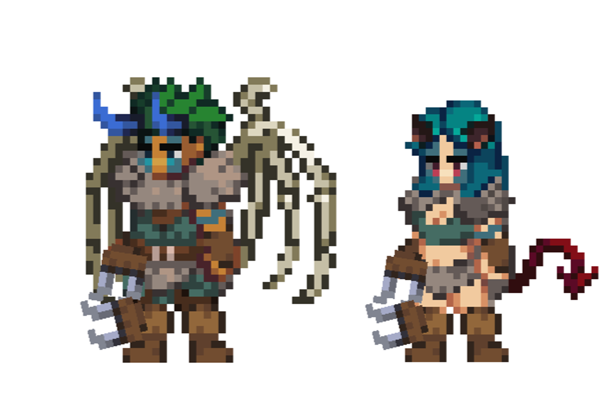

# Shapeshifter

<figure><figcaption></figcaption></figure>

This page details information about the Summoner class combat skills that will be used in Player-vs-Player (PVP) and Player-vs-Environment (PVE) combat environments.


All information on this page is considered "Pre-Alpha" and preliminary, and is therefore subject to change.

_Last Update: 12/19/2024_


## Class Description

> **“There are many who wear the face of man but hold within them the heart of the wild. They are neither wholly beast nor wholly human, but something born of both — and more.”**\
>  _— Excerpt from an unnamed Journal, Adelyn Archives_

In the shadowed woods and ancient hills of Gaia, where mortal paths seldom tread, dwell those touched by primal forces untamed by civilization. Known by most as **Shapeshifters**, these beings stand as a bridge between man and nature, wielding powers that reshape not only their bodies but the very flow of battle. To see one in their element is to witness the raw, unyielding essence of the world, unbound by the confines of flesh or reason.

The Shapeshifter is no mere spellcaster nor hardened warrior. They are conduits of instinct, emotion, and fury, able to transform into forms that embody the wild's many faces: the swift and deadly **Beast**, the cunning and venomous **Fiend**, and the towering, unyielding **Behemoth**. Each form serves a purpose, whether to rend, outmaneuver, or overwhelm, and all are tied to the Shapeshifter's volatile connection to the natural order - and the chaos it embodies.

But the Shapeshifter's power is not without a cost. Each transformation exacts a toll upon their vitality and spirit, and the more they linger in a form, the harder it becomes to return to their humanity. In their innate mastery lies their very peril - for the wild does not give without taking, and to lose oneself in the call of the Beast or the wrath of the Behemoth is to risk never returning. Yet, those who walk this path understand that such risks are the price of true power, the price of becoming exactly what the battle needs, precisely when it needs it.

**Beast, Fiend, Behemoth** - these are not simply transformations but deep and primal manifestations of the truths that dwell within all things.

Swifter than the springing wolf, **the Beast's** claws rend flesh and leave wounds that bleed beyond mending. The Beast embodies raw instinct, feeding off lifeblood and harnessing the savage hunger of the wild. In the Beast, there is no room for hesitation - only the hunt, the strike, the kill.

Silent and patient as a shadow creeping over moonlit ground, **the Fiend** is cunning made flesh. Its poison seeps unseen, unraveling even the stoutest foe's will. To face the Fiend is to know despair - for the bite of its venom is slow but inevitable, and its precision in combat is unmatched.

Massive and indomitable, **the Behemoth** strides forth as a living bulwark. Where it treads, the ground quakes, and the air grows heavy with fear. The Behemoth is the embodiment of endurance and might, capable of crushing shields, shattering ranks, and standing unmoved in the face of chaos.

Each form is a weapon, each form has its own way of getting what it wants - and the Shapeshifter wields them all with terrifying precision. Yet, between each transformation lies the **human form** - a state of balance and planning, where the Shapeshifter gathers strength and prepares for the next surge of primal fury. The mortal shape is not weak, but strategic, the calm before the storm of shifting flesh and clawed fury.

To live the life of a Shapeshifter is no simple thing. It requires one to embrace constant flux, to surrender to instinct, and to face the wild truths of their own soul. To walk this path is to live in a state of balance - between man and beast, reason and instinct, power and restraint.

And yet, it is this very struggle that makes the Shapeshifter who they are. Through every shift, every battle, and every transformation, they remind the world of what it has forgotten: that beneath the trappings of civilization, the wild heart of Gaia still beats, untamed and eternal.

> **“For some, the wild is a thing to be tamed. For others, it is a thing to become.”**\
> \- From _Shifting Priorities_ by Wheaton Gargadusa, Curator of Historical Accounts at the Adelyn Archives

## Class Skills

### Skill Points 0

#### Shifter

**Range:** Passive

**Description:**

**While the Beast:**\
Gain a X% chance to Retaliate X.\
All attacks gain +(X\*VIT.S)% Lifesteal.

Basic Attack becomes Slash.\
Slash deals (X\*ATTACK) damage. Slash gains a +(X\*DEX.S)% chance to inflict target with Bleed.

**While the Fiend:** \
Gain +X% SPD.\
All attacks gain X% Pierce.

Basic Attack becomes Bite.\
Bite deals (X\*ATTACK) damage.\
Bite gains (X\*VIT.S)% chance to Delay X, deal (X\*ATTACK) damage.

**While the Behemoth:**\
Gain +X% BLK.\
Gain +(X\*VIT.S)% P.RED and +(X\*VIT.S)% M.RED. Reduce SPD by -X%.

Basic Attack becomes Womp.\
Womp deals (X\*ATTACK) damage.\
Womp gains a +(X\*END.S)% chance to Slow target by X% for X turns.

**While in any non-Human form:**\
Pass Turn becomes Shift, which allows the Hero to transform back into a Human.\
Cannot use non-Shapeshifter skills while transformed. Abilities can still be used.\
Subclass active skills can only be used while in Human form.

**Status Effects:**

_Beast Instinct:_\
If this Hero transforms into the Beast while the "Beast Instinct" status effect is active, this Hero gains:&#x20;

* +(X\*DEX.S)% Retaliate X for X turns.
* +(X\*DEX.S)% P.ACC for X turns.

_Fiend Instinct:_\
If this Hero transforms into the Fiend while the "Fiend Instinct" status effect is active, this Hero gains:

* +(XAGI.S)% Haste for X turns.&#x20;
* +(XAGI.S)% EVA for X turns.

_Behemoth Instinct:_\
If this Hero transforms into the Behemoth while the "Behemoth Instinct" status effect is active, this Hero gains:

* +(XEND.S)% P.RED for X turns.
* +(XEND.S)% M.RED for X turns.
* +(X\*STR.S)% ATTACK for X turns.

### Skill Points 1

#### Swipe

**Discipline:** The Beast\
**Damage Type:** Physical\
**Range:** 1\
**Degree of Difficulty:** X

**Description:**

Deal (X\*ATTACK + X\*STR + X\*DEX) damage to target enemy.

(X\*STR.S + X\*DEX.S)% chance to inflict target with Bleed.

COMBO:\
While in Human Form, if this Hero used "Swipe" last turn, gain Beast Instinct for X turns.

COMBO:\
While the Beast, gain +(X\*VIT.S)% Lifesteal and increase damage by +(X\*ATTACK).

COMBO:\
While the Fiend, this attack gains a +(X\*DEX.S)% chance to inflict target with Poison.

COMBO:\
While the Behemoth, this attack gains a +(X\*STR.S)% chance to Daze target.

> _The Beast's claws are an extension of its will._
>
> _Better stay on its good side._

#### **Gnash**

**Discipline:** The Fiend\
**Damage Type:** Physical\
**Range:** 1\
**Degree of Difficulty:** X

**Description:**

Deal (X\*ATTACK + X\*AGI + X\*DEX) damage to target enemy.

(X\*AGI.S + X\*DEX.S)% chance to Blind target.

COMBO:\
While in Human Form, if this Hero used "Gouge" last turn, gain Fiend Instinct for X turns.

COMBO:\
While the Beast, this attack gains +X Range and increase damage by +(X\*ATTACK).

COMBO:\
While the Fiend, this attack gains +(X\*DEX.S)% CSC.

COMBO:\
While the Behemoth, this attack gains a (X\*STR.S)% chance to Fear target for X turn and increase damage by +(X\*ATTACK).

> _The Fiend hunts differently than the others._
>
> _Its poison takes hold slowly, painfully._
>
> _Until its prey can go on no longer._

#### **Slam**

**Discipline:** The Behemoth\
**Damage Type:** Physical\
**Range:** 1\
**Degree of Difficulty:** X

**Description:**

Deal (X\*ATTACK + X\*STR + X\*END) damage to target enemy.

(X\*STR.S + X\*END.S)% chance to Dispel target.

COMBO:\
While in Human Form, if this Hero used "Slam" last turn, gain Behemoth Instinct for X turns.

COMBO:\
While the Beast, this attack gains a (X\*STR.S)% chance to Silence target for X turns.

COMBO:\
While the Fiend, this attack gains +(X\*DEX.S)% chance to Blind target.

COMBO:\
While the Behemoth, gain a (X\*END.S)% chance to Slow target by X% for X ticks.

> _The Behemoth’s strikes are not crafted -- they are carved from raw emotion._
>
> _Each earth-shaking slam echoes the will to dominate._

### Skill Points 2

#### The Beast

**Range:** Passive

**Description:**

All attacks gain +X% chance to inflict target with Bleed.

"Slash", "Bite", and "Womp" gain +X% Lifesteal. - From

> "Shifters are born with the gift of transformation. That gift activates with a single emotion and that single emotion is what determines what the shifter transforms 'into'.
>
> Once transformed, the shifter becomes the form at the deepest of levels. Identity, attitude, size, strength, it all changes.
>
> All of these forms live in harmony, until an emotion, an instinct pushes a form into dominance over the others. This could last a moment or forever, but once that key is turned, it is absolutely core to who they are for as long is they choose."
>
>  _—_ From _Shifting Priorities_ by Wheaton Gargadusa, Curator of Historical Accounts at the Adelyn Archives

#### The Fiend

**Range:** Passive

**Description:**

All attacks gain +X% chance to Poison target.

"Slash", "Bite", and "Womp" gain +X% Pierce.

> "The energy used to change shape is deeply primal. It pulls from an unseen well within the shifter, based purely upon instinct. It appears to be very exhausting as it seemingly pulls from the shifter's very own vitality."
>
>  _—_ From _Shifting Priorities_ by Wheaton Gargadusa, Curator of Historical Accounts at the Adelyn Archives

#### The Behemoth

**Range:** Passive

**Description:**

Gain +X% P.RED Gain +X% M.RED.

"Slash", "Bite", and "Womp" gain +X% damage.

> "If you ask a shifter how they transform, they'll simply look at you with a confused expression as if to say, 'What do you mean? I just do it.'"
>
>  _—_ From _Shifting Priorities_ by Wheaton Gargadusa, Curator of Historical Accounts at the Adelyn Archives

### Skill Points 3

#### **Savage Leap**

**Discipline:** The Beast\
**Damage Type:** Physical\
**Range:** 3\
**Degree of Difficulty:** X

**Description:**

Amnesia X.

Transform into the Beast for X turns.

Deal (X\*ATTACK + X\*STR + X\*DEX) damage to target enemy.

(X\*STR.S + X\*DEX.S)% chance to inflict target with Bleed.

Conditional Reposition:\
If target was in P3, Reposition to P1. If target was in P2, Reposition to P2. If target was in P1, Reposition to P3.

COMBO:\
If target is currently inflicted with Bleed, gain a (X\*STR.S)% chance to Silence target for X ticks.

COMBO:\
If this Hero used "Slash" on its last turn, gain +X% EVA for X ticks.

> _Within each shifter resides the Beast._
>
> _The Beast is an entity of hunger, instinct, and fury._
>
> _The Beast is the part of every shifter that remembers the wilds before adventurers and heroes; a fragment of raw, unshaped chaos._

#### **Jawbreaker**

**Discipline:** The Beast\
**Damage Type:** Physical\
**Range:** 3\
**Degree of Difficulty:** X

**Description:**

Amnesia X.

Transform into the Beast for X turns.

Deal (X\*ATTACK + X\*STR + X\*DEX) damage to target enemy.

(X\*STR.S + X\*DEX.S)% chance to Silence target for X turn.

Conditional Reposition:\
If target was in P3, Reposition to P1. If target was in P2, Reposition to P2. If target was in P1, Reposition to P3.

COMBO:\
If target is Silenced, gain a (X\*STR.S)% chance to reduce the Range of all target's attacks by X (to a minimum of 1) for X ticks.

COMBO:\
If "Maul" refreshed the Beast, gain +X% P.ACC for X turns.

> _The Beast's prey won't understand, but it's already too late._
>
> _When the Beast’s jaws close around its prey, the world is reduced to silence._
>
> _Bones crack, screams cease, and it doesn't let go._

#### **Rend**

**Discipline:** The Beast\
**Damage Type:** Physical\
**Range:** 3\
**Degree of Difficulty:** X

**Description:**

Amnesia X.

Transform into the Beast for X turns.

Deal (X\*ATTACK + X\*STR + X\*DEX) damage to target enemy.

+(X\*VIT.S)% Lifesteal.

Conditional Reposition:\
If target was in P3, Reposition to P1. If target was in P2, Reposition to P2. If target was in P1, Reposition to P3.

COMBO:\
If target is inflicted with Silence or Bleed, increase Lifesteal by +(X\*VIT.S)%.

COMBO:\
If "Rend" refreshed the Beast, gain +(X\*VIT.S)% Lifesteal for X turns.

> _To tear flesh is not a choice for the Beast -- it is a necessity._
>
> _Each strike nourishes its body and spirit, feeding the relentless hunger within. The lifeblood of its prey is not wasted -- it is the Beast’s rightful claim._

### Skill Points 4

#### **Chomp**

**Discipline:** The Fiend\
**Damage Type:** Physical\
**Range:** 1\
**Degree of Difficulty:** X

**Description:**

Amnesia X.

Transform into the Fiend for X turns.

Deal (X\*ATTACK + X\*STR + X\*DEX) damage to target enemy.

X% Pierce.

Reposition to P3.

COMBO:\
If target is currently inflicted with Poison, Delay X, deal (X\*ATTACK) damage target.

COMBO:\
If this Hero used "Bite" last turn, gain +X% Pierce for X turns.

> _The Fiend’s fangs are not meant for tearing flesh alone -- they are vessels of venom._
>
> _Their bite is not about delivering pain, but creating inevitability, leaving their prey helpless as poison claims them._

#### **Sight Bite**

**Discipline:** The Fiend\
**Damage Type:** Physical\
**Range:** 2\
**Degree of Difficulty:** X

**Description:**

Amnesia X.

Transform into the Fiend for X turns.

Deal (X\*ATTACK + X\*STR + X\*VIT) damage to target enemy.

X% Pierce.

(X\*AGI.S + X\*DEX.S)% chance to Blind target.

Reposition to P2.

COMBO:\
If target is inflicted with Blind, gain a (X\*DEX.S + X\*AGI.S)% chance to Poison target.

COMBO:\
If "Sight Bite" refreshed the Fiend, gain a +X% EVA for X turns.

> _The Fiend strikes not to kill outright, but to sow confusion and fear._
>
> _A single bite robs its prey of vision, leaving them stumbling in darkness as the venom works its way through their veins._
>
> _The Fiend is patient. It can wait._

#### **Lunge**

**Discipline:** The Fiend\
**Damage Type:** Physical\
**Range:** 3\
**Degree of Difficulty:** X

**Description:**

Amnesia X.

Transform into the Fiend for X turns.

Deal (X\*ATTACK + X\*STR + X\*AGI) damage to target enemy.

X% Pierce.

(X\*AGI.S + X\*DEX.S)% chance to Poison target.

Reposition to P1.

COMBO:\
If target is inflicted with Poison or Bleed, this attack gains +X% Pierce.

COMBO:\
If "Lunge" refreshed the Fiend, gain +X% Haste for X turns.

> _To a shifter, distance is only an illusion._
>
> _It's never really cornered._

### Skill Points 5

#### **Crush**

**Discipline:** The Behemoth\
**Damage Type:** Physical\
**Range:** 1\
**Degree of Difficulty:** X

**Description:**

Amnesia X.

Transform into the Behemoth for X turns.

Deal (X\*ATTACK + X\*STR + X\*DEX) damage to target enemy.

(X\*END.S + X\*VIT.S)% chance to Slow target by X% for X ticks.

COMBO:\
If target is inflicted with Blind, Bleed, or Poison, gain (X\*END.S)% chance to increase Slow duration by X ticks.

COMBO:\
If this Hero used "Womp" last turn, gain +X% P.RED for X turns.

> _The Behemoth’s strike lands like a landslide, crushing all in its path._
>
> _Each blow seems to slow the world around it, leaving foes unable to escape the inexorable force of its wrath._
>
> _To be struck by the Behemoth is to feel the entire weight of Gaia crashing upon you._

#### **Rack**

**Discipline:** The Behemoth\
**Damage Type:** Physical\
**Range:** 1\
**Degree of Difficulty:** X

**Description:**

Amnesia X.

Transform into the Behemoth for X turns.

Deal (X\*ATTACK + X\*STR + X\*DEX) damage to target enemy.

(X\*END.S + X\*VIT.S)% chance to Fear target for X turns.

COMBO:\
If target is inflicted with Fear, gain a (X\*END.S + X\*STR.S)% chance to Dispel target.

COMBO:\
If "Rack" refreshed the Behemoth, gain +X% BLK for X turns.

> _The Behemoth is an unyielding monument to primal power._
>
> _When a Behemoth strikes, the ground trembles and lesser beings cower._

#### **Shove**

**Discipline:** The Behemoth\
**Damage Type:** Physical\
**Range:** 1\
**Degree of Difficulty:** X

**Description:**

Amnesia X.

Transform into the Behemoth for X turns.

Deal (X\*ATTACK + X\*STR + X\*DEX) damage to target enemy.

(X\*END.S + X\*VIT.S)% chance to Daze target.

COMBO:\
If target is Dazed, gain a (X\*END.S + X\*VIT.S)% chance to Push X target.

COMBO:\
If "Shove" refreshed the Behemoth, gain +X% M.RED for X turns.

> _The Behemoth moves not with grace, but with unrelenting force._
>
> _To stand in its way is to be moved, willingly or not, by the force of its will._

### Skill Points 10+

#### **Swipe +**

**Discipline:** The Beast\
**Damage Type:** Physical\
**Range:** 1\
**Degree of Difficulty:** X

**Description:**

Amnesia X.

Deal (X\*ATTACK + X\*STR + X\*DEX) damage to target enemy.

(X\*STR.S + X\*DEX.S)% chance to inflict target with Bleed.

COMBO:\
While in Human Form, gain "Beast Instinct" for X turns.

COMBO:\
While the Beast, gain +(X\*VIT.S)% Lifesteal and increase damage by +(X\*ATTACK).

COMBO:\
While the Fiend, this attack gains a +(X\*DEX.S)% chance to inflict target with Poison.

COMBO:\
While the Behemoth, this attack gains a +(X\*STR.S)% chance to Daze target.

> _To shift back is not to retreat, but to recalibrate._
>
> _For the shifter, humanity is the eye of the storm -- the moment before instinct takes hold again, before its will must be imposed._
>
> _The Beast's claws are an extension of its will._
>
> _Better stay on its good side._

#### **The Beast +**

**Discipline:** The Beast\
**Range:** Passive

**Description:**

All attacks gain +X% chance to inflict target with Bleed.

"Slash", "Bite", and "Womp" gain +X% Lifesteal.

At the start of each turn, gain a X% chance to gain "Beast Instinct" for X turns.

> "Shifters are born with the gift of transformation. That gift activates with a single emotion and that single emotion is what determines what the shifter transforms 'into'.
>
> Once transformed, the shifter becomes the form at the deepest of levels. Identity, attitude, size, strength, it all changes.
>
> All of these forms live in harmony, until an emotion, an instict pushes a form into dominance over the others. This could last a moment or forever, but once that key is turned, it is absolutely core to who they are for as long is they choose.
>
> There are accounts of some shifters who spent too much time as the Beast, however. This particular form seems to take hold of shifters in a very primal way and sometimes refuses to let go. When that happens, the shifter could lose themselves entirely."
>
>  _—_ From _Shifting Priorities_ by Wheaton Gargadusa, Curator of Historical Accounts at the Adelyn Archives

#### **Gnash +**

**Discipline:** The Fiend\
**Damage Type:** Physical\
**Range:** 1\
**Degree of Difficulty:** X

**Description:**

Amnesia X.

Deal (X\*ATTACK + X\*AGI + X\*DEX) damage to target enemy.

(X\*AGI.S + X\*DEX.S)% chance to Blind target.

COMBO:\
While in Human Form, gain "Fiend Instinct" for X turns.

COMBO:\
While the Beast, this attack gains +X Range and increase damage by +(X\*ATTACK).

COMBO:\
While the Fiend, this attack gains +(X\*DEX.S)% CSC.

COMBO:\
While the Behemoth, this attack gains a (X\*STR.S)% chance to Fear target for X turn and increase damage by +(X\*ATTACK).

> _The Fiend is a master of precision. It knows just the right amount of how, the exact moment of when, and most vulnerable where._
>
> _One bite is all it takes... if it's in the right place._
>
> _The Fiend hunts differently than the others._
>
> _Its poison takes hold slowly, painfully._
>
> _Until its prey can go on no longer._&#x20;

#### **The Fiend +**

**Discipline:** The Fiend\
**Range:** Passive

**Description:**

All attacks gain +X% chance to Poison target.

"Slash", "Bite", and "Womp" gain +X% Pierce.

At the start of each turn, gain a X% chance to gain "Fiend Instinct" for X turns.

> "There comes a moment in battle where a shifter appears to 'pre-shift', as if something internally has clicked deep within and the rules have changed.
>
> It's not something that can be easily quantified, but when you see it, you'll know it -- the shift is coming.
>
> The energy used to change shape is deeply primal. It pulls from an unseen well within the shifter, based purely upon instinct. It appears to be very exhausting as it seemlingly pulls from the shifter's very own vitality.
>
> Every shift draws on the deepest wells of a Shapeshifter’s vitality, leaving behind traces of raw instinct and unbridled will."
>
>  _—_ From _Shifting Priorities_ by Wheaton Gargadusa, Curator of Historical Accounts at the Adelyn Archives

#### **Slam +**

**Discipline:** The Behemoth\
**Damage Type:** Physical\
**Range:** 1\
**Degree of Difficulty:** X

**Description:**

Amnesia X.

Deal (X\*ATTACK + X\*STR + X\*END) damage to target enemy.

(X\*STR.S + X\*END.S)% chance to Dispel target.

COMBO:\
While in Human Form, gain "Behemoth Instinct" for X turns.

COMBO:\
While the Beast, this attack gains a (X\*STR.S)% chance to Silence target for X turns.

COMBO:\
While the Fiend, this attack gains +(X\*DEX.S)% chance to Blind target.

COMBO:\
While the Behemoth, gain a (X\*END.S)% chance to Slow target by X% for X turns.

> _When the need to intimidate and overwhelm converges, the Behemoth emerges._
>
> _The Behemoth’s strikes are not crafted -- they are carved from raw emotion._
>
> _Each quaking slam echoes the will to dominate._
>
> _Each slam shatters the ground and defies all opposition._
>
> _Each slam an end for those who have wandered too close._

#### **The Behemoth +**

**Discipline:** The Behemoth\
**Range:** Passive

**Description:**

Gain +X% P.RED Gain +X% M.RED.

"Slash", "Bite", and "Womp" gain +X% damage.

At the start of each turn, gain a X% chance to gain "Behemoth Instinct" for X turn.

> "If you ask a shifter how they do transform, they'll simply look at you with a confused expression as if to say, 'What do you mean? I just do it.'
>
> This commonality has led many to believe that the reason why shifters don't understand their powers, but simply use them, is because their transformations are emotion-based. If a shifter is backed into a corner, they lash out in all directions. If they seek to protect and intimidate, they grow in bulk and size to enforce their will. If they are filled with rage, the Beast emerges.
>
> If the Behemoth emerges, it's best to remove oneself from the situation."
>
>  _—_ From _Shifting Priorities_ by Wheaton Gargadusa, Curator of Historical Accounts at the Adelyn Archives

### Skill Points 10

#### **Ark Eye**

**Discipline:** The Beast\
**Range:** Passive

**Description:**

While in Human Form, all attacks gain (X\*VIT.S)% Lifesteal.

Whenever this Hero becomes the Beast, gain the follow effect:

For X turns, "Slash" gains:

* +(X\*STR.S)% ATTACK
* (X\*VIT.S)% chance to Silence target for X turn.
* (X\*DEX.S)% chance to inflict target with Bleed.

> "Most perceive Beasts as 'wild' or 'untamed'. This stereotype stems from overly publicized incidents of particular shifters who spent too much time in that form. If one stays too long on the other side, their mind tends to stay there longer than their body does."
>
>  _—_ From _Shifting Priorities_ by Wheaton Gargadusa, Curator of Historical Accounts at the Adelyn Archives

#### **Apex Predator**

**Discipline:** The Beast\
**Damage Type:** Physical\
**Range:** 3\
**Degree of Difficulty:** X

**Description:**

Amnesia X.

Channel X.

Deal (X\*ATTACK + X\*STR + X\*DEX) damage to target enemy.

(X\*STR.S + X\*DEX.S)% chance to Silence target for X turns.

Conditional Reposition:\
If target was in P3, Reposition to P1. If target was in P2, Reposition to P2. If target was in P1, Reposition to P3.

COMBO:\
If in Human Form, at the end of this turn, transform into the Beast for X turns.

COMBO:\
While the Beast, this attack gains +(X\*VIT.S)% Lifesteal.

COMBO:\
While the Fiend, this attack gains a +(X\*DEX.S)% chance to inflict target with Poison.

COMBO:\
While the Behemoth, this attack gains a +(X\*STR.S)% chance to Slow target by X% for X ticks.

> _When the apex predator approaches, its prey dare not make a sound._

#### Eviscerate

**Discipline:** The Beast\
**Damage Type:** Physical\
**Range:** 3\
**Degree of Difficulty:** X

**Description:**

Amnesia X.

Deal (X\*ATTACK + X\*STR + X\*DEX) damage to target enemy.

After damage is dealt, if target is below X% HP, this attack has a (X\*STR)% chance to inflict target with X stacks of Bleed.

Conditional Reposition:\
If target was in P3, Reposition to P1. If target was in P2, Reposition to P2. If target was in P1, Reposition to P3.

COMBO:\
If in Human Form, at the end of this turn, transform into the Beast for X turns.

COMBO:\
While the Beast, if target dies as a result of this attack, restore X% of max HP.

COMBO:\
While the Fiend, if target dies as a result of this attack, gain (X\*DEX.S)% chance to immediately Poison each enemy.

COMBO:\
While the Behemoth, if target dies as a result of this attack, gains +(X\*STR.S)% chance to Fear each enemy for X turns.

> _When the Beast strikes, it does so with brutal precision, tearing through flesh and sinew to expose the savage truth of nature’s law: only the strongest survive._

#### Toxic Veins

**Discipline:** The Fiend\
**Range:** Passive

**Description:**

While in Human Form, gain (X\*AGI.S)% EVA.

Whenever this Hero becomes the Fiend, gain the follow effect:

For X turns, "Bite" gains:

* +(X\*DEX.S)% ATTACK
* +(X\*DEX.S)% Pierce
* (X\*VIT.S)% chance to Delay X, deal (X\*ATTACK) damage.

> "When a shifter is the Fiend, it is a remarkable transformation.
>
> The Fiend’s body is truly a vessel of poison, its veins course with toxins that empower every strike. When it shifts, the venom seems to be unlocked, flowing freely and enhancing its fangs and sharpening its lethality.
>
> The Fiend's demeanor completely changes as well, as if it must -- it needs -- to expel the deluge of toxins it is now carrying.
>
> To face the Fiend is to face the inevitability of decay."
>
>  _—_ From _Shifting Priorities_ by Wheaton Gargadusa, Curator of Historical Accounts at the Adelyn Archives

#### Ambush

**Discipline:** The Fiend\
**Damage Type:** Physical\
**Range:** 3\
**Degree of Difficulty:** X

**Description:**

Amnesia X.

Deal (X\*ATTACK + X\*STR + X\*DEX) damage to target enemy in P3.

(X\*STR.S + X\*DEX.S)% chance to Poison target.

Reposition to P1.

COMBO:\
If in Human Form, at the end of this turn, transform into the Fiend for X turns.

COMBO:\
While the Beast, gain +(X\*VIT.S)% Lifesteal.

COMBO:\
While the Fiend, this attack gains a +(X\*DEX.S)% chance to inflict target with Blind.

COMBO:\
While the Behemoth, this attack gains a +(X\*STR.S)% chance to Pull X target.

> _The Fiend does not attack out of anger or rage -- it watches, calculating the perfect moment to strike from the shadows, both venomous and precise._

#### Lash Out

**Discipline:** The Fiend\
**Damage Type:** Physical\
**Range:** 1\
**Degree of Difficulty:** X

**Description:**

Amnesia X.

Deal (X\*ATTACK + X\*STR + X\*DEX) damage to target enemy in P1.

While the Fiend, if target is Poisoned, this attack gains a +(X\*DEX.S)% chance to restore (&#x58;_\*_&#x56;IT.S)% of this Hero's max HP.

Reposition to P3.

COMBO:\
If in Human Form, at the end of this turn, transform into the Fiend for X turns.

COMBO:\
While the Beast, gain X% Retaliate X for X turns.

COMBO:\
While the Fiend, this attack gains +(X\*DEX.S)% Pierce and increase damage by +(X\*ATTACK).

COMBO:\
While the Behemoth, this attack gains a +(X\*STR.S)% chance to Slow target by +(X\*STR.S)% for X ticks.

> _Cornered and desperate, the shifter lashes out in a frenzy that few can withstand. Instinct guides their strikes, unrelenting and deadly._

#### Shattering Impact

**Discipline:** The Behemoth\
**Range:** Passive

**Description:**

While in Human Form, all attacks gain (X\*END.S)% chance to destroy target's Barrier.

Whenever this Hero becomes the Behemoth, gain the follow effect:

For X turns, "Womp" gains:

* +(X\*END.S)% ATTACK
* (X\*STR.S)% chance to Slow target by X% for X ticks
* (X\*VIT.S)% chance to Fear target for X turns

> "I wouldn't get too close to that thing."
>
>  _—_ Famous Last Words by Anonymous

#### Groundbreaker

**Discipline:** The Behemoth\
**Damage Type:** Physical\
**Range:** 3\
**Degree of Difficulty:** X

**Description:**

Amnesia X.

Deal (X\*ATTACK + X\*STR + X\*DEX) damage to each target enemy.

(X\*STR.S + X\*END.S)% chance to Slow each target by (X\*END.S)% for X turns.

Become Exhausted.

COMBO:\
If in Human Form, at the end of this turn, transform into the Behemoth for X turns.

COMBO:\
While the Beast, gain +(X\*VIT.S)% Lifesteal.

COMBO:\
While the Fiend, this attack gains a Delay X, deal (X\*ATTACK) damage to each target.

COMBO:\
While the Behemoth, if a target is currently Slowed, gain (X\*STR.S + X\*DEX.S)% chance to Fear target for X turns.

> With a single strike, the Behemoth reshapes the battlefield, leaving cracks in the ground as visible reminders of its power.

#### Shockwave

**Discipline:** The Behemoth\
**Damage Type:** Physical\
**Range:** 3\
**Degree of Difficulty:** X

**Description:**

Amnesia X.

Deal (X\*ATTACK + X\*STR + X\*DEX) damage to each target enemy.

(X\*STR.S + X\*END.S)% chance to destroy each target's Barrier.

COMBO:\
If in Human Form, at the end of this turn, transform into the Behemoth for X turns.

COMBO:\
While the Beast, for each Barrier destroyed, gain X% Retaliate X for X turns.

COMBO:\
While the Fiend, for each Barrier destroyed, gain X% Haste for X turns.

COMBO:\
While the Behemoth, for each Barrier destroyed, restore X% of this Hero's max HP.

> _The Behemoth’s fury manifests as raw force, shattering defenses and leaving the weak reeling._
>
> _In the wake of that power, shields and armor seem silly._

### Skill Points 15

#### The Chimera

**Discipline:** The Chimera\
**Damage Type:** Physical\
**Range:** 3\
**Degree of Difficulty:** X

**Description:**

Amnesia X.

Channel X.

Transform into the Chimera for X turns. While the Chimera, this Hero is also considered to be the Beast, the Fiend, and the Behemoth. Basic Attack does not change while the Chimera.

Deal (X\*ATTACK + X\*STR + X\*DEX) damage to target enemy in P1.\
(X\*STR.S + X\*DEX.S)% chance to Fear target enemy for X turns.\
X% Pierce.

Deal (X\*ATTACK + X\*STR + X\*DEX) damage to target enemy in P2.\
(X\*STR.S + X\*DEX.S)% chance to inflict target with Poison.\
X% Pierce.

Deal (X\*ATTACK + X\*STR + X\*DEX) damage to target enemy in P3.\
(X\*STR.S + X\*DEX.S)% chance to Silence target for X turns.\
X% Pierce.

Reposition X.

> "Born to transform, the Chimera represents the shifter's truest form -- melding the primal forces within into a singular manifestation of instinct and will.
>
> Exceedingly rare in this world, they are revered amongst shifters as distinct and precious, even holy.
>
> To see a Chimera in battle is a marvel. Fluid forms all at once seem to dance. It is everything and nothing all at the same time. It's almost difficult to look at, yet impossible to look away.
>
> I'd like to see it again someday."
>
>  _—_ From _Shifting Priorities_ by Wheaton Gargadusa, Curator of Historical Accounts at the Adelyn Archives

### Notes

* 10+ point skills cost 10 minus the cost of the basic version of the skill
* 15 point skills are only available to Heroes with a matching Class/Subclass

