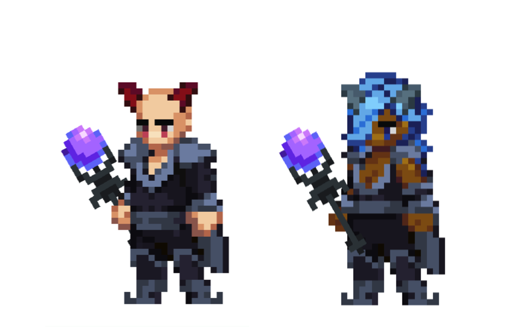

# Summoner

<figure><figcaption></figcaption></figure>

This page details information about the Summoner class combat skills that will be used in Player-vs-Player (PVP) and Player-vs-Environment (PVE) combat environments.


All information on this page is considered "Pre-Alpha" and preliminary, and is therefore subject to change.

_Last Update: 8/19/2024_


## Class Description

On the perilous frontiers of Gaia, few can match the magical prowess of the **Summoner**. Through ancient rituals and arcane knowledge, these masters of conjuration call forth beings and energies of unimaginable power to fight by their side and protect allies. Whether summoning celestial entities, commanding dark energies, or forging bonds with the everpresent ethereal spirits of this plane, the Summoner's path is one of uncharted exploration, mystical study, and profound potential.

When it comes to harnessing trans-realm magicks, the Summoner is both the weaver and the loom. Their abilities draw from the very fabric of the universe, intertwining elements of creation, destruction, and spirit. A Summoner does not merely cast spells - they commune with otherworldly forces, binding them to their will either in partnership or in servitude. This delicate balance between control and chaos defines the Summoner, making them a singular and potent presence on the battlefield. They unlock the mysteries of summoning, shaping reality with a flick of their wrist and a whisper of borrowed power.

A Summoner's journey is shaped by three distinct disciplines, one academic, one practical, and one forbidden - each offering a different approach to harnessing their magical potential. These paths are the essence of their training, allowing them to specialize in summoning celestial, dark, or spirit entities.&#x20;

The **Summon** Aspect discipline accesses the power of the celestial and elemental realms, uniting planes to make summoning an extension of their will. Summoners attune to the raw energies of creation, calling forth entities from other realms to embrace our own. These summoned entities embody both purity and power, but also a situational partnership. Whether conjuring a celestial being to strike down foes with radiant light or summoning a clay golem to reshape the very battlefield under the feet of their foe, Summoners of this discipline wield the forces of the universe with precision and grace. Their connection to transient energies allows them to weaken their opponents defenses, restrict enemy movements, and deliver punishing wide area spell damage, making them potent offensive mages who can turn the tide of battle with a single invocation.

But where there is light, one can always find the dark. Embracing the shadows and the void, the **Dark Summoner** delves into the forbidden arts to command powers that others dare not approach. Dark Summoners are reminiscent of those Scholars who delved too deep and touched the void, the difference is that Dark Summoners kept delving. As masters of debilitation and control, Dark Summoners wield dark energy to bend the will of their enemies and sow chaos on the battlefield. An advanced Dark Summoner even has the potential to call forth demonic entities from the abyss to wreak havoc and instill terror, and they'd gladly do so even without complete control over their invited guest. This perspective on how magic could be used, rather than how it should be used, results in a path fraught with danger, for the void demands a price for its near-infinite power. Yet, those who can master this dark art find themselves capable of feats beyond the reach of mere mortals and they'll gladly pay that price, or find someone who will.

On the other end of the umbral spectrum are those Summoners who walk the path of the **Spirit Bond**. These Summoners forge deep, mystical connections with the spirits that inhabit the ethereal planes. These Summoners are not only conjurers but also healers and protectors, using their abilities to shield their allies and mend their wounds. Through the use of ritualistic summoning circles and umbral magic, they channel the essence of benevolent entities to provide both physical and magical fortitude to their companions. This discipline emphasizes the importance of preparation and strategy, as each summoning and spellcasting action is meticulously planned to maximize its benefit. If you see a Summoner drawing glyphs on the ground, you must decide whether to run to the safe haven they create or run far away to escape the pending destruction they will soon unleash.

As a Summoner, you transcend the traditional boundaries of magic and physical might. Your journey is one of perpetual discovery, where each summon and spell is a step towards ultimate enlightenment - whether for good or for… not so good. By harmonizing each force pulled or invited from the celestial, void, and spirit realms, you can unlock magic woven into magnitudes of power. Woven by your own hands.

## Class Skills

<table><thead><tr><th width="80">Skill Points</th><th width="157">Discipline</th><th width="164">Skill Name</th><th width="112">Damage Type</th><th width="97">Range</th><th width="66">DOD</th><th width="467">Description</th><th width="415">Flavor Text</th></tr></thead><tbody><tr><td>1</td><td>Summon Aspect</td><td>Lesser Celestial</td><td>MAGICAL</td><td>3</td><td>X</td><td>Channel X Initiative.  Deal <code>(X*SPELL + X*INT)</code> damage to target enemy. <code>(X*INT.S)</code>% chance to reduce target's M.DEF by <code>(X*WIS.S)</code>% for X ticks.  Generate X charges of Arcane Power.  <strong>COMBO</strong>: If target is currently Slowed, generate X additional charges of Arcane Power.</td><td>"Upon your first summon, do not concern yourself with the potency of the entity that arrives. The fact that it arrived at all is what is remarkable. It's a first step, a first step of many."  - From Aetherweilding on the Frontier by Master Arthur Fontwell, Professor of Summoning at the Mages College of Serendale</td></tr><tr><td>1</td><td>Dark Summoner</td><td>Dark Energy</td><td>MAGICAL</td><td>3</td><td>X</td><td>Channel X Initiative.  Deal <code>(X*SPELL + X*INT)</code> damage to target enemy. <code>(X*INT.S)</code>% chance to reduce target's P.DEF by <code>(X*WIS.S)</code>% for X ticks.  Generate X charges of Void Power.  <strong>COMBO</strong>: If target has been previously Banished in this battle, generate X additional charges of Void Power.</td><td>"Did you see that?!"  - Xaden Eldenmorne, First Year, moments after the Void answered</td></tr><tr><td>1</td><td>Spirit Bond</td><td>Summoning Circle</td><td>MAGICAL</td><td>Self</td><td>X</td><td>Generate X charges of Arcane Power. Generate X charges of Void Power. The next skill this Hero casts gains <code>(X*INT.S)</code>% SPELL. If that skill requires a Channel, reduce the Channel length by <code>(X*INT.S + X*WIS.S)</code>% Initiative.  <strong>COMBO</strong>: If this Hero cast "Summoning Circle" on its last turn, gain: Heal each Party Member for <code>(X*SPELL +X*WIS)</code> HP.</td><td>"To be frank, you are not special. I don't care how good you are at hasty visualizations, nothing beats taking the time to do it right. Get on your knees, draw the glyph, and outclass every mage who thinks they can do it better because 'the magic speaks to them'. It's all rubbish."  - Terrine Wethermont, Head Scribe at the Mages College of Serendale at the first day of class</td></tr><tr><td>2</td><td>Summon Aspect</td><td>Aetherwalker</td><td>-</td><td>Passive</td><td>X</td><td>Reduce Channel Initiative by X% on all skills. Reduce SPELL and ATTACK by -X%.  Each instance this Hero deals basic attack damage, gain X charges of Arcane Power.</td><td>"When speed is of the essence, there is a technique that allows you to cast a spell without the need of the incantation itself to be spoken aloud. Although the result is not nearly as potent, a swift surprise may sometimes be more valuable than a proper wallop." - From Aetherweilding on the Frontier by Master Arthur Fontwell, Professor of Summoning at the Mage College of Serendale</td></tr><tr><td>2</td><td>Dark Summoner</td><td>Voidwalker</td><td>-</td><td>Passive</td><td>X</td><td>Increase Channel Initiative by X% on all skills. Gain +X% SPELL on Channeled skills. Reduce Max HP by -X%.  Each instance this Hero deals basic attack damage, gain X charges of Void Power.</td><td>"There is always more power available to a talented summoner. You just need to decide if you're willing to pay the price to take it."  - Excerpt from a letter written by Unknown Author to Xaden Eldenmorne</td></tr><tr><td>2</td><td>Spirit Bond</td><td>Spiritwalker</td><td>-</td><td>Passive</td><td>X</td><td>Each instance this Hero does not deal damage on its own turn, gain:  +X% P.DEF for X ticks. +X% M.DEF for X ticks. Generate X charges of Arcane Power. Generate X charges of Void Power.</td><td>"Preparation is key to any deliberate action. Measure twice, cut once."  - From Do This, Not That: A Guide to Spiritwalking by Terrine Wethermont</td></tr><tr><td>3</td><td>Summon Aspect</td><td>Clay Golem</td><td>MAGICAL</td><td>3</td><td>X</td><td>Empower this skill by consuming X charges of Arcane Power (AP).  Amnesia X.  Channel X Initiative.  Deal <code>((X*AP)*SPELL + X*INT + X*VIT)</code> damage to each enemy. <code>(X + X*VIT.S + X*INT.S)</code>% chance to Slow each target by X% for X ticks.  <strong>COMBO</strong>: If "Summon Lesser Celestial" was cast by this Hero in the last X turns, gain: UNLOCK X AP: <code>(X*WIS.S)</code>% chance to chance to Push X P1 <code>(X*WIS.S)</code>% chance to chance to Pull X P2. <code>(X*WIS.S)</code>% chance to chance to Pull X P3. </td><td>"Clay is a beautiful thing. It can be shaped in so many ways with just a brief channel of vitality. I prefer to shape clay into a weapon, for no one suspects a giant, sturdy, immoveable golem to leap from the earth in the midst of a fight between mages."  - From Practical Summons in a Melee Environment by Arthur Fontwell</td></tr><tr><td>3</td><td>Dark Summoner</td><td>Void Grasp</td><td>MAGICAL</td><td>3</td><td>X</td><td>Empower this skill by consuming all charges of Void Power (VP).  Amnesia X.  Channel X Initiative.  Deal <code>((X*VP)*SPELL + X*INT)</code> damage to target enemy. <code>(X*VP + X*INT.S)</code>% chance to Banish target for X ticks. Target returns to the Battlefield in P1.  If Banish misses, this Hero gains a <code>(X - X*INT.S)</code>% chance to be inflicted with Berserk for X ticks.  If this Hero is inflicted with Berserk, gain X charges of Void Power.  <strong>COMBO</strong>: If this Hero cast "Summon Dark Energy" in the last X turns, gain: Increase chance to Banish target by +<code>(X*WIS.S)</code>%.</td><td>"Void Power is limitless, but it doesn't come without its unique constraints. Arcane Power is like a faucet, its flow can be controlled. Void Power, however, is an all-or-nothing proposition. As a result, timing is everthing."  - From The Void Speaks by Unknown Author</td></tr><tr><td>3</td><td>Spirit Bond</td><td>Umbral Siren</td><td>MAGICAL</td><td>Party Member</td><td>X</td><td>Target party member gains +<code>(X*VIT.S)</code>% P.DEF, and +<code>(X*WIS.S)</code>% M.DEF for X ticks.  Target Party Member performs the following action immediately:  Target each enemy. On hit:  <code>(X*Summoner_WIS.S + X*Summoner_VIT.S)</code>% chance to Taunt target for X ticks. Generate X charges of Arcane Power and Void Power per enemy Taunted.  Amnesia X.  UNLOCK X AP: Target Party Member gains <code>(X*WIS.S)</code>% EVA for X ticks.  UNLOCK X VP: Target Party Member gains <code>(X*WIS.S)</code>% Riposte for X ticks.</td><td>"Umbral magic is very old, beyond ancient, really. Shrouding yourself or an ally in the energy of an arcane spirit is a remarkable thing to behold. Most believe this is achieved when a bargain is struck between the summoner and the spirit, but I believe it is empowered by a deeper bond, by a true partnership."  - From Forgotten Magic for a Modern Battlefield by Terrine Wethermont</td></tr><tr><td>4</td><td>Summon Aspect</td><td>Treant</td><td>MAGICAL</td><td>3</td><td>X</td><td>Amnesia X.  Channel X Initiative.  Deal <code>(X*SPELL + X*INT)</code> to each target enemy. <code>(X*WIS.S)</code>% chance to Root each target for X turns. Generate X charges of Arcane Power per enemy Rooted.  Delay X, heal each Party Member for <code>(X*SPELL + X*WIS)</code> HP. <code>(X*WIS.S)</code>% chance to Generate X charges of Arcane Power per healed Party Member.  <strong>COMBO</strong>: If "Summon Lesser Celestial" was cast by this Hero in the last X turns, gain: Delay X, heal each Party Member for <code>(X*SPELL + X*WIS)</code> HP. <code>(X*WIS.S)</code>% chance to Cleanse each target. Generate X charges of Arcane Power per Cleansed status effect.  <strong>COMBO</strong>: If "Summon Dark Energy" was cast in the last X turns, gain: Delay X, deal <code>(X*SPELL + X*INT)</code> damage to each target. <code>(X*WIS.S)</code>% chance to Dispel each target. Generate X charges of Void Power per Dispelled status effect.  <strong>COMBO</strong>: If "Summoning Circle" was cast by this Hero in the last X turns, gain X Initiative after channel resolves and heal this Hero for <code>(X*SPELL)</code> for each Rooted target.</td><td>"I met Howard in my Second Year and it was love at first sight. He was just so cute with his little leaves and crunchy bark that I knew I just needed to take him home with me."  - Liannda Lunaweave, Graduate of Mages College of Serendale</td></tr><tr><td>4</td><td>Dark Summoner</td><td>Void Shield</td><td>MAGICAL</td><td>Party Member</td><td>X</td><td>Target party member gains a Pure Ward for X ticks.  If this Pure Ward expires, generate X charges of Void Power. If this Pure Ward breaks, heal target for (X*SPELL + X*WIS).  Amnesia X.  <strong>COMBO</strong>: If "Lesser Celestial" was cast by this Hero last turn, gain: If Pure Ward breaks, deal (X*SPELL + X*INT) damage to a random enemy.  <strong>COMBO</strong>: If "Dark Energy" was cast by this Hero last turn, gain: If Pure Ward expires, generate X additional charges of Void Power.  <strong>COMBO</strong>: If "Summoning Circle" was cast by this Hero last turn, gain: Delay X, cast a Pure Ward on a random Party Member.</td><td>"I discovered something truly unexpected today: objects can siphon Void Power. I think it works like an energy well, but only seems to work if a certain condition -- or promise -- is met. The more complex -- the more taxing -- the promise, the greater the power siphoned."  - Excerpt from a letter written by Xaden Eldenmorne to Unknown Recipient</td></tr><tr><td>4</td><td>Spirit Bond</td><td>Umbral Guardian</td><td>MAGICAL</td><td>Party Member</td><td>X</td><td>Amnesia X.  Channel X Initiative.  Heal each Party Member for <code>(X*SPELL + X*WIS)</code> HP and gains: +<code>(X*WIS.S)</code>% P.DEF for X ticks. +<code>(X*WIS.S)</code>% M.DEF for X ticks.  <strong>COMBO</strong>: If "Summon Lesser Celestial" was cast by this Hero in the last X turns, gain: Delay X, Heal each Party Member for (X*SPELL + X*WIS) HP. Generate X charges of Arcane Power for each healed Party Member.  <strong>COMBO</strong>: If "Summon Dark Energy" was cast in the last X turns, gain: Delay X, all Party Members gain a Barrier with <code>(X*SPELL)</code> HP. Generate X charges of Void Power for each targeted Party Member.  <strong>COMBO</strong>: If "Summoning Circle" was cast by this Hero in the last X turns, gain: Each Party Member is healed for an additional <code>(X*SPELL)</code> and gains X% Haste for X ticks. Generate X charges of Arcane Power and Void Power for each healed Party Member. </td><td>"Umbral energy can be found everywhere. All you need to do is open the door but a tiny crack and the magic will flow into our realm. As it flows, you can guide its intent. It's purpose. Heal, protect, empower, it's up to you."  - From Forgotten Magic for a Modern Battlefield by Terrine Wethermont</td></tr><tr><td>5</td><td>Summon Aspect</td><td>Cryopyre Elemental</td><td>MAGICAL</td><td>3</td><td>X</td><td>Empower this skill by consuming X charges of Arcane Power (AP).  Amnesia X.  Channel X Initiative.  Deal <code>((X*AP)*SPELL + X*INT)</code> damage to target enemy in X. <code>(X*INT.S + X*WIS.S)</code>% chance to Daze target.  Delay X, deal <code>((X*AP)*SPELL + X*INT)</code> damage to target enemy in X. <code>(X*INT.S + X*WIS.S)</code>% chance to Daze target.  Delay X, deal <code>((X*AP)*SPELL + X*INT)</code> damage to target enemy in P1. <code>(X*INT.S + X*WIS.S)</code>% chance to Daze target.  UNLOCK X AP: <code>(X*INT.S)</code>% chance to apply X stacks of Burn to each target.  UNLOCK X AP: <code>(X*INT.S)</code>% chance to apply X stacks of Chill to each target.  <strong>COMBO</strong>: If this Hero cast "Summoning Circle" in the last X turns, gain X Initiative after channel resolves and deal an additional <code>(X*SPELL + X*INT)</code> damage to each target.</td><td>"I summoned the Cryopyre completely by accident at first. In mere moments it ended up setting everything in my chambers on fire while in a complete panic; from my bed to my drapes, it was chaos. It was quite a relief when it put everything out with a cool frost once it calmed down. It's safe to say I still lost my deposit." - Excerpt from the personal journal of Liannda Lunaweave</td></tr><tr><td>5</td><td>Dark Summoner</td><td>Lesser Demon</td><td>MAGICAL</td><td>3</td><td>X</td><td>Empower this skill by consuming all charges of Void Power (VP).  Amnesia X.  Channel X Initiative.  Deal <code>((X*VP)*SPELL + X*INT)</code> damage to each enemy. <code>(X*INT.S + X*WIS.S + X*LCK.S)</code>% chance to Banish target in P1 for X ticks. <code>(X*INT.S + X*WIS.S + X*LCK.S)</code>% chance to Banish target in P2 for X ticks. <code>(X*INT.S + X*WIS.S + X*LCK.S)</code>% chance to Banish target in P3 for X ticks.  Each Banished target suffers <code>(X*VIT.S)</code>% reduced current MP (rounded up) and returns in a random Position.  If all Banishes miss, this Hero loses <code>(X - X*VIT.S)</code>% of its current MP (rounded up) and gains a <code>(X - X*WIS.S)</code>% chance to become Exhausted for X turns.  <strong>COMBO</strong>: If this Hero cast "Summoning Circle" in the last X turns, gain X Initiative after channel resolves and deal an additional <code>(X*SPELL + X*INT)</code> damage to each target.</td><td>“When summoning a demon of any size or order, one must understand there is a price to be paid. That price doesn’t necessarily need to be paid by you, but you will pay it if you do not provide the demon with a... reasonable alternative.”  - Excerpt from Demons and their Demons by Xaden Eldenmorne</td></tr><tr><td>5</td><td>Spirit Bond</td><td>Ethereal Gatekeeper</td><td>Passive</td><td>Passive</td><td>X</td><td>Each instance a combatant is Banished, generate X charges each of Arcane Power and Void Power.  Each instance an enemy is Banished, gain a <code>(X*INT.S + X*WIS.S)</code>% chance to automatically spend <code>(X + X*LVL)</code> Mana (rounded up) to cause each Party Member to gain +X% ATTACK and SPELL for X ticks.  Each instance a Party Member is Banished, gain a <code>(X*INT.S + X*WIS.S)</code>% chance to automatically spend <code>(X + X*LVL)</code> Mana (rounded up) to cause each Party Member to be healed for <code>(X*SPELL + X*WIS)</code> HP.</td><td>"It took several centuries for mages to realize that there was more than meets the eye when it comes to banishment. It's not just the target that comes and goes, but another morsel of magic 'piggybacks' onto the target to enter our realm -- and that energy can be convinced to be helpful, or harmful."  - Excerpt from the personal journal of Terrine Wethermont</td></tr><tr><td>10+</td><td>Summon Aspect</td><td>Lesser Celestial +</td><td>MAGICAL</td><td>3</td><td>X</td><td>Channel X Initiative.  Deal <code>(X*SPELL + X*INT)</code> damage to target enemy. <code>(X*INT.S)</code>% chance to reduce target's M.DEF by <code>(X*WIS.S)</code>% for X ticks.  Generate X charges of Arcane Power.  <strong>COMBO</strong>: If Aetherwalker is active, gain: Deal an additional <code>(X*SPELL + X*INT)</code> damage to target.  <strong>COMBO</strong>: If Spiritwalker is active, gain: Gain X Initiative after channel resolves.</td><td>"Upon your first summon, do not concern yourself with the potency of the entity that arrives. The fact that it arrived at all is what is remarkable. It's a first step, a first step of many.  Once you've learned how to aetherwalk, you'll begin to understand how to coax more substantial energy from the exchange, bringing more potent celestials into our realm."   - From Aetherweilding on the Frontier by Master Arthur Fontwell, Professor of Summoning at the Mages College of Serendale</td></tr><tr><td>10+</td><td>Summon Aspect</td><td>Clay Golem +</td><td>MAGICAL</td><td>3</td><td>X</td><td>Empower this skill by consuming X charges of Arcane Power (AP).  Amnesia X.  Channel X Initiative.  Deal <code>((X*AP)*SPELL + X*INT + X*VIT)</code> damage to each enemy. <code>(X + X*VIT.S + X*INT.S)</code>% chance to Slow each target by X% for X ticks.  UNLOCK X AP: <code>(X*WIS.S)</code>% chance to chance to Push X P1 <code>(X*WIS.S)</code>% chance to chance to Pull X P2. <code>(X*WIS.S)</code>% chance to chance to Pull X P3.</td><td>"Clay is a beautiful thing. It can be shaped in so many ways with just a brief channel of vitality. I prefer to shape clay into a weapon, for no one suspects a giant, sturdy, immoveable golem to leap from the earth in the midst of a fight between mages.  On another note related to the topic, I've also taken a shine to a new hobby that I call 'spinning' pottery. It's not like any technique you'd see a true potter use, but I think it's rather neat."  - From Practical Summons in a Melee Environment by Arthur Fontwell</td></tr><tr><td>10+</td><td>Dark Summoner</td><td>Dark Energy +</td><td>MAGICAL</td><td>3</td><td>X</td><td>Channel X Initiative.  Deal <code>(X*SPELL + X*INT)</code> damage to target enemy. <code>(X*INT.S)</code>% chance to reduce target's P.DEF by <code>(X*WIS.S)</code>% for X ticks.  Generate X charges of Void Power.  <strong>COMBO</strong>: If Voidwalker is active, gain: Deal an additional <code>(X*SPELL + X*INT)</code> damage to target.  <strong>COMBO</strong>: If Spiritwalker is active, gain: Gain X Initiative after channel resolves.</td><td>"It is reported that the first moment Xaden Eldenmorne shaped void energy into a weapon marked a turning point for magic users who wished not to conform to the mainstream methods of spellwork. It is said it was an 'accident', but most individuals close to the situation believe Elendmorne had been attempting to access the void through summoning magic for some time. How he knew the connection could be made or to what purpose initially was unknown, but it certainly ended in new movement for magic users. A movement that resulted in the deaths of many who both embraced this change and also feared it."  - From The Historical Impact of Void Magic by Wheaton Gargadusa, Curator of Historical Accounts at the Adelyn Archives"</td></tr><tr><td>10+</td><td>Dark Summoner</td><td>Void Grasp +</td><td>MAGICAL</td><td>3</td><td>X</td><td>Empower this skill by consuming all charges of Void Power (VP).  Amnesia X.  Channel X Initiative.  Deal <code>((X*VP)*SPELL + X*INT)</code> damage to target enemy. <code>(X*VP + X*INT.S + X*WIS.S)</code>% chance to Banish target for X ticks. Target returns to the Battlefield in P1.</td><td>"Summoning and banishment are actually just two sides of the same coin. Don't take your textbooks as undeniable fact, you cannot have one without the other. In both cases, energy enters or exits. In both cases, that energy can be leveraged."  - Excerpt from Demons and their Demons by Xaden Eldenmorne</td></tr><tr><td>10+</td><td>Spirit Bond</td><td>Summoning Circle +</td><td>MAGICAL</td><td>3</td><td>X</td><td>Generate X charges of Arcane Power. Generate X charges of Void Power. The next skill this Hero casts gains <code>(X*INT.S)</code>% SPELL. The next skill this Hero casts costs -<code>(X*INT.S)</code>% MP. If that skill requires a Channel, reduce the Channel length by <code>(X*INT.S + X*WIS.S)</code>% Initiative.  This Hero gains: +X% P.DEF for X ticks. +X% M.DEF for X ticks.</td><td>"The first mages of our age knew the power of summoning circles and it is they who have to thank for understanding the space between our realm and all others. From their teachings we must derive a greater understanding of what makes a summoner a 'summoner' and it all starts with summoning circles.  To be frank, you are not special. I don't care how good you are at hasty visualizations, nothing beats taking the time to do it right. Get on your knees, draw the glyph, and outclass every mage who thinks they can do it better because 'the magic speaks to them'. It's all rubbish."  - Terrine Wethermont, Head Scribe at the Mages College of Serendale at the first day of class</td></tr><tr><td>10+</td><td>Spirit Bond</td><td>Spiritwalker +</td><td>-</td><td>-</td><td>-</td><td>For each action this Hero performs that deals damage, this Hero gains:  +X Haste and +X% EVA until this Hero's next turn. Generate X charges of Arcane Power. Generate X charges of Void Power.</td><td>"Preparation is key to any deliberate action. Measure twice, cut once.  If you don't you may end up losing your advantage, or worse, falling behind."  - From Do This, Not That: A Guide to Spiritwalking by Terrine Wethermont</td></tr><tr><td>10</td><td>Summon Aspect</td><td>Summoner's Pact</td><td>-</td><td>-</td><td>-</td><td>UNLOCK X AP:  For each instance this Hero uses a Summon Aspect discipline skill, gain a <code>(X*WIS.S)</code>% chance to automatically spend <code>(X + X*LVL)</code> MP to heal each Party Member for <code>(X*SPELL)</code> HP.  <code>(X*WIS.S)</code>% chance to Cleanse each Healed target.  Generate X charges of Arcane Power for each status effect Cleansed.</td><td>"As you've learned, the precise moment a summoned entity enters our plane, there is an opportunity to capture the energy released when the planar boundary opens. But what you don't know is that if you have a kinship with the same few summons you bring into our realm, they may just grow to appeciate the attention and even share a bit of that energy with you and your allies."  - Excerpt from Summons Are Really Something by Arthur Fontwell</td></tr><tr><td>10</td><td>Summon Aspect</td><td>Celestial Light</td><td>MAGICAL</td><td>3</td><td>X</td><td>Amnesia X.  Channel X Initiative.  Deal (0) damage to target enemy in P1. <code>(X*INT.S)</code>% chance to inflict target with Blind.  Deal (0) damage to target enemy in P2. <code>(X*INT.S)</code>% chance to inflict target with Confuse.  Deal (0) damage to target enemy in P3. <code>(X*INT.S)</code>% chance to inflict target with Silence for X turns.  Generate X charges of Arcane Power for each inflicted target.  <strong>COMBO</strong>: If "Summon CryoPyre Elemental" was cast by this Hero in the last X turns and "Aetherwalker" is active and "Summoner's Pact" is not active, gain: <code>(X*INT.S)</code>% chance to apply X stacks of Burn to each target. <code>(X*INT.S)</code>% chance to apply X stacks of Chill to each target. Generate X charges of Arcane Power for each inflicted target.  <strong>COMBO</strong>: If "Summon CryoPyre Elemental" was cast by this Hero in the last X turns and both "Aetherwalker" and "Summoner's Pact" are active, gain: Deal an additional <code>(X*SPELL + X*INT)</code> damage to each target. <code>(X*WIS.S)</code>% chance to Daze each target. <code>(X*INT.S)</code>% chance to apply X stacks of Burn to each target. <code>(X*INT.S)</code>% chance to apply X stacks of Chill to each target. Generate X charges of Arcane Power for each inflicted target.  <strong>COMBO</strong>: If "Summoning Circle" was cast by this Hero in the last X turns and "Aetherwalker" is active, gain: Generate X charges of Arcane Power for each status effect inflicted. Deal an additional <code>(X*SPELL + X*INT)</code> damage to each target.</td><td>"What surprises me most of all about this new generation of Summoners is their ability to weave different spells together, like some kind of magical alchemist mixing potions in a pot. I admit that I am a bit jealous of this innovation. Back in my day, we summoned the biggest monster we could, aimed it at the bad guys, and hoped for the best."  - Arthur Fontwell, overheard by a faculty member</td></tr><tr><td>10</td><td>Summon Aspect</td><td>Spectral Chains</td><td>MAGICAL</td><td>3</td><td>X</td><td>Empower this skill by consuming X charges of Arcane Power (AP).  Amnesia X.  Channel X Initiative.  Deal <code>((X*AP)*SPELL + X*INT)</code> damage to target enemy. <code>(X*INT.S + X*WIS.S)</code>% chance to Stun target for X turns. <code>(X*INT.S + X*WIS.S)</code>% chance to Silence target for X ticks. <code>(X*INT.S + X*WIS.S)</code>% chance to Root target for X ticks.  Generate X charges of Arcane Power for each inflicted debuff.  <strong>COMBO</strong>: If "Treant" was cast by this Hero in the last X turns, gain: UNLOCK X AP: +<code>(X*INT.S)</code>% increased chance to Root target and extend duration by X ticks.  <strong>COMBO</strong>: If "Summoning Circle" was cast by this Hero in the last X turns and "Aetherwalker" is active, gain: UNLOCK X AP: Repeat X.</td><td>"Clink-"</td></tr><tr><td>10</td><td>Dark Summoner</td><td>Dark Deal</td><td>-</td><td>-</td><td>-</td><td>This Hero gains Poisoned at the start of Battle. This Hero cannot be Cleansed, Purified, Recovered, or Dispelled. Each skill this Hero casts costs X% more MP. This Hero receives X% more damage from all sources. Gain X charges of Void Power for each instance this Hero takes damage. Gain X charges of Void Power for each instance an Enemy dies. Gain X charges of Void Power for each instance an Ally dies. Whenever Void Power is spent by this Hero, gain X% of the VP spent (rounded up).</td><td>"I woke up this morning and chose violence... let's see if it works."  - Excerpt from the personal journal of Xaden Eldenmorne</td></tr><tr><td>10</td><td>Dark Summoner</td><td>Void Prison</td><td>MAGICAL</td><td>3</td><td>X</td><td>Amnesia X.  Channel X Initiative.  Deal (0) damage to target enemy in P2. <code>(X*INT.S)</code>% chance to inflict target with Blind. <code>(X*INT.S)</code>% chance to Banish target for X ticks. Generate X charges of Void Power for each inflicted debuff.  <strong>COMBO</strong>: If "Void Grasp" was cast by this Hero in the last X turns, gain: Deal an additional (X*SPELL + X*INT) damage to target. Generate X charges of Void Power.  <strong>COMBO</strong>: If "Ethereal Gatekeeper" is active, gain: Delay X, Deal (0) damage to target enemy in P3. <code>(X*INT.S)</code>% chance to inflict target with Blind. <code>(X*INT.S)</code>% chance to Banish target for X ticks. Generate X charges of Void Power for each inflicted debuff.</td><td>"We don't know where they go, either."  - Excerpt from a letter written by Unknown Author to Xaden Eldenmorne</td></tr><tr><td>10</td><td>Dark Summoner</td><td>Greater Demon</td><td>MAGICAL</td><td>3</td><td>X</td><td>Amnesia X.  Empower this skill by consuming all charges of Void Power (VP).  Channel X Initiative.  Reduce current HP by X%.  Deal <code>((X*VP)*SPELL + X*INT + X*VIT)</code> damage to each enemy. <code>(X*INT.S + X*WIS.S + X*LCK.S)</code>% chance to Fear target in P3 for X turns. <code>(X*INT.S + X*WIS.S + X*LCK.S)</code>% chance to Fear target in P2 for X turns. <code>(X*INT.S + X*WIS.S + X*LCK.S)</code>% chance to Fear target in P1 for X turns.  If Fear was not inflicted, this Hero loses <code>(X - X*VIT.S)</code>% of its current MP (rounded up) and gains a <code>(X - X*INT.S)</code>% chance to become Exhausted for X turns.  <strong>COMBO</strong>: If "Summon Lesser Demon" was cast by this Hero in the last X turns, gain: Delay X, target each enemy inflicted with Fear. X% chance to inflict each target with Confuse.  <strong>COMBO</strong>: If "Summon Lesser Demon" was cast by this Hero in the last X turns and "Dark Deal" is active, gain: Delay X, target each enemy inflicted with Fear. X% chance to inflict each target with Amnesia X on a random skill.</td><td>"Most view Xaden Eldenmorne as a plague to the class of summoning magic, but others see him as a visionary that paved a path into realms of forbidden magic that deserve mainstream consideration. Prominent Dark Knights, Dreadknights, and even some Scholars pay homage to Eldenmorne as a key luminary who was integral to the advancements of void magic. Personally, I believe that without his work, we'd still be weilding magicless metal swords or shooting unremarkable wooden arrows."  - From The Historical Impact of Void Magic by Wheaton Gargadusa, Curator of Historical Accounts at the Adelyn Archives</td></tr><tr><td>10</td><td>Spirit Bond</td><td>Binding Contract</td><td>-</td><td>-</td><td>-</td><td>Gain X charges of Arcane Power each turn. Gain X charges of Void Power each turn.  UNLOCK X AP: Each instance a party member or enemy is Banished, gain X% Haste for X ticks.  UNLOCK X AP: Reduce channel length by X% for all skills that require Arcane Power to cast. Gain X% resistance to Negate. Gain X% resistance to Dispel.  UNLOCK X AP: All skills that require Arcane Power to cast gain a <code>(X*INT.S + X*WIS.S + X*LCK.S)</code>% chance to Repeat X.  UNLOCK X VP: Gain +X% Status Effect Resistance while Channeling.  UNLOCK X VP: For each instance this Hero channels, gain a <code>(X*WIS.S)</code>% chance to automatically spend <code>(X + X*LVL)</code> MP to gain a Pure Ward for X ticks.  UNLOCK X VP: Gain +X% resistance to Negate. Gain +X% resistance to Dispel. The next skill that requires Void Power to cast has X% reduced channel length.</td><td>"I once saw my roommate Terrine talking to a summoned spirit. So, I figured I'd give it a shot. Turns out, they are chatty and like to do business."  - Excerpt from the personal journal of Liannda Lunaweave</td></tr><tr><td>10</td><td>Spirit Bond</td><td>Ancestral Guide</td><td>MAGICAL</td><td>Self</td><td>X</td><td>Amnesia X.  Channel X Initiative.  Heal X% of this Hero's missing HP.  <strong>COMBO</strong>: If "Summoning Circle" was cast in this Hero's last X turns and "Aetherwalker" is active, gain: Heal each ally for X% of the HP restored.  <strong>COMBO</strong>: If "Summoning Circle" was cast in this Hero's last X turns and "Voidwalker" is active, gain: Deal damage to each enemy equal X% of the HP restored.  <strong>COMBO</strong>: If "Summoning Circle" was cast in this Hero's last X turns and "Spiritwalker" is active, gain: <code>(X*WIS.S)</code>% chance to heal a random ally for X% of target's missing HP.</td><td>"Despite being essentially unique, each umbral spirit is deeply connected to those that share the same lineage. Summoning an ancestor is quite difficult and not something I recommend one does regulalry. Not only is it a very complex incantation, but it also requires immense energy to make the connection. In turn, I have only cast this spell twice in my lifetime, but when I cast it, it saved lives."  - From Do This, Not That, A Guide to Spiritwalking by Terrine Wethermont</td></tr><tr><td>10</td><td>Spirit Bond</td><td>Ethereal Sanctuary</td><td>MAGICAL</td><td>Allies</td><td>X</td><td>Banish target ally for X ticks.  Target gains <code>(X*INT.S)</code>% Haste for X ticks and is healed for <code>(X*SPELL + X*WIS)</code> HP.  Amnesia X.  <strong>COMBO</strong>: If "Summoning Circle" was cast by this Hero last turn, gain: UNLOCK X AP: Target gains X charges of Arcane Power and gains +<code>(X*INT.S)</code>% SPELL for X ticks.  UNLOCK X VP: Target gains X chrages of Void Power and gains a Pure Ward for X ticks.</td><td>"Banishment is seen almost exclusively as offensive skill, but I consider that narrowminded."  - From Do This, Not That, A Guide to Spiritwalking by Terrine Wethermont</td></tr><tr><td>15</td><td>Spirit Bond</td><td>Greater Summoning Circle</td><td>MAGICAL</td><td>Self</td><td>X</td><td>Amnesia X.  At the start of the next X turns:  Generate X charges of Arcane Power. Generate X charges of Void Power. Gain +<code>(X*INT.S)</code>% SPELL for X turns. If that skill requires Channeling, reduce the Channel length by <code>(X*INT.S + X*WIS.S)</code>% Initiative. This Hero is considered to have cast "Summoning Circle" in its last turn in addition to any other actions taken.</td><td>"Like I said: measure twice, cut once."  - Said by Terrine Wethermont moments after killing Xaden Eldenmorne</td></tr></tbody></table>

### Notes

* \*DoD: Degree of Difficulty
* 10+ point skills cost 10 minus the cost of the basic version of the skill
* 15 point skills are only available to Heroes with a matching Class/Subclass

