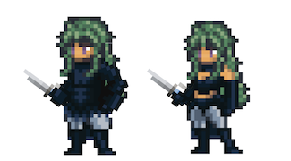

# Thief

<figure><figcaption></figcaption></figure>

This page details information about the Thief class combat skills that will be used in Player-vs-Player (PVP) and Player-vs-Environment (PVE) combat environments.


All information on this page is considered "Pre-Alpha" and preliminary, and is therefore subject to change.

_Last Update: 3/13/2023_


## Class Description

**Thieves** are often seen as cunning and mischievous, preferring to work in the shadows rather than on the front lines, but that's really just what they want you to think. They may be skilled pickpockets, infiltrators, or even assassins, but above all, they aren't afraid to get their hands dirty. Some Thieves use their skills for personal gain, while others use their talents to aid their allies or take down the corrupt. Whatever their motivation, Thieves are not to be trusted, unless they trust you.

The Thief is a class that excels in sneaky and underhanded tactics, with a range of skills that allow them to deal damage, sabotage enemies, and even steal from them. The class is divided into three main discipline paths: Sneak, Savvy, and Thug.

The **Sneak** discipline focuses on the Thief's inherent agile nature and quickness to deal damage and evade attacks. Whether it's a twisted dagger skillfully placed just so in the side of an enemy, or a thrifty opportunity capitalized upon, a Thief always looks for ways to cause a little bit of mischief. That mischief often comes at the expense of an already beaten-down opponent. A Thief that has mastered the art of staying hidden in plain sight really knows how to take advantage of a fool on the back foot, never scared to cause a little bleed.

One could be forgiven for thinking that a Thief is all sneakiness and shadows, but there is so much more to the resourceful mind of these lovable rogues. At its core, the **Savvy** discipline focuses on the Thief's ability to use the environment around them to turn the tables in their favor. Traps, poisons, smoke bombs, and tripwires, these are the tools a clever Thief knows can be the difference between escape, capture, and even death. Oh, and pocket sand. Never leave home without some of that.

The **Thug**, on the other hand, forgoes any overture of deception or intrigue by simply finding the opportune moment to send a very clear message: don't mess with me and my team. Sabotage, brute force, and intimidation are the not-so-subtle methods of choice for damage dealing and convincing an enemy to think twice before acting. But a Thug isn't born, a Thug is made. From pocket picking to straight-up extortion, the Thug understands how to manipulate a situation to take control of the outcome, and how to keep a target quiet.

One way or another, the Thief will have their way. Either you knowingly bend to their agenda, or they simply take from you what they deem to really belong to them. So, whether you're looking for a sneaky backstabber, a resourceful mastermind, or a tough guy who gets things done, the Thief has got you covered. Just be sure to keep an eye on your pockets and watch your back, because with a Thief around, you never know what might go missing.

## Class Skills

| Skill Points | Range                | Discipline | DoD     | Skill                  | Description                                                                                                                                                                                                                                                                                                                                                                                                                                                                                                                                                                                                                                                                                                                                                                                                                                                                                                                                         |
| ------------ | -------------------- | ---------- | ------- | ---------------------- | --------------------------------------------------------------------------------------------------------------------------------------------------------------------------------------------------------------------------------------------------------------------------------------------------------------------------------------------------------------------------------------------------------------------------------------------------------------------------------------------------------------------------------------------------------------------------------------------------------------------------------------------------------------------------------------------------------------------------------------------------------------------------------------------------------------------------------------------------------------------------------------------------------------------------------------------------- |
| 1            | 1                    | Sneak      | X       | Twisted Dagger         | 
<em>Stick them with the pointy end. And then twist it.</em>  Deal physical damage to target enemy equal to (X*BASIC + X*DEX + X*STR). (X + X*DEX)% chance to inflict target enemy with Bleed.
                                                                                                                                                                                                                                                                                                                                                                                                                                                                                                                                                                                                                                                                                                                                       |
| 1            | Allies               | Savvy      | X       | Toxic Trap             | 
<em>Maybe they won't notice?</em>  Place a trap on target party member that lasts for a Duration of X.  When that party member is attacked and after incoming damage resolves, deal physical damage to attacking enemy equal to (X*BASIC + X*LCK). This attack has a (X + X*LCK)% chance to Poison the attacking enemy. Only activates once.
                                                                                                                                                                                                                                                                                                                                                                                                                                                                                                                                                                               |
| 1            | 3                    | Thug       | X       | Pickpocket             | 
<em>This now belongs to me.</em>  Deal physical damage to target enemy equal to (0). X% chance to Sabotage.  (X + X*AGI)% chance to reduce target enemy's EVA by X% for a Duration of X. If successful, gain X% EVA for a Duration of X.
                                                                                                                                                                                                                                                                                                                                                                                                                                                                                                                                                                                                                                                                                   |
| 2            | -                    | Sneak      | Passive | Sneak                  | 
<em>One must sneak with purpose. And that purpose is to take things that don't belong to you.</em>  At the start of Battle, reduce (X + X*DEX)% DEX from the enemy with the highest DEX value. Gain effective DEX equal to the value reduced.
                                                                                                                                                                                                                                                                                                                                                                                                                                                                                                                                                                                                                                                                                       |
| 2            | -                    | Savvy      | Passive | Savvy                  | 
<em>If you get caught, you're going to need to think on your feet.</em>  At the start of Battle, reduce (X + X*LCK)% LCK from the enemy with the highest LCK value. Gain effective LCK equal to the value reduced.
                                                                                                                                                                                                                                                                                                                                                                                                                                                                                                                                                                                                                                                                                                                  |
| 2            | -                    | Thug       | Passive | Thug                   | 
<em>A death mark is not an easy thing to live with.</em>  At the start of battle, a random enemy receives a death mark. When attacking marked target, deal (X + X*STR)% additional physical damage. When target enemy dies, each party member gains effective STR equal to (X + X*Target_STR).
                                                                                                                                                                                                                                                                                                                                                                                                                                                                                                                                                                                                                                   |
| 3            | 1                    | Sneak      | X       | Backstab               | 
<em>If they don't see you do it, they can't blame you for it.</em>  Deal physical damage equal to (X*BASIC + X*DEX + X*STR) to target enemy. If target is Dazed, Blinded, or Exhausted, gain CSC equal to (X + X*DEX)%.  <strong>COMBO</strong>: If this Hero used a "Sneak" Discipline skill on its last Turn, this attack gains a (X + X*DEX)% chance to inflict target enemy with Bleed.
                                                                                                                                                                                                                                                                                                                                                                                                                                                                                                                                   |
| 3            | 1                    | Savvy      | X       | Pocket Sand            | 
<em>Pocket sand!</em>  Deal physical damage equal to (X*BASIC + X*DEX + X*LCK). (X + X*DEX)% chance to Blind target enemy for a Duration of X.  <strong>COMBO</strong>: If "Toxic Trap" was used on this Hero's last Turn, gain a (X + X*LCK)% chance to Confuse target.  <strong>Amnesia</strong> X, "Pocket Sand".
                                                                                                                                                                                                                                                                                                                                                                                                                                                                                                                                                                                                 |
| 3            | 3                    | Thug       | X       | Ambush                 | 
<em>The reach of the Syndicate is vast. We can get you into any room.</em>  Deal damage to target enemy in P3 equal to (X*BASIC + X*STR + X*DEX). X% chance to Sabotage.  (X + X*STR)% chance to reduce target enemy's EVA by (X + X*AGI)% for a Duration of X. If successful, gain (X + X*AGI)% EVA for a Duration of X.  <strong>COMBO</strong>: If "Pickpocket" was used on this Hero's last Turn, gain (X + X*STR)% chance to Silence target for a Duration of X.
                                                                                                                                                                                                                                                                                                                                                                                                                                             |
| 4            | 3                    | Sneak      | X       | Hidden Blade           | 
<em>Take this. It isn't safe where you're going.</em>  Channel for a Duration of X. During Channel, gain (X + X*DEX + X*AGI)% EVA. Deal physical damage to target enemy equal to (X*BASIC + X*DEX + X*STR). (X + X*DEX)% chance to inflict target with Bleed.  <strong>COMBO</strong>: If "Ambush" was used on this Hero's last Turn, gain a (X + X*DEX)% chance to Silence target for a Duration of X.
                                                                                                                                                                                                                                                                                                                                                                                                                                                                                                                 |
| 4            | 1                    | Savvy      | X       | Dose                   | 
<em>When they're not looking, drop this in their cup.</em>  Deal physical damage to target enemy equal to (0). This attack ignores Barriers. (X + X*DEX)% chance to Poison target enemy.  Delay X, deal physical damage to target enemy equal to (X*BASIC + X*LCK).  <strong>COMBO</strong>: If "Pocket Sand" was used on this Hero's last Turn, target enemy's accuracy is reduced by (X + X*DEX)% for a Duration of X.  <strong>Amnesia</strong> X, "Dose".
                                                                                                                                                                                                                                                                                                                                                                                                                                               |
| 4            | 3                    | Thug       | X       | Extort                 | 
<em>If they can't pay up, there's only one thing to do.</em>  Deal physical damage to target enemy equal to X (X = X*BASIC + X*STR).  If target enemy is unable to deal damage greater than (X*X) within a Duration of X, target receives physical damage equal to (X*BASIC + X*STR) and gains a X% chance to be Silenced for a Duration of X.  <strong>COMBO</strong>: If "Backstab" was used on this Hero's last Turn, gain a (X + X*STR)% chance to Exhaust target for a Duration of X.
                                                                                                                                                                                                                                                                                                                                                                                                                           |
| 5            | 2                    | Sneak      | X       | Go for the Throat      | 
<em>Did I get 'em? I think I got 'em.</em>  Channel for a Duration of X. During Channel, gain (X + X*DEX + X*AGI)% EVA. Deal physical damage to target enemy equal to (X*BASIC + X*DEX + X*STR).  <strong>Execute</strong>: If a target is below X% of max HP after damage resolves, target dies.  <strong>COMBO</strong>: If target is currently afflicted with Bleed, increase Execute threshold to X% of max HP.
                                                                                                                                                                                                                                                                                                                                                                                                                                                                                                  |
| 5            | 3                    | Savvy      | X       | 
 Miasma Bomb
 | 
<em>Save this for a special occassion.</em>  Deal physical damage equal to (X*BASIC + X*DEX + X*LCK) to all enemies, divided evenly. (X + X*LCK)% chance to Blind all enemies. (X + X*LCK)% chance to Poison all enemies. (X + X*LCK)% chance for all party members to gain Untargetable for a Duration of X.  <strong>Amnesia</strong> X, "Miasma Bomb".
                                                                                                                                                                                                                                                                                                                                                                                                                                                                                                                                                               |
| 5            | 1                    | Thug       | X       | Mug                    | 
<em>Send 'em a message.</em>  Deal physical damage to target enemy equal to (X*BASIC + X*STR). X% chance to Sabotage. If Sabotage successfully reduces target's Battle Budget by X, restore X party Battle Budget.  <strong>COMBO</strong>: If target is Exhausted, Confused, or Silenced, gain a (X + X*STR + X*DEX)% chance to reduce the current Mana of target enemy by (X + X*STR)%.
                                                                                                                                                                                                                                                                                                                                                                                                                                                                                                                                  |
| 10+          | 1                    | Sneak      | X       | Twisted Dagger +       | 
<em>Stick them with the pointy end. And maybe the wavy part, too.</em>  Deal physical damage to target enemy equal to (X*BASIC + X*DEX). This attack has X% Pierce. (X + X*DEX)% chance to inflict target enemy Bleed.  <strong>COMBO</strong>: If target is already inflicted with Bleed, gain (X + X*DEX)% chance to Daze target.
                                                                                                                                                                                                                                                                                                                                                                                                                                                                                                                                                                                        |
| 10+          | 2                    | Sneak      | X       | Backstab +             | 
<em>If they don't see you do it, they can't blame you for it.</em>  Deal physical damage equal to (X*BASIC + X*DEX + X*STR) to target enemy. If target is Dazed, Blinded, or Exhausted, this attack gains CSC equal to (X + X*DEX)%. This attack has X% Pierce.  <strong>COMBO</strong>: If this Hero used a "Sneak" Discipline skill on its last Turn, this attack gains a (X + X*DEX)% chance to inflict target enemy with Bleed.
                                                                                                                                                                                                                                                                                                                                                                                                                                                                                        |
| 10+          | Party                | Savvy      | X       | Toxic Trap +           | 
<em>Maybe they won't notice?</em>  Place a trap on target party member that lasts for a Duration of X.  If that party member is attacked and after incoming damage resolves, deal damage to attacking enemy equal to (X*BASIC + X*LCK). This attack has a (X + X*LCK)% chance to Poison the attacking enemy. This attack has an increased CSC of X%. Only activates once.
                                                                                                                                                                                                                                                                                                                                                                                                                                                                                                                                               |
| 10+          | 2                    | Savvy      | X       | Dose +                 | 
<em>When they're not looking, drop this in their cup.</em>  Deal physical damage to target enemy equal to (0). (X + X*DEX)% chance to Poison target enemy.  Delay 1, deal physical damage to target enemy equal to (0). (X + X*DEX)% chance to Daze target enemy.  Delay 2, deal physical damage to target enemy equal to (0). (X+ X*DEX)% chance to Blind target enemy.  Delay X, deal physical damage to target enemy equal to (X*BASIC + X*LCK).  <strong>COMBO</strong>: If "Pocket Sand" was used on this Hero's last Turn, target's accuracy is reduced by (X + X*DEX)% for a Duration of X.  <strong>Amnesia</strong> X, "Dose".
                                                                                                                                                                                                                                                      |
| 10+          | 2                    | Thug       | X       | Pickpocket +           | 
<em>This now belongs to me.</em>  Deal physical damage to target enemy equal to (0). X% chance to Sabotage.  (X + X*AGI)% chance to reduce target enemy's EVA by X% for a Duration of X. If successful, gain X% EVA for a Duration of X. (X + X*AGI)% chance to Confuse target enemy for a Duration of X.
                                                                                                                                                                                                                                                                                                                                                                                                                                                                                                                                                                                                               |
| 10+          | 3                    | Thug       | X       | Ambush +               | 
<em>The reach of the Syndicate is vast. We can get you into any room.</em>  Deal damage to target enemy in P3 equal to (X*BASIC + X*STR + X*DEX). X% chance to Sabotage.  (X + X*STR)% chance to reduce target enemy's EVA by (X + X*AGI)% for a Duration of X. If successful, gain X EVA for a Duration of X, where X equals the value reduced. (X + X*AGI)% chance to Silence target enemy for a Duration of X.  <strong>COMBO</strong>: If "Pickpocket" was used on this Hero's last Turn, gain (X + X*STR)% chance to Confuse target for a Duration of X.
                                                                                                                                                                                                                                                                                                                                                  |
| 10           | -                    | Sneak      | Passive | Sneak, Stab, Hide      | 
<em>These three techniques practically never fail.</em>  Every X Durations, this Hero receives a random single status effect that lasts for a Duration of X from this list:  1: Increase attack Range by X. 2: All attacks to gain X% chance to inflict Bleed. 3: X% EVA.
                                                                                                                                                                                                                                                                                                                                                                                                                                                                                                                                                                                                                                                  |
| 10           | 3                    | Sneak      | X       | Swindle                | 
<em>Trust me, just send me your seed phrase.</em>  Deal physical damage to target enemy equal to (0). X% chance to Sabotage. (X + X*LCK + X*DEX)% chance to reduce the current Mana of target enemy by (X + X*LCK + X*DEX + X*WIS)%.  <strong>COMBO</strong>: If a "Sneak" Discipline skill was used on this Hero's last Turn, this attack gains: Deal physical damage to target enemy equal to (X*BASIC + X*DEX).  <strong>Amnesia</strong> X, "Swindle".
                                                                                                                                                                                                                                                                                                                                                                                                                                                        |
|              | 3                    | Sneak      | X       | Steal                  | 
<em>They'll never even notice it's gone.</em>  Channel for a Duration of X. During Channel, gain (X + X*DEX + X*AGI)% EVA. While Channeling, at the start of each of this Hero's Turn, roll to cause up to X of the below effects to occur. If successful, these effects last for the remainder of Battle or until Interrupted.  1: (X + X*AGI + X*DEX)% chance to reduce a random enemy's P.DEF by (X + X*LCK + X*DEX)%. If successful, increase a random party member's P.DEF by the value reduced.  2: (X + X*AGI + X*DEX)% chance to reduce a random enemy's M.DEF by (X + X*LCK + X*DEX)%. If successful, increase a random party member's M.DEF by the value reduced.  3: (X + X*AGI + X*DEX)% chance to reduce a random enemy's current P.ACC by (X + X*LCK + X*DEX)%. If successful, increase a random party member's current P.ACC by the value reduced.  4: X% chance to Sabotage.
 |
| 10           | -                    | Savvy      | Passive | Siphon                 | 
<em>What's theirs is theirs, but also ours.</em>  Each time the enemy team uses a consumable, gain a (X + X*LCK)% chance to gain the same effects on a random party member.
                                                                                                                                                                                                                                                                                                                                                                                                                                                                                                                                                                                                                                                                                                                                                            |
| 10           | 3                    | Savvy      | X       | Thick as Thieves       | 
<em>The only thing a mercenary likes more than getting paid to fight is getting paid not to fight.</em>  Activate to gain CSC equal to (X + X*LCK + X*DEX + X*WIS)% for a Duration of X. This Hero's attacks gain X% Pierce for a Duration of X.  All Thieves on the battlefield gain EVA equal to (X + X*LCK + X*DEX + X*WIS)% for a Duration of X.  This Hero deals X% less physical damage to Heroes with Thief, Pirate, Bard, Ninja, and Warrior main classes for a Duration of X. This Hero receives X% less physical damage from Heroes with Thief, Pirate, Bard, Ninja, and Warrior main classes for a Duration of X.  <strong>Amnesia</strong> X, "Thick as Thieves".  <strong>LIMIT</strong> 1: Only one instance of the ability can be in effect at one time, and if any Thief uses this ability, it will override the previous results.
                                                       |
| 10           | 3                    | Savvy      | X       | Tripwire               | 
<em>Watch your step.</em>  Place a Tripwire on target enemy.  If target enemy is Pushed or Pulled, they are Stunned for a Duration of X.  Can be Cleansed.  <strong>Amnesia</strong> X, "Tripwire".
                                                                                                                                                                                                                                                                                                                                                                                                                                                                                                                                                                                                                                                                                                                  |
| 10           | -                    | Thug       | Passive | Crime Doesn't Pay      | 
<em>Sometimes you just get lucky.</em>  Every action this Hero takes that requires Mana has a (X + X*LCK)% chance to cost (0) Mana.
                                                                                                                                                                                                                                                                                                                                                                                                                                                                                                                                                                                                                                                                                                                                                                                                    |
| 10           | 1                    | Thug       | X       | Rob from the Rich      | 
<em>It's technically not stealing, it's more like a redistribution of wealth.</em>  Deal physical damage to target enemy equal to (X*BASIC + X*STR + X*DEX). X% chance to Sabotage.  (X + X*AGI)% chance to reduce target enemy's STR by (X + X*AGI)% for a Duration of X. If successful, gain STR equal to the amount reduced for a Duration of X.  (X + X*STR)% chance to reduce target enemy's AGI by (X + X*STR)% for a Duration of X. If successful, gain AGI equal to the amount reduced for a Duration of X.  If target enemy is protected by a Physical, Magical, or Pure Barrier, gain: (X + X*AGI)% chance to destroy target enemy's Barrier. If successful, deploy a Barrier of the same type and HP value to random party member.
                                                                                                                                                         |
| 10           | 
Full Party
 | Thug       | X       | Give to the Poor       | 
<em>The squad is only as strong as the weakest link.</em>  Activate to effect the party member with the least HP for a Duration of X. Target party member gains EVA equal to (X + X*AGI)%.  Target ally: If below 75% HP: gain X% effective END. If below 50% HP: gain X% effective STR. If below 25% HP: gain X% effective AGI. If below 10% HP: gain X% Lifesteal, chance to hit decreased by X%.  <strong>Amnesia</strong> X, "Give to the Poor".
                                                                                                                                                                                                                                                                                                                                                                                                                                                        |
| 15           | -                    | Sneak      | Passive | Ghost                  | 
<em>Si Vis Pacem, Para Bellum.</em>  If this Hero dealt damage to an enemy this Turn, gain (X + X*LCK + X*DEX + X*AGI)% chance to become Untargetable for a Duration of X.
                                                                                                                                                                                                                                                                                                                                                                                                                                                                                                                                                                                                                                                                                                                                                          |

### Notes

* \*DoD: Degree of Difficulty
* 10+ point skills cost 10 minus the cost of the basic version of the skill
* 15 point skills are only available to Heroes with a matching Class/Subclass

