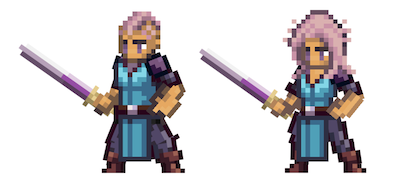

# Warrior

<figure><figcaption></figcaption></figure>

This page details information about the Warrior class combat skills that will be used in Player-vs-Player (PVP) and Player-vs-Environment (PVE) combat environments.


All information on this page is subject to change.

_Last Update: 8/29/2024. Note that skills beyond Tier 5 have not yet been revised or balanced._


## Class Description

The thrill of battle, the glory of a hard fought victory, and the oceans of blood and sweat that come along with it; the **Warrior** lives for the battlefield. Some say Warriors are the fiercest fighters in the realm, others say the gods adorned them with unrivaled strength and endurance, but pretty much everyone agrees that you should never mess with one unless you have to.

A durable and powerful melee class, the Warrior excels in close-quarters combat and can adapt to different situations with a wide array of skills and abilities. They are the backbone of any adventuring party, and are often called upon to lead the charge into battle - even as mercenaries. They truly are the embodiment of strength and courage, a true force to be reckoned with.

Whether it be in the heat of combat or in a quiet moment of contemplation, the three paths of the Warrior each require the need for constant growth and improvement. Each with its own identity and approach to handling the chaos of the fray. Each with its own way to start and quickly end a fight.

First, the path of the **Gladiator** is for those Warriors who have honed their skills in the subtle art of cleaving things in two. The Gladiator leverages their considerable strength to overwhelm and crush their enemies with heavy physical blows. This path focuses on both aggressive and powerful single target attacks and whirlwind spins hastily executed to cut through enemy teams, leaving nothing but destruction and mayhem in their wake.

Second, the **Juggernaut** is a Warrior of few words and even fewer… thoughts. Fully-equipped with an ever-present look of "come at me", the endurance and raw defense of a Juggernaut allows them to shrug off the most powerful of blows and even become unstoppable in the face of a formidable opponent. Unbridled instinct and utter defiance take over to mitigate physical attacks and to resist any incoming onslaught with ease, making the Juggernaut a wall of defense for their allies that can also stop enemies dead in their tracks.

Lastly, the **Bloodthirst** path lends the Warrior significant sustained damage in the face of a tiring enemy. Pure rage and frenzied fury adds fuel to the fires of battle, rewarding these Warriors for their excellent bladework and hardened bloodlust. Intimidation, strength, and a touch of madness are enough to execute any weakened foe, but are never enough to stay the hand of this battle-obsessed and hard-nosed Warrior. Look to the bloodthirsty to never relent once the battle has begun, but most certainly expect the Warrior to strike the final blow to end it.

Beware, for the Warrior's path is not an easy one. It requires unwavering determination and courage even when facing off against the most deadly of foes. But for those who are willing to take upon themselves these challenges head-on, the rewards are great.

## Class Skills

<table data-full-width="true"><thead><tr><th width="78">Skill Points</th><th width="122">Discipline</th><th width="163">Ability</th><th width="405">Description</th><th>Range</th><th width="106">Mana Cost / Growth</th><th width="81">DoD*</th><th data-hidden>Duration</th></tr></thead><tbody><tr><td>1</td><td>Gladiator</td><td>Gladiator Strike</td><td>
Deal (1.1*ATTACK + 0.7*STR + 0.7*END) raw damage to target enemy.

 <strong>COMBO</strong>: If "Basic Attack" was used last turn, this attack gains a (50 + 3.5*DEX.S)% chance to inflict Bleed to target.
</td><td>1</td><td>1.4 / 0.6</td><td>-</td><td>Passive</td></tr><tr><td>1</td><td>Juggernaut</td><td>Ruff</td><td>
This Hero gains +30% Riposte for 3 turns.

<strong>COMBO</strong>: If "Tuff" is active, gain +30% P.DEF for 1 turn.

Amnesia 2
</td><td>-</td><td>2.25 / 0.75</td><td>-</td><td>Passive</td></tr><tr><td>1</td><td>Bloodthirst</td><td>War Cry</td><td>
Party members gain:
<ul><li>(1.0*STR.S + 1.0*END.S)% increase to damage dealt for 2 turns.</li><li>(0.3*STR.S + 0.3*END.S)% increase to Physical and Magical Accuracy for 2 turns.</li></ul>
Target each enemy. On hit:
<ul><li>(50 + 3.0*STR.S)% chance to Intimidate each target by 15% for 1 turn.</li></ul>
<strong>COMBO</strong>: If "Punish" was used last turn, (50 + 3.0*STR.S)% chance to Silence each target for 1 turn.
</td><td>3</td><td>2.4 / 0.6</td><td>5</td><td>Passive</td></tr><tr><td>2</td><td>Gladiator</td><td>Gladiator</td><td>Basic Attacks deal +10% raw damage.</td><td>-</td><td>Passive</td><td>-</td><td>-</td></tr><tr><td>2</td><td>Juggernaut</td><td>Buff</td><td>
Gain +40% P.DEF.

Reduce raw damage dealt by -10%.
</td><td>-</td><td>Passive</td><td>-</td><td>X</td></tr><tr><td>2</td><td>Bloodthirst</td><td>Bloodthirst</td><td>Gain +10% Lifesteal. Gain +10% additional Lifesteal when target is Bleeding.</td><td>-</td><td>Passive</td><td>-</td><td>X</td></tr><tr><td>3</td><td>Gladiator</td><td>Whirlwind</td><td>
Deal (1.0*ATTACK + 1.0*DEX + 1.0*LCK) raw damage to each enemy.

(50 + 3.0*END.S)% chance to Slow each hit target by 15% for 25 ticks.

90% chance to self-inflict 25% Slow for 25 ticks.

Lose 500 Initiative. 

Amnesia 1
</td><td>3</td><td>3.8 / 0.7</td><td>7</td><td>-</td></tr><tr><td>3</td><td>Juggernaut</td><td>Gruff</td><td>
Deal (0.5*ATTACK + 1.3*STR) raw damage to target enemy.

(50 + 2.0*STR.S)% chance to Taunt target for 2 turns.

Gain Unstoppable for 2 turns.  Amnesia 4
</td><td>3</td><td>3.8 / 0.7</td><td>-</td><td>X</td></tr><tr><td>3</td><td>Bloodthirst</td><td>Brutal Rend</td><td>
Deal (1.2*ATTACK + 1.0*DEX) raw damage to target enemy.

(60 + 2.0*DEX.S)% chance for 15% Lifesteal.

<strong>COMBO</strong>: If target enemy is Bleeding:

Deal an additional (0.5*ATTACK + 0.3*STR) raw damage to target.

This attack gains a (50 + 3.0*DEX.S)% chance to inflict Bleed to target.

Amnesia 2
</td><td>1</td><td>3.8 / 0.7</td><td>-</td><td>X</td></tr><tr><td>4</td><td>Gladiator</td><td>Rapid Onslaught</td><td>
Deal 4 Basic Attacks to target enemy.

The damage of each successful hit is reduced by 25%.

<strong>COMBO</strong>: If "Gladiator Strike" was used last turn, "Rapid Onslaught" has +10% accuracy.

Amnesia 2
</td><td>1</td><td>8 / 0.7</td><td>10</td><td>-</td></tr><tr><td>4</td><td>Juggernaut</td><td>Tuff</td><td>
Gain +10% Block.

Reduce raw damage dealt by -5%.
</td><td>-</td><td>Passive</td><td>-</td><td>Passive</td></tr><tr><td>4</td><td>Bloodthirst</td><td>Punish</td><td>
Deal (0.7*ATTACK + 0.3*STR) raw damage to target enemy.

<strong>COMBO</strong>: If target enemy is Bleeding, Dazed, Stunned, or Intimidated, deal an additional (1.2*ATTACK + 1.5*DEX) raw damage to target.

Amnesia 2
</td><td>1</td><td>8 / 0.7</td><td>5</td><td>-</td></tr><tr><td>5</td><td>Gladiator</td><td>Furious Cleave</td><td>
This Hero's Basic Attacks gain Cleave.

Basic Attack damage is reduced by 25%.

Basic attacks gain -10% P.ACC.
</td><td>-</td><td>Passive</td><td>-</td><td>Passive</td></tr><tr><td>5</td><td>Juggernaut</td><td>Nuff</td><td>
This Hero gains:
<ul><li>Redirect 100% of all physical damage dealt to the ally immediately behind this Hero to this Hero for 2 turns.</li></ul>
<strong>COMBO</strong>: If "Buff""is active, gain +30% P.DEF for 2 turns.

Amnesia 2
</td><td>1</td><td>10.5 / 0.7</td><td>-</td><td>X</td></tr><tr><td>5</td><td>Bloodthirst</td><td>Final Blow</td><td>
Channel 500 Initiative

Deal (2.0*ATTACK + 3.0*STR) raw damage to target enemy.

If this attack results in target having less than 10% of max HP, Execute target.

Amnesia 4
</td><td>1</td><td>12 / 0.8</td><td>30</td><td>-</td></tr><tr><td>10+</td><td>Gladiator</td><td>Whirlwind +</td><td>Spin through the enemy team. Deal Physical damage equal to (X*Basic + X*DEX + X*LCK) to all enemies.</td><td>3</td><td>Melee</td><td>X</td><td>-</td></tr><tr><td>10+</td><td>Gladiator</td><td>Blade Flurry +</td><td>Unleash a flurry of Basic Attacks that hit a single enemy target X times. Each strike deals damage equal to (X*Basic). X% chance to inflict Daze per hit.</td><td>3</td><td>Icon</td><td>X</td><td>-</td></tr><tr><td>10+</td><td>Juggernaut</td><td>Gruff +</td><td>Become Unstoppable. Reduce Physical damage recieved by X%.</td><td>-</td><td>Self</td><td>-</td><td>X</td></tr><tr><td>10+</td><td>Juggernaut</td><td>Tuff +</td><td>Gain Block equal to +X%, where X = (X*END + X*DEX + X*AGI + X*LCK)</td><td>-</td><td>Icon</td><td>-</td><td>Passive</td></tr><tr><td>10+</td><td>Bloodthirst</td><td>War Cry +</td><td>Deal physical damage to all target enemies equal to (X*Basic). Intimidate all enemies for X%.</td><td>3</td><td>Ranged</td><td>X</td><td>X</td></tr><tr><td>10+</td><td>Bloodthirst</td><td>Unyielding Blade +</td><td>Deal damage equal to (X*Basic) to target enemy. If target enemy is Dazed, Stunned, Silenced, or Blinded, deal damage equal to (X*Basic + X*STR) instead.</td><td>1</td><td>Melee</td><td>-</td><td>-</td></tr><tr><td>10</td><td>Gladiator</td><td>Adrenaline Rush</td><td>If this Hero took damage last Round, increase Basic Attack damage by X% this Round.</td><td>-</td><td>Icon</td><td></td><td>Passive</td></tr><tr><td>10</td><td>Gladiator</td><td>Mighty Strike</td><td>Deal damage to target equal to (X*Basic). Daze target enemy. <strong>COMBO</strong> Gladiator Strike Last Turn, Blade Flurry the Turn Before: Deal damage to target equal to (X*Basic + X*STR).</td><td>1</td><td>Melee</td><td>-</td><td>-</td></tr><tr><td>10</td><td>Gladiator</td><td>Battleforged</td><td>Activate to gain a Barrier equal to X% of max HP.</td><td>-</td><td>Self</td><td>-</td><td>-</td></tr><tr><td>10</td><td>Gladiator</td><td>Highlander</td><td>Target enemy Warrior, challenging target to a 1v1 duel. Both Warriors deal alternating Basic Attacks rapidly until one Warrior dies.</td><td>3</td><td>Melee</td><td>-</td><td>-</td></tr><tr><td>10</td><td>Juggernaut</td><td>Cuff</td><td>Deal damage to target equal to (X*Basic). Stun target.</td><td>1</td><td>Melee</td><td>-</td><td>-</td></tr><tr><td>10</td><td>Juggernaut</td><td>Slam</td><td>Deal damage to all enemies equal to (X*Basic). X% chance to inflict Daze on hit. X% chance to inflict Stun on hit. COMBO Juggernaut: Inflict X% Slow on hit for a Duration of X.</td><td>3</td><td>Melee</td><td>X</td><td>-</td></tr><tr><td>10</td><td>Juggernaut</td><td>Spin</td><td>Deal damage to all enemies equal to (X*Basic + X*STR + X*END + X*DEX). X% chance to Push P1 to P2. X% chance to Pull P3 to P2. X% chance to inflict Daze on hit. X% chance to inflict Silence on hit. X% chance to inflict Stun on hit. Become Exhausted.</td><td>3</td><td>Melee</td><td>X</td><td>-</td></tr><tr><td>10</td><td>Bloodthirst</td><td>Fury</td><td>Each instance this Hero does Basic Attack damage, gain X Fury. At X stacks of Fury, this Hero's next Basic Attack deals damage equal to (X*Basic).</td><td>-</td><td>Icon</td><td></td><td>Passive</td></tr><tr><td>10</td><td>Bloodthirst</td><td>Defiance</td><td>Gain X% Riposte.</td><td>-</td><td>Self</td><td>-</td><td>X</td></tr><tr><td>15</td><td>Bloodthirst</td><td>Way of the Warrior</td><td>Instantly heal for X% of missing HP. Reduce Physical damage taken by X% for a Duration of X. The next instance of lethal damage this Hero receives is prevented, but HP is reduced to X.</td><td>-</td><td>Self</td><td>-</td><td>X</td></tr></tbody></table>

### Notes

* \*DoD: Degree of Difficulty
* 10+ point skills cost 10 minus the cost of the basic version of the skill
* 15 point skills are only available to Heroes with a matching Class/Subclass

