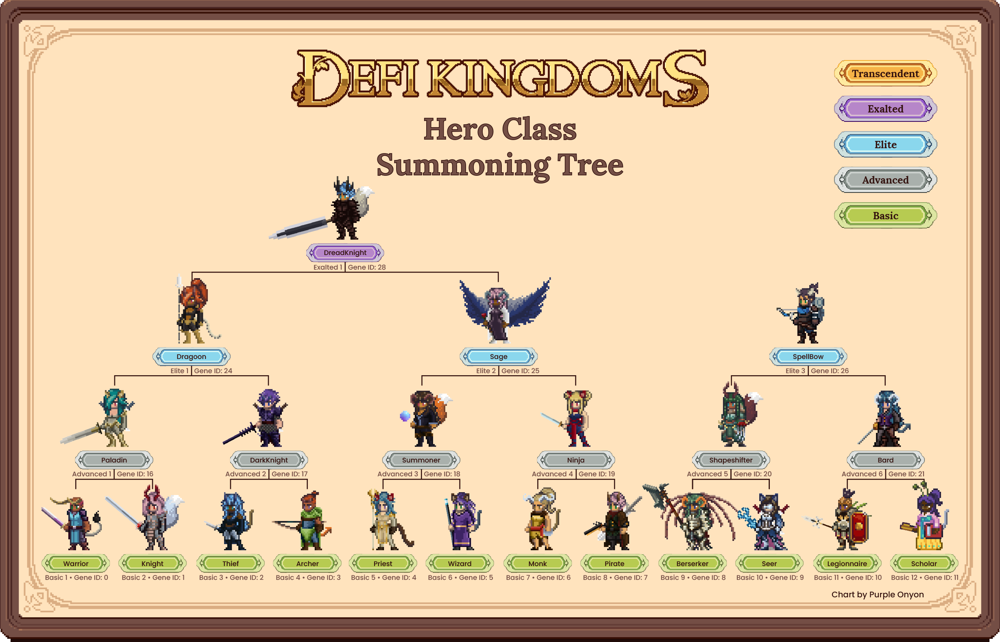

# Summoning

<figure><figcaption>
The Crystalvale Summoning Portal
</figcaption></figure>

To summon, two Heroes must visit the **Arch Druid** and infuse a Summoning Crystal with their combined essence. **Infused Crystals** are then used at the [Portal](../../../learn/gameplay/portal.md) to seek Heroes from far away lands that are in tune with the Heroes that infused the crystal.

To infuse a crystal, Heroes pour their energy into **Gaia’s Tears** and the **Power Token** of that realm, which are then fed into a Summoning Crystal. Stronger Heroes may use additional Gaia’s Tears to cause the portal to seek stronger Heroes more like the summoner.

### Summoning Mechanics

#### Summoning Cooldown

The act of Summoning is an exhausting process, and that exhaustion compounds with each act of Summoning. For each Summon a Hero performs, they must wait for a **cooldown period** before they can Summon again.&#x20;

Gen0 Heroes have a base cooldown of 4 hours, and each summon increases that cooldown by an addition 4 hours, up to a maximum of 14 days.

Gen1+ Heroes use the following cooldown formula, in which there is a minimum of 32 hours after they are first summoned before they can summon themselves:

$$
baseCooldown = (24 + 8 * generation) * (summonCount + 1)
$$


This cooldown structure was changed by [governance vote](https://vote.defikingdoms.com/#/proposal/0xf38713aae62984a9d9e93435991051af82fd14cd9e10e974472057e57a0caa7a) on 6/15/2024, and the changes went into effect on 6/28/2024


#### Summoning Costs

The exhaustion of Summoning doesn’t end at just a cooldown. The amount of Power Tokens needed to for each Hero to infuse the next Summoning Crystal also increases by 2 Power Tokens after each Summon. Gen0 Heroes have the lowest starting cost for Summoning (6 Power Tokens), and each generation above 0 will see an increase of 10 Power Tokens per generation in cost for their Summons compared to lower generations.

$$
powerTokenCost = 6+2*summonCount + 10*generation
$$


Note: Gen0 Heroes have a maximum Power Token cost of 30.


#### Generations & Maximum Summons

What’s this? Yes, unfortunately only Gen0 Heroes are able to maintain their attunement to Gaia Summon after Summon. **All later generations simply have a limit to how many times they can focus their energies into Gaia’s Tears.** Once they have expended the last of their attunement energies, they can no longer Summon.

Another quirk of the Summoning process is that the portal seeks those who have similar Gaia attunement strength as the weakest Summoner. So if a Gen0 summoner Hero infuses a crystal with a Gen1 summoner Hero with only four remaining summons worth of attunement, then the summoned Gen2 will only be able to summon three times (the same number of remaining summons as the weakest summoner after summoning this new hero). Two Gen0 summoners will Summon a Gen1 with ten Summons worth of attunement.

#### Attunement Limitations

Summoned Heroes are too similar to the Heroes that summoned them to be able to properly attune a new Summoning Crystal. This is also true for pairs of Heroes that were Summoned by one or two of the the same Heroes. All other combinations of Heroes will not encounter any trouble attuning a Summoning Crystal so long as they have remaining attunement energy.

### Boosted Summons

For every 5 levels a summoning Hero has reached, the player may increase the Gaia's Tear cost by 10 to provide bonuses to the Summoned Hero. Those bonuses are applied to the Summoned Hero’s stats, Primary Stat Growth, and Secondary Stat Growth. The bonuses are based on the summoning Hero’s top three stats, and each summoning Hero may provide their own bonuses if they use extra tears.

<figure><figcaption>
Tears Bonus
</figcaption></figure>

The bonuses loop through the following pattern with each increased step in +10 tears paid per summoning Hero:

1. \+`(1 + loopCount)` to stat matching highest stat of summoning Hero
2. \+`(1 + loopCount)`% to primary stat growth rate of stat matching the highest stat of summoning Hero
3. \+`(2 + loopCount)`% to secondary stat growth rate of stat matching the highest stat of summoning Hero
4. \+`(1 + loopCount)` to stat matching second highest stat of summoning Hero
5. \+`(1 + loopCount)`% to primary stat growth rate of stat matching the second highest stat of summoning Hero
6. \+`(2 + loopCount)`% to secondary stat growth rate of stat matching the second highest stat of summoning Hero
7. \+`(1 + loopCount)` to stat matching third highest stat of summoning Hero
8. \+`(1 + loopCount)`% to primary stat growth rate of stat matching the third highest stat of summoning Hero
9. \+`(2 + loopCount)`% to secondary stat growth rate of stat matching the third highest stat of summoning Hero

In these formulas, `loopCount` indicates the number of times the bonuses have looped back to step 1 (this happens at +100 and +190 tears added). So the second time around, on step 1 the bonus would be +2 added to the stat matching the highest stat of the summoning Hero, and so on.


**Examples**

* A Level 30 Wizard (highest stats INT, WIS, and LCK) pays 70 Gaia’s Tears (base 10 + 60 for 6 steps of 5 levels). The Summoned Hero receives +1 to INT and WIS, +1% primary stat growth to INT and WIS, and +2% secondary stat growth to INT and WIS.
* A Level 100 Wizard (highest stats INT, WIS, and LCK) pays 210 Gaia’s Tears (base 10 + 200 for 20 steps of 5 levels). The Summoned Hero receives +6 to INT, +3 WIS, and +3 LCK, +6% primary stat growth to INT, +3% to WIS, and 3% to LCK, and +5% secondary stat growth to INT, WIS, and LCK.


These bonuses are **per** summoning Hero, so the maximum possible for two Level 100 Heroes to spend would be 420 Gaia's Tears (`base 10*2 + 200*2 extra`).

### Enhancement Stones

[**Enhancement Stones**](../../../learn/gameplay/heroes/enhancement-stones.md) can also be used during Summoning to further improve the starting stats and stat growth values of the summoned Hero! Each Enhancement Stone is attuned to a particular stat. Rarer and more potent Enhancement Stones will increase these values even further.

### Hero Ranks

<figure><figcaption></figcaption></figure>

Summoning with Heroes that have the appropriate genes can cause a genetic mutation that results in a higher ranked Hero being Summoned from the Portal. The chart above displays the genetic combinations needed to Summon each possible Hero class.

* **Basic** - Warrior, Knight, Thief, Archer, Priest, Wizard, Monk, Pirate, Berserker, Seer, Legionnaire, Scholar
* **Advanced** - Paladin, DarkKnight, Summoner, Ninja, Shapeshifter, Bard
* **Elite** - Dragoon, Sage, SpellBow
* **Exalted** - DreadKnight

Heroes of higher rank have better starting stats and stat growth values than those of ranks below them. However, a side effect of their advanced abilities is that they require **more Gaia's Tears** to perform a Summon than Heroes of lower ranks. In addition, higher-ranked Heroes are more difficult for the Portal to have a chance to locate, so higher-ranked Heroes have **lower maximum summons** than lower-ranked ones. The table below displays the Gaia's Tears requirements and the maximum number of Summons for higher-ranked classes:

| Rank     | Minimum Gaia's Tears | Maximum Summons |
| -------- | -------------------- | --------------- |
| Basic    | 10                   | 10              |
| Advanced | 40                   | 5               |
| Elite    | 70                   | 3               |
| Exalted  | 100                  | 1               |

### Hero Rarity

The rarity level of a Summoned Hero is impacted by the rarity of the two Heroes used to infuse the Summoning Crystal.

The chart above illustrates the likelihood that pairing Heroes of given rarities will result in a Summoned Hero of a given rarity. For further information on this topic, visit the [Rarity](../../../learn/gameplay/heroes/rarity.md) topic page.
