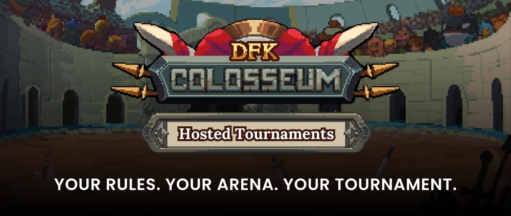

# Void Hunt: Mad Boar

**Void Hunts** are Player vs Environment (PvE) combat experiences that can be undertaken with three Heroes. Send your Combat Party into the wilderness to defeat epic beasts and earn XP, **Void Shards**, **Gaia’s Tears**, or rare equippable items. Defend the realm, join the Hunt today!

> _There have been reports of a mama boar and her piglets infected with manshroom spores terrorizing villages in the snowy cliffs above Reyalin Mountain Pass. We are calling on all able-bodied Heroes to go investigate._

<figure><figcaption></figcaption></figure>

### Void Hunt Basics

#### Required Heroes

3 Heroes per Hunt

#### Stamina Required per Attempt

Consumes 25 Stamina upon completion

#### Minimum XP Reward

* 750 XP on a successful Hunt
* 150 XP on an unsuccessful Hunt

#### Costs

* 10 CRYSTAL, 1000 Gold for an initial attempt
* 5 CRYSTAL, 500 Gold per retry

### Rewards

<table><thead><tr><th width="233.69851729818782">Name</th><th width="184">Base Drop Rate</th><th width="170">Quantity</th><th data-hidden align="center"></th></tr></thead><tbody><tr><td> Gaia's Tear</td><td>??</td><td>??</td><td align="center"></td></tr><tr><td> Moksha Rune</td><td>??</td><td>??</td><td align="center"></td></tr><tr><td> Void Shard</td><td>??</td><td>??</td><td align="center"></td></tr><tr><td>??</td><td>??</td><td>??</td><td align="center"></td></tr></tbody></table>

## Void Hunt Status Effects & Keywords


[status-effects-and-mechanics-glossary.md](status-effects-and-mechanics-glossary.md)

