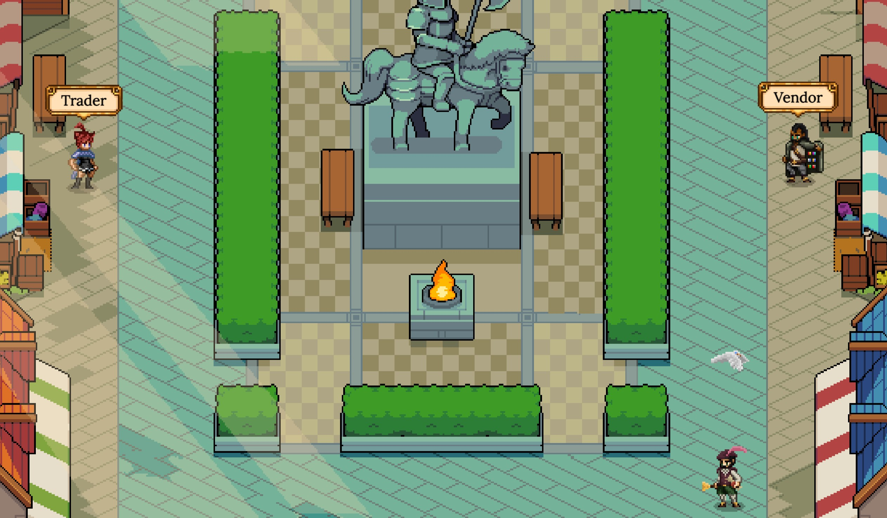
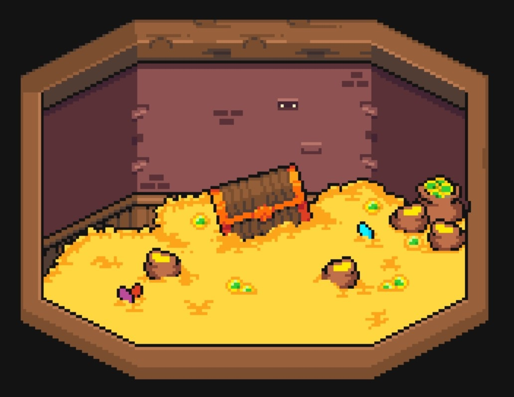

# Decentralized Exchange

At its heart, DeFi Kingdoms has a decentralized exchange that uses the tried-and-true UniswapV2 Protocol. Investing is one of the main reasons we are drawn to blockchain technology, and we want to make the investing experience fun and enjoyable for all within the kingdom.

**The Dev team is committing approximately $15k worth of ONE for to be provided to the initial ONE/JEWEL pair.**

From the Market, you can swap tokens at the current exchange rates. You can also become a Liquidity Provider by adding liquidity to any token pools you’d like. These will earn you fees any time anyone trades those tokens. Alternatively, these LP tokens can also be staked in the Gardens to earn JEWEL rewards.

Another unique feature that DeFi Kingdoms offers is the Bank, where you can deposit JEWEL tokens to receive xJEWEL shares. The Bank will receive fees from the DEX and periodically do a market buy for more JEWEL tokens, meaning your xJEWEL shares will always be worth more JEWELs than you put in! **Additionally, every in-game transaction of JEWELs will deposit a percentage into the Bank to further reward xJEWEL holders.**
