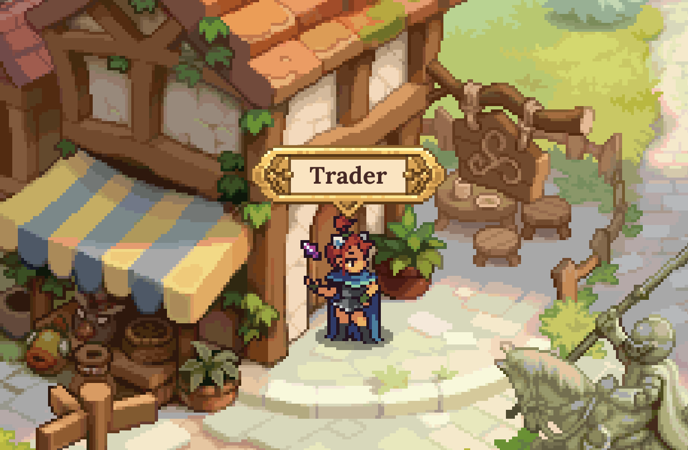

# Decentralized Exchange

DeFi Kingdoms currently has two decentralized exchanges that use the tried-and-true UniswapV2 Protocol. DeFi Kingdoms: Crystalvale's DEX trades in JEWEL, CRYSTAL, AVAX, and a variety of tokens on DFK Chain, our Avalanche subnet, while DeFi Kingdoms: Serendale's DEX trades in JEWEL, JADE, KAIA, and a host of other tokens on the Kaia network. Trading is one of the main reasons we are drawn to blockchain technology and we want to make the experience fun and enjoyable for all within the realms.

<figure><figcaption>
Merchant Matoya in Serendale's Central Marketplace
</figcaption></figure>

From the [Marketplace](../learn/gameplay/marketplace.md), you can swap tokens at current exchange rates. These tokens can be placed in liquidity pools, which will earn fees any time anyone trades those token pairs. Additionally, the LP tokens for certain incentivized token pairings can also earn CRYSTAL or JADE rewards when staked in the [Gardens](the-gardens/).
