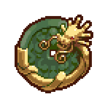

# JADE Token

<figure><figcaption>
JADE
</figcaption></figure>

### JADE Hard Cap

The JADE token has a hard cap of **250,000,000** tokens.

### **Token Allocations**

JADE has the following token allocations:

* **787,500 JADE** - Pre-mints as described below.
* **5,000,000 JADE** - Claimable in full from the Jeweler at launch to holders of Locked JEWEL on Harmony.
* **\~16,469,178 JADE -** Claimable at launch from the Jeweler by holders of locked JEWEL on Harmony, vesting over one year according to the original JEWEL unlock schedule from September 24, 2022 ([Harmony Block #31,772,767](https://explorer.harmony.one/block/31772767)).
* **125,000,000 JADE** - Locked and airdropped to holders of Locked JEWEL on Harmony, and unlocking ratably over the course of one year, beginning around November 30, 2023.
* **\~85,619,435 JADE** - Emitted from the Gardens to reward liquidity providers and Locked/Unlocked according to the [Issuance Schedule](../the-gardens/jade-gardens.md#issuance-schedule).
* **\~17,123,887 JADE -** Emitted from the Gardens to fund the project and reward players. These emissions do not count against those described in [JADE Gardens](../the-gardens/jade-gardens.md), and are subject to separate [locking rates](../the-gardens/#allocations-and-rewards). These allocations are as follows:
  * \~5.82 unlocked JADE / \~7.88m locked JADE - Development Fund Multisig
    * (_Note: The allocations to the Development Fund, Marketing Fund, and Founders Fund are all held in this single multisig._)
  * \~1.88m unlocked JADE / \~1.54m locked JADE - Jeweler (to reward sJEWEL stakers)

### **Pre-Minting**

A small amount of JADE was pre-minted prior to launch and distributed as follows:

* ****[**Klaytn Utility Wallet**](https://scope.klaytn.com/account/0xfECBd8Dd13fB958594Ad5d22d477786622A58Bca)**: 37,500  JADE**— for initial LP Liquidity
* ****[**Klaytn Quest Reward Fund**](https://scope.klaytn.com/account/0x24D557a1C580ec8B78E6e0de910df5E0CE090049)**: 750,000 JADE** — for Gardening Quest rewards

### **Initial Liquidity**

In addition to the pre-mint of 37,500 JADE, an additional 300,000 JADE (from the liquid JADE distribution to the Dev Fund) plus the equivalent of JEWEL from project funds was allocated toward initial liquidity for the JADE–JEWEL and JADE-KLAY Liquidity Pairs. **These LP Tokens and others created by the project are held in the** [**Liquidity Fund Multisig**](https://scope.klaytn.com/account/0x65b8131cb67c7f17e60b9114bcc0ae9755ae89a0) **and never placed in the Gardens.**

### **Multisig Wallet Treasury**

Development funds on Klaytn are held in a **single multisig wallet** that requires 3 out of 4 signatures for any transactions to execute. A [portion of fees from in-game transactions](./#transactions-and-fee-distribution) are sent to this address. Additional multisigs are used for other purposes, like holding LP Tokens.

* **Development Fund Multisig:** [`0xa03990511B6ee8BDb24C1693f9f8BD90DDfFd19D`](https://scope.klaytn.com/account/0xa03990511B6ee8BDb24C1693f9f8BD90DDfFd19D)****
* **Liquidity Fund Multisig:** [`0x65b8131cb67c7f17e60b9114bcc0ae9755ae89a0`](https://scope.klaytn.com/account/0x65b8131cb67c7f17e60b9114bcc0ae9755ae89a0)****

#### **Multisig Signer Addresses:**

* Professor Tango: `0x03B5c81d9759eb3ca12b2201891e61EE4bDfBB7A`
* Bolon Soron: `0x3F0Ef7Db4C124E1Cb377DB1Ff398ab43DA9b57EA`&#x20;
* Sashei: `0x42C1B36BB243bFE02326473EC02a3488b55183E5`&#x20;
* Pine Cone: `0x826c3c6946cAF394c8811814Bb54B56480E39aa9`
