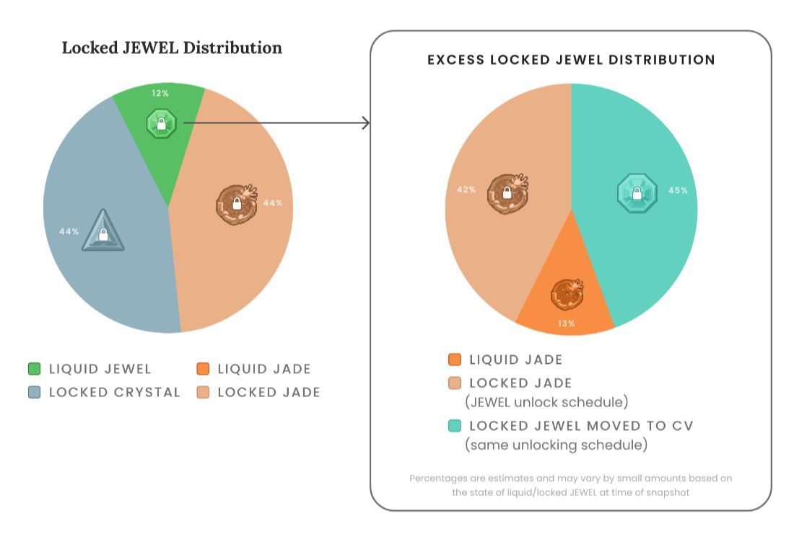

# JEWEL Token

## Updated Tokenomics

### JEWEL Maximum Supply

The JEWEL token has a maximum supply of **125,000,000** tokens.

As of December 2022, all JEWEL that will ever exist has been minted and is circulating or burned, though some remains held in a [vesting contract](jewel-token.md#vesting-jewel).

Given the fully minted supply and the consistency of burned tokens through gameplay and gas fees on [DFK Chain](../defi-kingdoms-blockchain.md), **JEWEL is a deflationary token.**

### "The Splittening"

In accordance with the [community governance vote](https://vote.defikingdoms.com/#/proposal/0x2a83ec79bf88a5d8170b831b4c941a934e47ca0c569a40bb8d240666978b73e6) adopted on 9/1/2022, **JEWEL emissions on Harmony ended and locked JEWEL on Harmony was set to never unlock.**

At the time that Harmony emissions ceased, approximately 112,851,539 JEWEL was circulating as unlocked, and approximately 283,644,055 JEWEL was locked.

To account for the reduction in maximum supply and existing locked JEWEL, this difference was  redistributed as CRYSTAL, JADE and JEWEL on Crystalvale and Serendale 2.0. This airdrop took place alongside the launch of Serendale 2.0. Vested tokens are unlocking retroactively to the start of the original Locked JEWEL unlocking schedule on September 24, 2022 ([Harmony Block #31,772,767](https://explorer.harmony.one/block/31772767)).

As of 3/20/2023, all of these distributions have taken place.

The final percentages of locked JEWEL redistribution were as follows:

* **Locked CRYSTAL**: 44.07342236579% (DFK Chain)
* **Locked JADE**: 44.07342236579% (Klaytn)
* **Vested JADE**: 5.806824466532% (Klaytn)
* **Vested JEWEL**: 4.283393907257% (DFK Chain)
* **Liquid JADE**: 1.762936894631% (Klaytn)

### Vesting JEWEL

According to the percentages above, and to bring the new maximum supply to 125,000,000, approximately 12,148,460 JEWEL was placed in a [vesting contract](https://subnets.avax.network/defi-kingdoms/address/0x9a7C710A6E3A86c69F2FE704AD223Ce76934bb37) on DFK Chain, vesting over one year according to the schedule above.

Approximately 1,710,424 of this JEWEL was allocated to the [Development Fund](crystal-token.md#multisig-wallet-treasury) on DFK Chain, according to the percent of the locked balances held in the team funds on Harmony. Another 59,001 JEWEL was allocated to the Jeweler on DFK Chain according to percent of the locked balance of the Jeweler contract on Harmony.

The remaining 10,379,035 JEWEL was allocated to individual wallets.

## Original Tokenomics


In accordance with the project's [updated tokenomics](jewel-token.md#updated-tokenomics), above, this information is no longer up-to date, but has been left here for reference.


### JEWEL Maximum Supply


Per the [updated tokenomics](jewel-token.md#updated-tokenomics), above, the JEWEL cap has been lowered to 125m.


The JEWEL token has a hard cap of **500,000,000** tokens.

### Token Allocations


These allocations were based on the original emissions schedule and 500m maximum token supply. Since JEWEL emissions ended early, approximately 386.5m JEWEL was emitted from the Gardens in addition to the 10m JEWEL pre-mint. All 283.6m locked and vesting JEWEL was converted as part of the project's [updated tokenomics](jewel-token.md#updated-tokenomics).


JEWEL initially had the following token allocations:

* **10,000,000 JEWEL** - Pre-Mints as described below
* **\~418,800,000 JEWEL** - Emitted from the Gardens to reward liquidity providers and locked/unlocked according to the [Issuance Schedule](../the-gardens/jewel-gardens.md#issuance-schedule).
* **\~71,200,000 JEWEL** - Emitted from the Gardens to fund the project and reward players. These emissions did not count against those described in [JEWEL Gardens](../the-gardens/), and were subject to separate [locking rates](../the-gardens/#allocations-and-rewards). These allocations were broken down as follows:
  * \~13.82m unlocked JEWEL / \~11.31m locked JEWEL - Development Fund Multisig
  * \~13.82m unlocked JEWEL / \~11.31m locked JEWEL - Marketing Fund Multisig
  * \~0.84m unlocked JEWEL / \~15.91m locked JEWEL - Founders Fund Multisig
  * \~2.3m unlocked JEWEL / \~1.89m locked JEWEL - Jeweler (to reward xJEWEL stakers)

### Pre-Minting

**10,000,000 JEWEL** tokens were pre-minted and distributed as follows:

* **5,000,000 JEWEL**: Allocated to the Development Fund Multisig Safe to fund the future development of the game. These tokens were time-locked and released over a set schedule as features are completed.
* **2,000,000 JEWEL**: Allocated to the Marketing Fund Multisig Safe for promotion of the project, including marketing, airdrops, etc. These tokens were also time-locked to release slowly over the next few years to ensure that there are always funds available to market the game and acquire new players and traders.
* **2,000,000 JEWEL**: Allocated for initial liquidity. These tokens were matched with ONE tokens to form the initial liquidity pool and will not be withdrawn or sold.
  * **Initial Liquidity Fund:** The LP tokens from the initial liquidity are permanently held in the [Marketing Fund Multsig Safe](https://explorer.harmony.one/address/0x3875e5398766a29c1b28cc2068a0396cba36ef99), and will never be broken.
* **1,000,000 JEWEL**: Allocated to the Founders Fund Multisig Safe for bounties and hours for the founding team based on their work towards launch. Half of these tokens were awarded at launch, and the other half will vest over time.

## Harmony Multisig Wallets


_Note: Most liquid funds from these multisigs have been moved to their counterparts on DFK Chain. Locked JEWEL held in these wallets was redistributed according to the project's updated tokenomics, above._


**Our funds are secured in multisig wallets at** [**https://multisig.harmony.one**](https://multisig.harmony.one)**.** These wallets will be controlled by 4 members of the core team, which may change from time to time. Any transaction will require 3 out of 4 signatures to execute. This helps to protect against hacks that would target the treasuries, ensuring that there is no single point of failure. Additionally, this protects against any one member of the team having the power to make any changes on their own, without the rest of the team being aware of and agreeing to it. It also gives 100% transparency, as anyone can view all of the transactions that are proposed before they are executed, as well as a history of every past transaction that was executed, including the executing wallets.&#x20;

We know there has been concern with some other projects selling a large amount of tokens at launch that left some feeling frustrated in the project. We seek to help put these concerns at ease with these measures to help our community have confidence in the DeFi Kingdoms project.&#x20;

You can see the addresses of these funds here:

* **Development Fund Multisig Safe:** [`0xa4b9A93013A5590dB92062CF58D4b0ab4F35dBfB`](https://explorer.harmony.one/address/0xa4b9a93013a5590db92062cf58d4b0ab4f35dbfb)
* **Marketing Fund Multisig Safe:** [`0x3875e5398766a29c1B28cC2068A0396cba36eF99`](https://explorer.harmony.one/address/0x3875e5398766a29c1b28cc2068a0396cba36ef99)
* **Founders Fund Multisig Safe:** [`0x79F0d0670D17a89f509Ad1c16BB6021187964A29`](https://explorer.harmony.one/address/0x79f0d0670d17a89f509ad1c16bb6021187964a29)

Additional notable project smart contracts on Harmony include:

* **Quest Fund Smart Contract:** [`0x5ca5bcd91929c7152ca577e8c001c9b5a185f568`](https://explorer.harmony.one/address/0x5ca5bcd91929c7152ca577e8c001c9b5a185f568)
* **Pay Portal Vesting Contract:** [`0x2b12d9a2480d6dd9f71dabaa366c87134195b679`](https://explorer.harmony.one/address/0x2b12d9a2480d6dd9f71dabaa366c87134195b679)

#### **Multisig Signer Addresses**&#x20;

* Pine Cone: `0x826c3c6946cAF394c8811814Bb54B56480E39aa9`
* Sashei: `0x42C1B36BB243bFE02326473EC02a3488b55183E5`
* Bolon Soron: `0x2f26B3426504c28C29b6eDecae399D54717526CF`
* Professor Tango: `0x03B5c81d9759eb3ca12b2201891e61EE4bDfBB7A`
