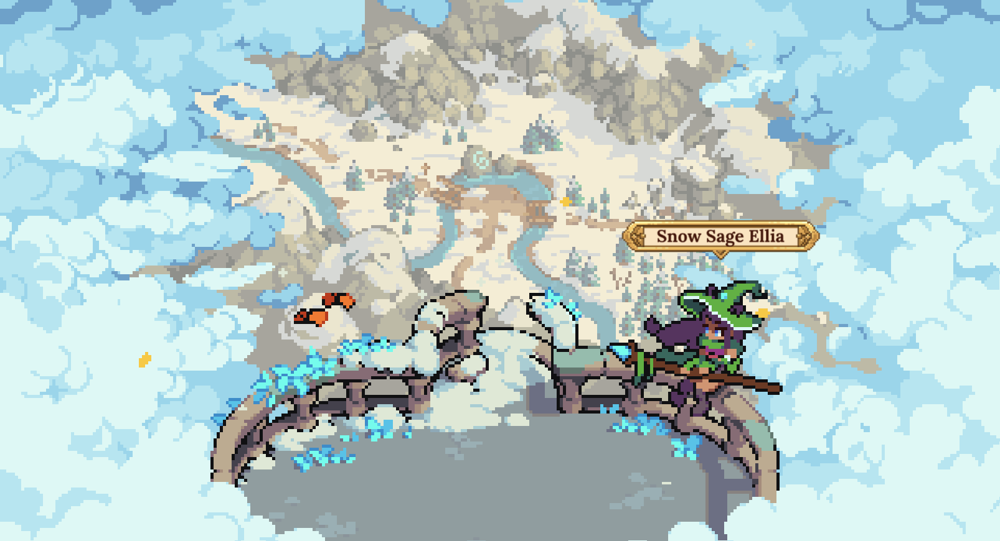
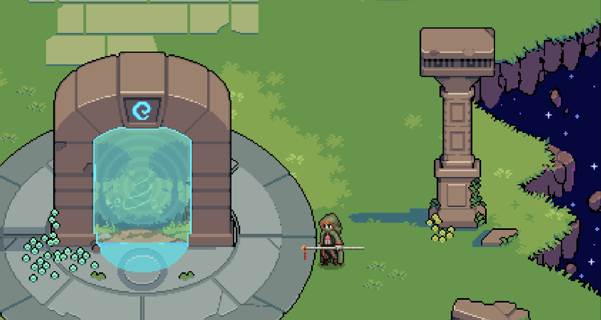

# Realms

DeFi Kingdoms has always been envisioned as a **cross-chain game** with **multiple realms** that have their own unique flavors and different opportunities for players. Currently, there are two realms: **Serendale** and **Crystalvale**, with more planned in the future. The **DFK Colosseum**, exclusively on Metis, is where PVP combat takes place.  Other blockchains will have [**Outposts**](realms.md#outposts) allowing players to easily onboard and bridge tokens from the chain of their choice into one of our realms.

## Realms

### Crystalvale (DFK Chain)

<figure><figcaption></figcaption></figure>

DeFi Kingdoms: Crystalvale launched on March 30, 2022. This was the first expansion to DeFi Kingdoms and lives on [DFK Chain](defi-kingdoms-blockchain.md), an Avalanche subnet. Crystalvale introduced the new Power Token, [CRYSTAL](power-tokens/crystal-token.md), along with new Hero classes, and a brand new world to explore.

### Serendale 2.0 (Kaia)

<figure><figcaption></figcaption></figure>

DeFi Kingdoms: Serendale relaunched on the Kaia (formerly Klaytn) blockchain on December 7, 2022, using the new Power Token, JADE, and bringing additional Hero classes and an updated flavor to match its new home.

## DFK Colosseum (Metis)

<figure><figcaption></figcaption></figure>

The **DFK Colosseum** launched on October 4, 2024, bringing our exclusive Player-vs-Player Combat System to the Metis blockchain. Bring your best Heroes and compete head-to-head against other players, with an on-chain Tournament system coming soon!

## Outposts

### Avalanche C-Chain

<figure><figcaption>
"Beautiful, isn’t it? Snow-capped mountains and forests teeming with life! The calming sounds of water flowing down the river… it’s all so breathtaking. Don’t be shy, take a look! I promise I won’t push you over, hee hee." — Snow Sage Ellia
</figcaption></figure>

The **Avalanche C-Chain Outpost** was launched on March 30, 2022 as part of the launch of DeFi Kingdoms: Crystalvale on [DFK Chain](defi-kingdoms-blockchain.md), an Avalanche subnet. Visit **Snow Sage Ellia** to swap tokens or easily bridge them to either of our Realms.

### Harmony

### Serendale 1.0

<figure><figcaption></figcaption></figure>

DeFi Kingdoms: Serendale originally launched on the Harmony network on August 22, 2021 as a DEX with LP farming opportunities. Heroes and Quests came soon after. Serendale on Harmony officially closed on October 12, 2022, and was converted into an Outpost.

<figure><figcaption>
“The thread of this reality has finally snapped and has begun to sag under the enormity of its own weight. Yes, the <strong>Portal</strong> remains intact but no one can say for how long. Please, save yourself…” — Druid Lisa
</figcaption></figure>

Players can withdraw remaining liquidity from the Gardens by speaking with **Druid Lazarus**, convert remaining xJEWEL back to JEWEL through **Banker Ian**, and Bridge any remaining Heroes, Tokens, or Items through **Dockmaster Maria**.

