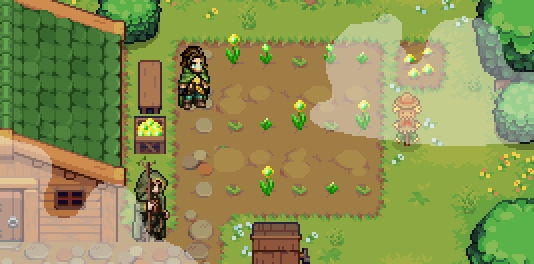
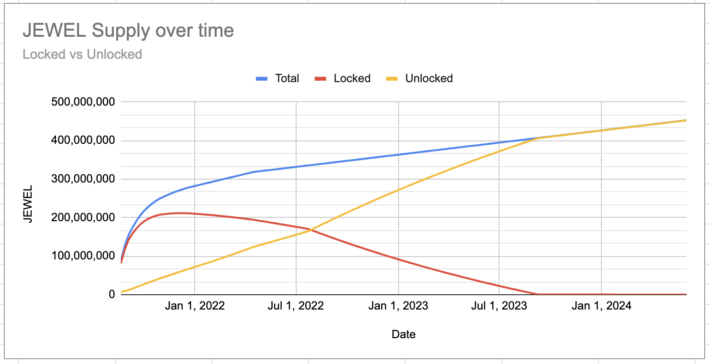

# The Gardens

At its core, the Gardens is a place to stake liquidity provider tokens to receive JEWEL tokens. You’ll be gaining JEWEL tokens to use in game for rare NFTs and other items JUST by staking! It’s a powerful part of the game, and really fun.

Our visualization on liquidity pool mining is unique and fresh. We’re building an epic world and gardens in which to represent token pairs and liquidity pool mining. Within each garden, you will be able to see your portion of the total share within the plot represented by your owned plants. The gardener busies himself with tending to your plants \(this represents the countdown timer between blocks mined\) and once harvested, the gardener deposits your yield in the storehouse representing your share of JEWEL tokens of the block mined. **There will be ways in which to augment and increase your yield by in-game items that will provide you with increased JEWEL token rewards!**

### Issuance Schedule

* **Week 1**: 256x multiplier = 256 JEWEL/block = 7,680 JEWEL/minute
* **Week 2**: 128x multiplier = 128 JEWEL/block = 3,840 JEWEL/minute
* **Week 3**: 96x multiplier = 96 JEWEL/block = 2,880 JEWEL/minute
* **Week 4**: 64x multiplier = 64 JEWEL/block = 1,920 JEWEL/minute
* **Week 5:** 56x multiplier = 56 JEWEL/block = 1,680 JEWEL/minute
* **Week 6:** 48x multiplier = 48 JEWEL/block = 1,200 JEWEL/minute
* **Week 7:** 40x multiplier = 40 JEWEL/block = 1, JEWEL/minute
* **Week 8:** 32x multiplier = 32 JEWEL/block = 960 JEWEL/minute
* **Week 9:** 28x multiplier = 28 JEWEL/block = 840 JEWEL/minute
* **Week 10:** 24x multiplier = 24 JEWEL/block = 720 JEWEL/minute
* **Week 11:** 20x multiplier = 20 JEWEL/block = 960 JEWEL/minute
* **Week 12:** 16x multiplier = 16JEWEL/block = 480 JEWEL/minute
* **Week 13:** 15x multiplier = 15 JEWEL/block = 450 JEWEL/minute
* **Week 14:** 14x multiplier = 14 JEWEL/block = 420 JEWEL/minute
* **Week 15:**  13x multiplier = 13 JEWEL/block = 390 JEWEL/minute
* **Week 16:** 12x multiplier = 12 JEWEL/block = 360 JEWEL/minute
* **Week 17:** 11x multiplier = 11 JEWEL/block = 330 JEWEL/minute
* **Week 18:** 10x multiplier = 10 JEWEL/block = 300 JEWEL/minute
* **Week 19:** 9x multiplier = 9 JEWEL/block = 270 JEWEL/minute
* **Week 20-35:** 8x multiplier = 8 JEWEL/block = 240 JEWEL/minute
* **Week 36+ :** 4x multiplier = 4 JEWEL/block = 120 JEWEL/minute

### Locking Model

_A portion of the JEWELs grown can be harvested immediately, while the rest are dispersed deep underground. These JEWELs will slowly work their way upward and will be rewarded to the owners in time. **Heroes can also be set to mine for these locked JEWEL tokens, unlocking them early.**_

To balance the amazing multipliers for early adopters, our tokenomics include a sliding locking model. **Starting the first week**, **5% of staking rewards will be immediately accessible. This percentage will then increase by 2% every week until it reaches 100% around July 15, 2022.** So, for example, staking rewards issued on week 1 will be 5% available, 95% locked; For week 2 will be 7% available, 93% locked; For week 3 will be 9% available, 91% locked, and so on, until week 51, when no more locking of staked rewards will occur.

**One amazing and unique feature of Defi Kingdoms that sets us apart from any other DeFi exchange out there today is the ability for Heroes to mine for unlocked tokens, unlocking locked JEWEL tokens early based on their stats.**

This locking model helps the project retain value for the long-term, and ensures only those who see the long-term vision of DeFi Kingdoms jump in and earn the maximized rewards available to early adopters.

Once July 15, 2022 comes and we reach 100% unlocking, all remaining locked tokens will begin to unlock over the next year, so that by July 23, 2023, all locked tokens will have been unlocked.

### **Staking Deposit and Withdrawal Fees**

**There are no deposit fees for staking.** To protect against flash loans and pump and dumps, we do implement withdrawal fees. The withdrawal fees are listed below.

* **0.01%** fee if a user withdraws after **4 weeks**
* **0.25%** fee if a user withdraws after **2 weeks but before 4 weeks**
* **0.5%** fee if a user withdraws after **5 days but before 2 weeks**
* **1%** fee if a user withdraws under **5 days**
* **2%** fee if a user withdraws under **3 days.** 
* **4%** fee if a user withdraws under **24 hours.** 
* **8%** fee if a user withdraws under **1 hour.**
* **25%** slashing fee if a user withdraws **during the same block.**

  \*\*\*\*

