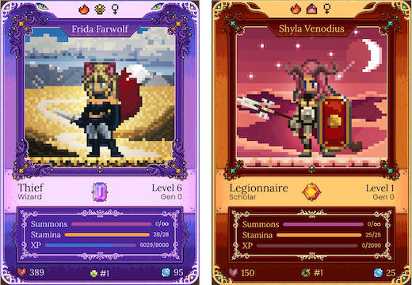
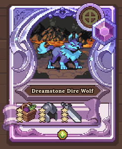
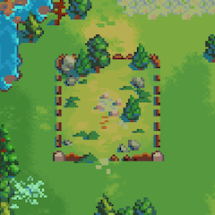

# Heroes & NFTs

Though gardening and growing JEWEL and CRYSTAL tokens is amazing on its own, we wanted to add a bit of sword and sorcery to this fantasy kingdom, and what better way to do that than introducing one-of-a-kind pixel art Hero NFTs?&#x20;

<figure><figcaption></figcaption></figure>

## Heroes

Going one step further than the standard NFTs, DeFi Kingdoms Hero NFTs are full RPG characters with [stat blocks](the-heroes.md#stats), consumable resources like HP, MP, and Stamina, as well as a [leveling](../learn/gameplay/heroes/leveling.md) system. These NFTs are one of the key features of the game. Heroes can work multiple [professions](../learn/gameplay/professions/) for rewards (including tending gardens for additional rewards and mining locked tokens for earlier access), participate in [quests](../gameplay/quests/), and eventually battle each other and a variety of enemies in future updates. Heroes are both central to gameplay and important tools to earn a variety of rewards.

### **Hero Genes**

Heroes have two sets of genes, one for appearance and another for their playable attributes, such as profession, class, subclass, passive and active abilities, and more. During [Summoning](../gameplay/heroes/summoning/), the newly summoned Hero will acquire genes from both source Heroes used in the summoning. **There is also a chance of mutations in genes, resulting in new, rare abilities, classes, and aesthetics!**

### **Summoning and Trading**

Heroes are summoned through a dimensional portal by combining the genes of two existing Heroes and paying a summoning cost. Since there are so many parts that make up a Hero, each new NFT has a unique combination of appearance, class, and stats. Summoning is an art and a science, but with significant elements of chance as well. Every summon has a chance to produce an extremely rare and valuable Hero to play with or trade!

Heroes can be purchased or listed for sale in the [Tavern](../learn/gameplay/tavern.md). Players may also offer their Heroes up for hire in the Tavern, to be used by other players for Summoning.

### **Stats**

Heroes have various [stats](../learn/gameplay/heroes/stats.md) that impact their performance in each profession and their strength in combat. These stats can be increased as Heroes gain experience and [level up](../learn/gameplay/heroes/leveling.md).

### **Quests**

Heroes are able to go on various [quests](../gameplay/quests/) within the kingdom. [Profession Quests](../learn/gameplay/professions/) allow Heroes to gather in-game resources, earn additional tokens from the Gardens, and unlock tokens early, all while gaining experience and increasing their profession skill. Heroes can also participate in [Training Quests](../learn/gameplay/training-quests.md) that require them to utilize their stats to achieve certain goals, engage in dialogue with NPCs, and travel the map to successfully complete. Eventually, Heroes will battle enemies as well. The latter features are currently in development.

### **PvP**

Heroes will be able to participate in 3v3 [combat](../gameplay/combat.md) against other players both for fun and to compete for wagers. Additionally, periodic tournaments will be held that reward winning teams from the Quest Fund. Maximize your stats and take your rightful place as the world champion! PvP is in active development.

## **Pets**

<figure><figcaption></figcaption></figure>

Heroes can sometimes find eggs that they may hatch into rare [Pet NFTs](../learn/gameplay/heroes/pets.md) that will accompany them on their adventures. These Pets can grant stat bonuses, provide bonuses to abilities, and more. Each Pet that is hatched has a chance of being a different rarity, similar to Heroes, and the number and magnitude of bonuses they receive is based on that rarity and randomness.

## **Land**

<figure><figcaption></figcaption></figure>

Heroes will have the opportunity to compete for the right to purchase land, which is a special kind of upgradeable and limited NFT**.** Land can be bought and sold, and will be able to be built on, and visited by traveling Heroes. The latter features are currently in development.

## **Equipment**

Heroes will be able to find, craft, and equip valuable equipment NFTs that will grant them special passive and active abilities, and increase their stats. The equipment & crafting systems are currently in development.
