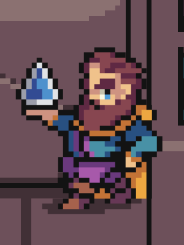

# Jeweler

The **Jeweler** zone allows players to [stake JEWEL tokens](../../how-defi-kingdoms-works/the-jeweler/) for rewards that come through fee distribution. It is also the place to manage locked Power Tokens, claim vesting and unlocked JEWEL and Power Tokens, and manage [Power-Ups](../../how-defi-kingdoms-works/the-jeweler/power-ups.md).

The following interactable NPCs are available in the Jeweler zone in each realm:

### Crystalvale

|                                                       | Name                                                      | Function(s)                                                                                                                                                                                                                                                                                                                                                                                                                                                                                                                                                       |
| ----------------------------------------------------- | --------------------------------------------------------- | ----------------------------------------------------------------------------------------------------------------------------------------------------------------------------------------------------------------------------------------------------------------------------------------------------------------------------------------------------------------------------------------------------------------------------------------------------------------------------------------------------------------------------------------------------------------- |
|  | 
<strong>Thorstein Silvertongue</strong> Welcome
 | <ul><li>Information about notable NPCs</li><li>Link to these Docs</li></ul>                                                                                                                                                                                                                                                                                                                                                                                                                                                                                       |
|          | 
<strong>Soren the Tall</strong> Jeweler
         | <ul><li><a href="../../how-defi-kingdoms-works/the-jeweler/">Stake JEWEL</a> &#x26; claim rewards</li><li>Claim <a href="../../how-defi-kingdoms-works/power-tokens/jewel-token.md#vesting-jewel">Vesting JEWEL</a></li><li>Claim <a href="../../how-defi-kingdoms-works/power-tokens/crystal-token.md#allocations">Locked CRYSTAL</a></li><li><a href="../../how-defi-kingdoms-works/the-gardens/ice-gardens.md#locking">Unlock CRYSTAL</a></li><li>Manage xCRYSTAL (<a href="../../how-defi-kingdoms-works/the-jeweler/#jeweler-1.0">Jeweler 1.0</a>)</li></ul> |
|     | 
<strong>Dorarulir Gemmaster</strong>

Manager
 | <ul><li><a href="../../how-defi-kingdoms-works/the-gardens/ice-gardens.md#transferring-locked-crystal">Transfer locked CRYSTAL</a> to another wallet</li><li>Allow incoming locked CRYSTAL transfer</li></ul>                                                                                                                                                                                                                                                                                                                                                     |
|      | 
<strong>Durnan Gearspinner</strong> Power-Ups
   | <ul><li>Manage <a href="../../how-defi-kingdoms-works/the-jeweler/power-ups.md">Power-Up</a> subscriptions</li></ul>                                                                                                                                                                                                                                                                                                                                                                                                                                              |
|                  | 
<strong>Lemira</strong> Tafl Match
              | <ul><li>Start and Complete "Tafl Match" (Intelligence) <a href="training-quests.md">Training Quest</a></li></ul>                                                                                                                                                                                                                                                                                                                                                                                                                                                  |

### Serendale

|                                                    | Name                                                     | Function(s)                                                                                                                                                                                                                                                                                                                                                                                                                                                                                                                                                               |
| -------------------------------------------------- | -------------------------------------------------------- | ------------------------------------------------------------------------------------------------------------------------------------------------------------------------------------------------------------------------------------------------------------------------------------------------------------------------------------------------------------------------------------------------------------------------------------------------------------------------------------------------------------------------------------------------------------------------- |
|        | 
<strong>Jeweler Micah</strong> Welcome
         | <ul><li>Information about notable NPCs</li><li>Link to these Docs</li></ul>                                                                                                                                                                                                                                                                                                                                                                                                                                                                                               |
|          | 
<strong>Jeweler Ian</strong> Jeweler
           | <ul><li><a href="../../how-defi-kingdoms-works/the-jeweler/">Stake JEWEL</a> &#x26; claim rewards</li><li>Claim <a href="../../how-defi-kingdoms-works/power-tokens/jade-token.md#token-allocations">Liquid JADE</a></li><li>Claim <a href="../../how-defi-kingdoms-works/power-tokens/jade-token.md#token-allocations">Vesting JADE</a></li><li>Claim <a href="../../how-defi-kingdoms-works/power-tokens/jade-token.md#token-allocations">Locked JADE</a></li><li><a href="../../how-defi-kingdoms-works/the-gardens/jade-gardens.md#locking">Unlock JADE</a></li></ul> |
|         | 
<strong>Manager Greg</strong>

Manager
       | <ul><li><a href="../../how-defi-kingdoms-works/the-gardens/jade-gardens.md#transferring-locked-jade">Transfer locked JADE</a> to another wallet</li><li>Allow incoming locked JADE transfer</li></ul>                                                                                                                                                                                                                                                                                                                                                                     |
|  | 
<strong>Wizzle von Sniksnak</strong> Power-Ups
 | <ul><li>Manage <a href="../../how-defi-kingdoms-works/the-jeweler/power-ups.md">Power-Up</a> subscriptions</li></ul>                                                                                                                                                                                                                                                                                                                                                                                                                                                      |
