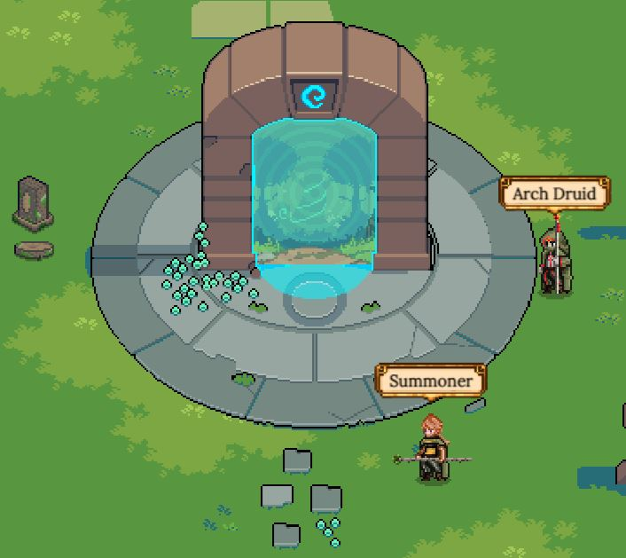

# Portal

The sacred **Portal** is the location where new [Heroes](heroes/) are **Summoned** from Gaia's Inner Grove.

[Summoning](heroes/summoning.md) requires two Heroes, whose genetics impact what kind of new Hero will emerge. The class and subclass of both these Heroes, along with their [stats](heroes/stats.md), [rarity](heroes/rarity.md), and main [profession](professions/) are passed to the new Hero, although mutations can occur that lead to unexpected results!

In order to Summon, you must own at least one Hero. The second can be rented from another player, or it can be another Hero that you own. The **Arch Druid**'s interface allows you to select these Heroes, as well as to spend additional resources to increase the stats of the new Hero (only available when the Summoning Heroes are higher level).

The cost of Summoning is determined by the generation of the Summoning Hero, along with how many times it's Summoned before. Additionally, the minimum number of **Gaia's Tears** is determined by the rank of the Summoning Heroes. Summoning costs increase for higher generations and with each Summon that an individual Hero has performed.

Once the Heroes are selected and any additional Tears or **Enhancement Stones** have been added, the Arch Druid will provide an **Infused Crystal** which you can take to the **Summoner** to open. Once you open the Crystal, you can view your new Hero in all its glory!

You should be aware that all Heroes have a Summoning limit, except for gen0 Heroes. Additionally, Heroes have a cooldown after Summoning that increases with each successive Summon. Further details on Summoning including cost breakdowns, class trees, and rarity chances can be found on the main [Summoning](heroes/summoning.md) topic page.

