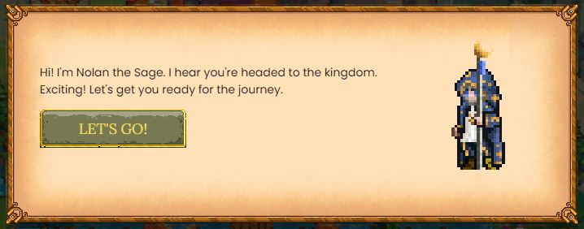

# Getting Started

DeFi Kingdoms is a browser-based game, so all you need to set up your system is a compatible browser with the MetaMask extension installed.&#x20;

The DeFi Kingdoms [tutorial](https://defikingdoms.com/tutorial.html) walks you through downloading a compatible browser and installing the MetaMask extension.

Additionally, you will need Harmony ONE tokens for gas fees, and to convert to JEWEL within the game. The [tutorial](https://defikingdoms.com/tutorial.html) also gives further info on purchasing Harmony ONE tokens. In general, you will need to find an exchange like Binance, Crypto.com, or Kucoin that trades ONE, and then you will need to send the ONE to your MetaMask wallet.

Once you have your browser and MetaMask set up, and you have some Harmony ONE in your wallet, you will be able to enter the game. You can take a [tour](https://defikingdoms.com/tour.html) of the Kingdoms to learn more about the game, and explore these documents for in-depth information about a multitude of topics.

As you explore, you will probably have plenty of questions. The [Gameplay](gameplay/) section offers a lot of information, and you may find what you need in the [FAQ](faq.md) section as well. Additionally, the best place for real-time discussion and support is in our Discord server. Links to this and our other social media sites can be found on our homepage.
