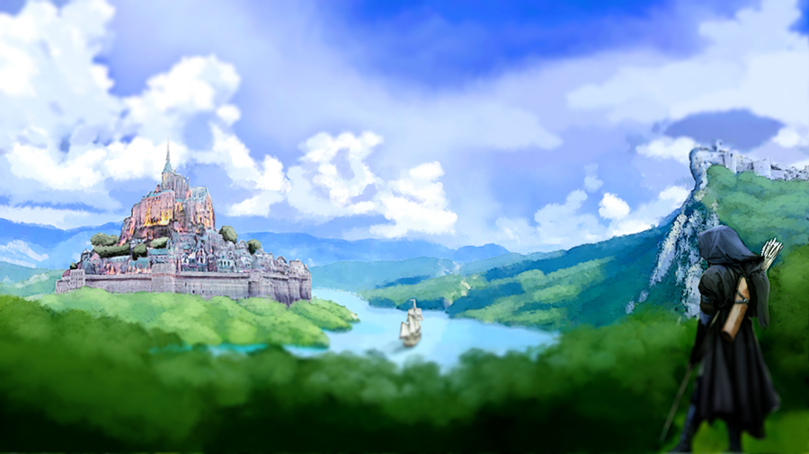

# Lore

## Gaia - A World in Recovery

**The world of Gaia** once consisted of a singular continent, a singular people. As they grew in numbers and shared freely with each other information and schools of learning, they prospered greatly, century after century. All were cared for, wealthy beyond measure, all living in an unaware state of peace and utopia.

Not satisfied by all the wonders and glories that nature freely provided them, their global civilization embarked on an era of technological advancement. What began with the promise of swift progress, catapulted their global civilization away from an appreciation of Gaia, who they began to destroy for the sake of their own advancement. Gaia’s children moved with reckless abandon. With unrelenting greed, they took from her, digging and poisoning the soil with their oils, gasses, and contraptions. In the wake of their progress, the first age was declared, known as the **Age of Progression**, and Gaia wept.

A small number of the people held true to Gaia and continued to worship her, and she did grant them safe journey into **the Inner Grove**, a paradisiacal dimension for those who remained true to her during the destructive and dark times in the Age of Progression.

Once these first heroes were whisked away into the Inner Grove, **Irae**, an old God, the God of Renewal, could harness his anger no longer in the face of such disrespect for Gaia. In his wrath for what the children of the world had done to his love, he sundered the continent, separating them by vast oceans to put a halt to their progress, bringing low their great machines and monumental structures.

After many millennia apart, the lands and peoples are beginning to knit back together, having learned their lesson, all peoples returning to the harmonious balance of peace with Gaia and an appreciation for her gifts.

Kingdoms, once continents all their own, now are connecting with other kingdoms. Though the people are uniquely different, all have one thing in common—a connection to the life-giving land they inhabit, prizing their garden plots above all else which provides them with not only food, but a special crystallization key to powering their economy, called **JEWEL**s.

Gardeners tend to the JEWEL gardens, and kingdoms are beginning to use the crystal’s mystical energy to summon back to the realm the ancient powerful heroes from the Inner Grove. These heroes are helping to defend and fight for their kingdoms, vanquishing invaders and corrupted monsters that roam the countryside.

A new age, the **Age of Heroes**, has begun, and the history books are yet to be written, awaiting the great deeds and stories that are just on the horizon. _Welcome to the kingdom, Hero._

