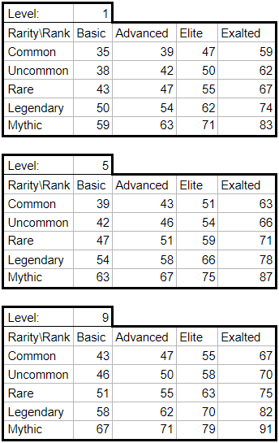
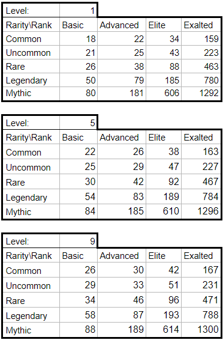
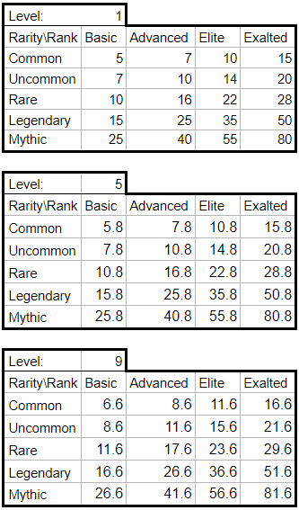
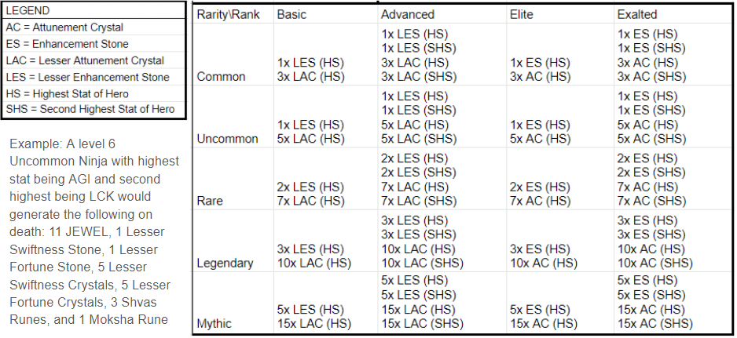

# The Perilous Journey

The Perilous Journey is an optional quest that players may send their Heroes on in anticipation of the DeFi Kingdoms: Crystalvale announcement.&#x20;

This quest is designed to be incredibly high risk for Heroes, and many of the Heroes will be burned. Burning means that they are moved to an inaccessible wallet; they will be dead for all intents and purposes. Because of this, we want players to be very careful about their decision to risk their Heroes and very clear about the risks and reward structure. Once Heroes are committed to the Journey, they **cannot be removed.** Heroes will be **inaccessible** from the time that they are pledged to the Journey until March 16, 2022 at 1400 EST, when the Journey is complete.

This quest does not involve any bridging. All rewards except CRYSTAL for survivors will be distributed in Serendale on Harmony, and all surviving Heroes will return there upon the completion of the Journey. CRYSTAL rewards will be distributed in Crystalvale, so they will be inaccessible until the launch of DeFi Kingdoms: Crystalvale at which point an in-game mechanic will assist with RPC configuration and allow players to access the expansion, bridge JEWEL if they desire, and access their rewards.&#x20;

An **increase** in the number of gen0 Heroes to be given in each reward raffle was announced on February 28, 2022 during the weekly AMA.

**The information that follows is an in-depth look at the formulas behind survival and rewards. However, you will be able to view the exact survival chance and potential rewards for each of your Heroes when speaking to the quest NPC and queuing for the quest.**&#x20;

### **Dates and Times**

Journey becomes available: March 2, 2022 during the weekly patch

Journey registration closes: March 7, 2022 at 1400 EST

Journey is complete and NFTs/rewards are available to claim: March 16, 2022 at 1400 EDT

Reward claim deadline: March 21, 2022 at 1400 EDT

Players may complete the quest after the deadline, but they will receive the JEWEL reward as opposed to the CRYSTAL airdrop, even if their Heroes survive. Heroes that are unclaimed at the deadline will be counted as dead for the purpose of the gen0 raffle. Additionally, the deadline for applying the stat bonuses is April 4, 2022 at 1400 EDT.

### Survival Chance

An individual Hero's chance of survival is determined by their level, rank, and rarity. Level is found directly on the Hero card; Heroes level up by gaining experience and then going to the Meditation Circle.&#x20;

Rarity is indicated by the color of the Hero card and the icon in the center of the card (which displays the rarity on mouseover). Rarity ranges from Common to Mythic.

Rank refers to where on the Summoning chart Heroes fall:&#x20;

The formula for Hero survival is:

survivalChance = 34 + level + rarity \* (2 + rarity) + 2 \* rank \* (1 + rank) _where_

&#x20;    rarity = 0 for Common, 1 for Uncommon, 2 for Rare, 3 for Legendary, 4 for Mythic _and_

&#x20;    rank = 0 for Basic, 1 for Advanced, 2 for Elite, 3 for Exalted

Additionally, players will have the option to group their Heroes together, under the leadership of a gen0 Hero. gen0 Heroes cannot die, but they'll receive no material rewards other than the achievement for survival, a full XP bar, and access to any quests that require that achievement. gen0 Heroes will add 3% to the survival chance of all Heroes in their group, and they may add up to 5 other Heroes into their group to provide that bonus to. Only one gen0 will be allowed per group. There is no benefit to grouping Heroes other than to receive this gen0 survival chance boost.

### Survival Chance Charts

The survival chance for each Hero is calculated individually. The following charts don't account for every Hero, but can be used for easy guidance to understand the variability between Heroes based on level, rank, and rarity.

### Survival Rewards

Survivors receive a variety of rewards:

* A boost of +5 to any three stats chosen by their owner (not stackable)
* Enough experience to fill their experience bar
* A survival achievement which will unlock specific quests in the future
* Access to a selection of land tournaments only accessible to Perilous Journey survivors
* Entries into a raffle for 100 Crystalvale gen0 Heroes (formula below)
* An airdrop of CRYSTAL when Crystalvale launches (formula below)

Raffle entries are determined by this formula:

entries = level + (2 \* rarity) + (2 \* rank) _where_

&#x20;    rarity = 0 for Common, 1 for Uncommon, 2 for Rare, 3 for Legendary, 4 for Mythic _and_

&#x20;    rank = 0 for Basic, 1 for Advanced, 2 for Elite, 3 for Exalted

To discourage multi-walleting, wallets that have more than one Hero survive will receive additional raffle entries. The bonus entries received is equal to the total base number of entries received divided by three (rounded down), plus the total number of heroes that survived in the wallet. Each wallet may only win once per raffle.

CRYSTAL airdrop amounts are impacted by level, rarity, and rank. The table below is for reference, and you will note that the growth per level is linear: 1 CRYSTAL per level. So, when determining rewards for each individual Hero, just find the closest on the chart and add or subtract 1 CRYSTAL per level to match your Hero's stats.

### Death Rewards

The owners of Heroes who die will receive:

* A payout in JEWEL based on level, rank, and rarity
* A selection of runes based on level
* Enhancement stones and attunement crystals based on the stat array, rank, and rarity of the dead Heroes
* Entries into a separate raffle for 100 Crystalvale gen0 Heroes

JEWEL payout is according to the table below. You will note that the growth per level is linear: .2 JEWEL per level. So, when determining rewards for each individual Hero, just find the closest on the chart and add or subtract .2 JEWEL per level to match your Hero's stats.

Rune rewards are determined according to the table below. Note that this is the first opportunity to receive Moksha runes.

.png>)

[Enhancement Stones](gameplay/heroes/enhancement-stones.md) and [Attunement Crystals](gameplay/heroes/attunement-crystals/) are awarded based on the rank and rarity of the hero, as seen in the table below. The type of enhancement stones and attunement crystals received are determined based on the highest one or two stats (depending on rank) of the burned hero. In case of ties for highest stat, primary and secondary growth percentages are used as tiebreakers.

Raffle entries are determined by this formula:

entries = level + (2 \* rarity) + (2 \* rank) _where_

&#x20;    rarity = 0 for Common, 1 for Uncommon, 2 for Rare, 3 for Legendary, 4 for Mythic _and_

&#x20;    rank = 0 for Basic, 1 for Advanced, 2 for Elite, 3 for Exalted

To discourage multi-walleting, wallets that have more than one Hero die will receive additional raffle entries. The bonus entries received is equal to the total base number of entries received divided by three (rounded down), plus the total number of heroes that died in the wallet. Each wallet may only win once per raffle.
