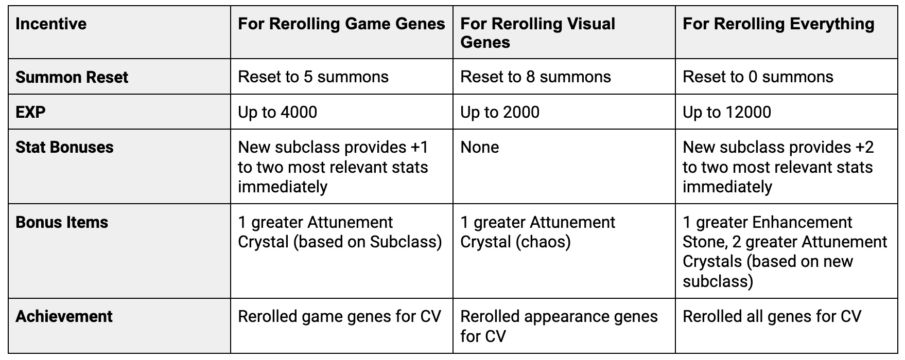

# Vithraven's Reawakening

Vithraven’s Reawakening is a limited time event that allows owners of Gen0 heroes to "reroll" some of their Hero's genes. This is being done to ensure that the new basic genes introduced with the Crystalvale expansion have a similar rarity to the original 8 sets of genes. Existing Gen0 holders will be given an opportunity to reroll some of their genes, with the new Crystalvale genes being possible options. Players will have 31 days to take advantage of this opportunity in Serendale, and will be eligible to receive a series of rewards.

### **Dates and Times**

Vithraven’s Reawakening becomes available: May 6, 2022 at 9PM EDT

Vithraven’s Reawakening ends: June 6, 2022 at 9PM EDT

Rewards are provided during the reroll process, and will no longer be available when the event ends.

### **Gene Rerolling**

While Vithraven’s Reawakening is live, players will have the option to select a Gen0 Hero to reroll. The following gene reroll choices are available:

1. Reroll Game Genes&#x20;
2. Reroll Appearance Genes
3. Reroll Game and Appearance Genes

Only one of these actions may be selected per Gen0 Hero. The following genes will be reroll based on the selection made:

**Game Genes**

* Main class recessive genes
* Subclass dominant and recessive genes

**Appearance Genes**

* Hair style dominant and recessive genes
* Hair color dominant and recessive genes
* Head appendage dominant and recessive genes
* Head appendage color dominant and recessive genes
* Back appendage dominant and recessive genes
* Back appendage color dominant and recessive genes

### **Rewards**

Each of the three reroll options provide a number of rewards, with the greatest rewards coming from rerolling both Game and Appearance genes. Rewards include experience bonuses, stat bonuses, bonus items, an effective summon reset, and achievement rewards. The rewards as they relate to the three options available are detailed in the table below:

Rerolling your Gen0 Hero’s genes will help balance the gene pool and kickstart the appearance of new genes across Gaia.
