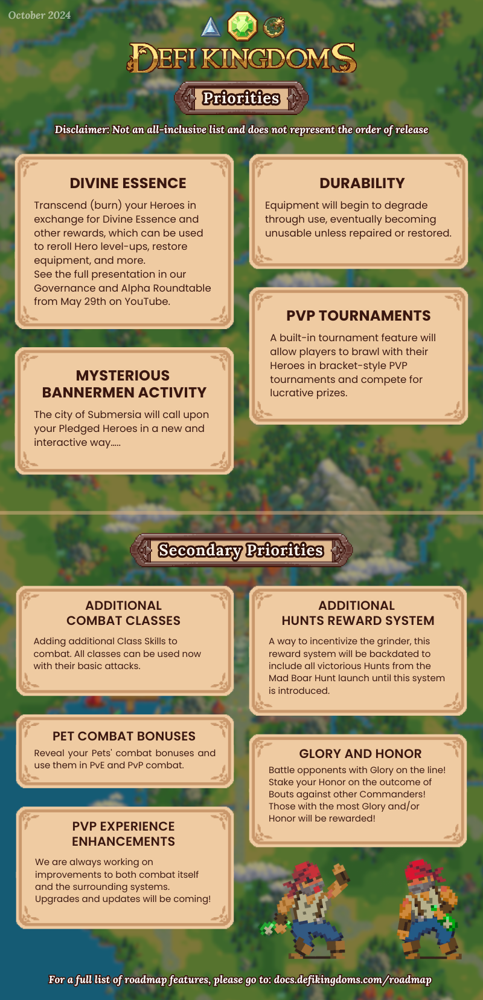
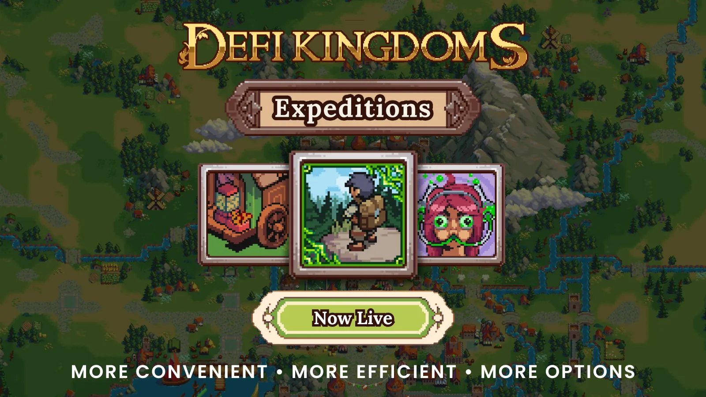
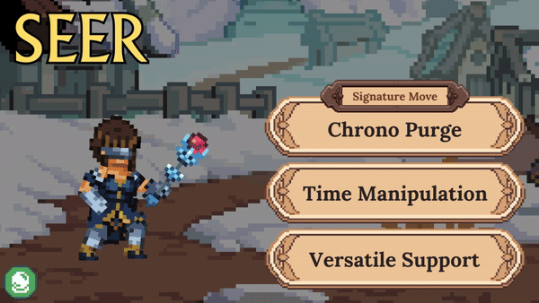
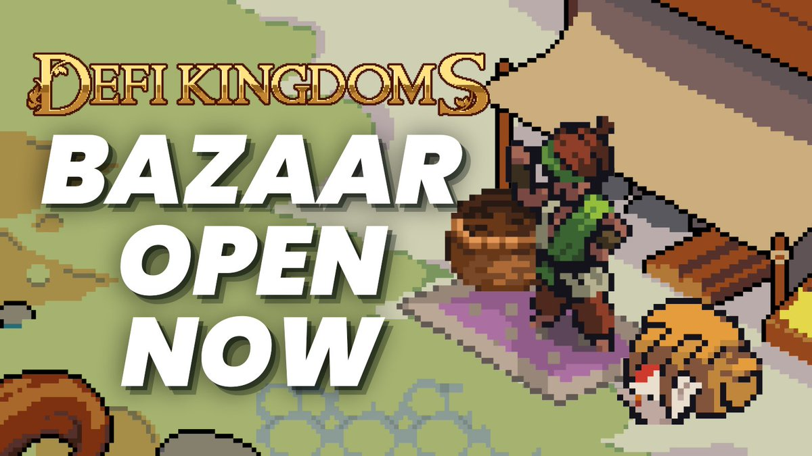

# Roadmap

DeFi Kingdoms will continue to grow with new features, systems, maps, and cross-chain gameplay!&#x20;


This roadmap lists many, but not all feature releases currently planned. While they are generally in the order in which we expect them to be released, some items may shift and be released earlier or later, and others will be subdivided into additional parts.


## Current Priorities

<figure><figcaption></figcaption></figure>

* **Divine Essence:** Transcend (burn) your Heroes in exchange for Divine Essence and other rewards, which can be used to reroll Hero level-ups, restore equipment, and more. See the full presentation in our [Governance and Alpha Roundtable](https://www.youtube.com/live/1A1BEGx3g18?si=XXCAqegFYF9CVM07) from May 29th on YouTube.
* **Equipment Durability:** A major aspect of the Equipment system, items will begin to degrade through use, eventually becoming unusable unless repaired or restored.
* **Mysterious Bannerman Activity:** The city of Submersia will call upon your Pleged Heroes in a new and interactive way...
* **Tournaments**: A built-in tournament feature will allow players to brawl with their Heroes in bracket-style PVP tournaments and compete for lucrative prizes.

### Secondary Priorities

* **Additional Combat Classes**: We are actively adding additional Class Skills to combat, and all classes can be used now with their basic attacks.
* **Additional Hunts Reward System:** A way to incentivize the grinder, this reward system will be backdated to include all victorious Hunts from the Void Hunt: Mad Boar launch up until the system is introduced.
* **Pet Combat Bonuses:** Reveal your Pets' combat bonuses and use them in PvE & PvP combat.
* **Glory and Honor:** Battle opponents with Glory on the line! Stake your Honor on the outcome of Bouts against other Commanders! Those with the most Glory and/or Honor will be rewarded!
* **PVP Experience Enhancements:** We are always working on improvements to both combat itself and the surrounding systems. Upgrades and updates will be coming!

## Long-Term Roadmap Features

* **Additional Player vs Environment (PVE) Experiences**: New Void Hunts and other PvE Experiences are in the works.
* **Level 10 Mining Quests**: The final Profession Quests, Gold Mining and Token Mining, will get their more challenging Level 10 variants.
* **Yellow Egg Hatching (Mining Pets)**: Explore many new mining-themed pets and equip them to your Heroes to help them yield the best rewards while down in the mines.
* **Traveling System**: Heroes will now be able to travel with their Heroes and Pets between different regions on the map to visit lands and complete quests.
* **In-Game Chat**: Communicate with other players around the world with our in-game chat feature: -recruit guild members, trade Heroes, challenge players and more.
* **Achievements**: Earn and collect unique achievements with a variety of challenging tasks and show them off to other players!
* **Crafting**: Use your Heroes to harvest and craft various items and equipment!
* **Golden Egg Hatching**: The fifth and final egg type will be available for hatching new Pets.
* **Land Functionality**: DeFi Kingdoms Lands will receive a full set of features, including the release of land in Crystalvale.
* **Guild Implementation**: Players will be able to create and manage guilds, and access guild-unique features.
* **Limited Quests**: Send your Heroes on unique, limited quests to earn special rewards.
* **Dungeons**: Send your Heroes out to fight and explore unique Dungeons.
* **Large-Scale PvP**: Compete with your Heroes in large-scale world events and challenge frightening enemies!

## Completed

### 2024

#### November

<figure><figcaption></figcaption></figure>

:white\_check\_mark: **Submersian Shell, Raffle, & Quest System**: Earn Submersian Shells from doing activities throughout the Colosseum and use those Shells as raffle tickets for a variety of prizes. Collect enough Shells to complete daily and other quests for bonus Shells!

#### October

<figure><figcaption></figcaption></figure>

* :white\_check\_mark: **Player vs Player (PVP) Combat**: Launched with initial exclusivity on the [Metis](https://www.metis.io/) blockchain, this core game mode allows players to fight other players in the **Colosseum** -- an animated, action-packed, turn-based combat mode featuring near endless possibilities with an extensive skill tree, Hero equipment, and Hero team variations.
* :white\_check\_mark: **Hero Spectating System:** Pledge (stake) your Heroes as Bannermen to earn Influence & fee sharing. Use that Influence to vote on the outcome of Bouts, and win a portion of the rewards!
* :white\_check\_mark: **Basic Equipment Shop:** A shop for players to acquire starter gear for their Heroes, until better can be found.

#### August

* :white\_check\_mark: **Hero Combat Traits:** Use your Heroes' genetic Active and Passive Ability Traits in PvE and PvP combat.

<figure><figcaption></figcaption></figure>

* :white\_check\_mark: **Expeditions**: This feature allows players to send their Heroes questing for longer periods of time. Until the user ends the Expedition, the Heroes will automatically farm materials for the player.

#### July

* :white\_check\_mark: **DFK Duel Season 8:** This season of DFK Duel launched with a completely re-written contract that automates future seasons. No more extended between-season downtime! This release brings DFK Duel to a "feature complete" state.

#### June

* :white\_check\_mark: **In-Game Governance Voting:** Powered by Snapshot, players can now vote on governance proposals through a native, in-game interface.

#### May

<figure><figcaption></figcaption></figure>

:white\_check\_mark: **Berserker Combat Skills:** Unleash your inner rage with the [Berserker](gameplay/combat/berserker.md), the latest class to join the fray with a full combat codex!

#### April

:white\_check\_mark: **DFK Duel Season 7:** The newest season of DFK Duel launches with a brand new contract, Pack (5v5) Mode, and new Keepsies and Deathmatch private challenges.

<figure><figcaption></figcaption></figure>

* :white\_check\_mark: **Seer Combat Skills:** The [Seer](gameplay/combat/seer.md) joins the lineup of Heroes with full combat codices, bending time to their will and harnessing powerful stones to either heal or destroy.

#### March

* :white\_check\_mark: **LP Staking - Serendale:** With JADE fully emitted, LP Stakers in Serendale are now incentivized by a percentage of fees collected through in-game features, providing a sustainable model to token redistribution.

#### February

<figure><figcaption></figcaption></figure>

* :white\_check\_mark: **Void Hunt: Bad Motherclucker:** Our newest **Player vs Environment (PvE)** offering, players must face off against a trio of vicious Rocbocs in order to win mysterious **Void Shards**, Equipment NFTs, and other prizes.
* :white\_check\_mark: **Bring Your Own Potions (BYOP):** Players must now craft and bring their own Potions for use in Void Hunts, bringing additional utility to these items and the materials required to brew them. As part of this update, _all_ combat Potions are now usable during combat.

<figure><figcaption></figcaption></figure>

* :white\_check\_mark: **New Equipment:** All new equipment drops, including brand new Weapon types and first-ever Armor and Off-Hand items.
* :white\_check\_mark: **Sponsored Hunt Raffles:** Now even more prizes are available through the Daily Hunt Raffles, made possible by donations from generous sponsors. Our first Sponsored Raffle from the [Klaytn Foundation](https://klaytn.foundation/) totals 50,000 KLAY in prizes!
* :white\_check\_mark: **Quest Re-Queue Feature:** Automatically re-queue your Quests once they have completed, and manage them in a single location!

#### January

* :white\_check\_mark: **LP Staking - Crystalvale:** With CRYSTAL fully emitted, LP Stakers are now incentivized by a percentage of fees collected through in-game features, providing a sustainable model. A new interface allows for easy migration from the old staking system to the new one.
* :white\_check\_mark: **Hunt Daily Raffle:** Every Void Hunt you win now enters you into a daily raffle to earn 1000 CRYSTAL. Defeat those Boars and walk away with the jackpot!
* :white\_check\_mark: **Visage Auctions:** Trade or sell your Visages to other players with the Visage Auction feature. Visages can be sold once they've left the shop for good!

### 2023

#### December

<figure><figcaption></figcaption></figure>

* :white\_check\_mark: **Visages & Visage Shop:** Spice up your Heroes’ style with a selection of custom, limited Visages! These items are purely cosmetic and can be equipped over combat weapons, armor, and accessories.
* :white\_check\_mark: **DFK Smart Wallets on Kaia:** DFK Smart Wallets provided by Halliday now fully support Serendale on Kaia! Bridge your Heroes, tokens, and items back and forth, and get the full DFK experience in both realms.
* :white\_check\_mark: **Quick Trade:** Buy items from the Bazaar or Trader with one-click-access from your inventory or crafting NPCs. Now you don't need to walk all the way across town if you're short one Bloater!

#### November

<figure><figcaption></figcaption></figure>

* :white\_check\_mark: **DFK Duel Season 6:** The newest season brings even better features to the Champion System, plus five unique equippable items to boost your Duel prowess!

<figure><figcaption></figcaption></figure>

* :white\_check\_mark: **Warrior Combat Skills:** The [Warrior](gameplay/combat/warrior.md) joins the Knight, Archer, and Priest as fully playable classes in combat with all of their available skills.

#### October

<figure><figcaption></figcaption></figure>

* :white\_check\_mark: **Halloween Spooktacular Event**: Win limited-time only cosmetics, and Dark Summon Heroes for a chance to Summon with all new skin colors!

<figure><figcaption></figcaption></figure>

* :white\_check\_mark: **Void Hunt: Mad Boar**: Our first **Player vs Environment (PvE)** offering, players will pit three of their Heroes in head-to-head combat against a pack of corrupted wild boars in order to win mysterious **Void Shards**, Equipment NFTs, and other prizes.
* :white\_check\_mark: **Equipment**: Earn new weapon, armor, and accessory Equipment NFTs to boost your Heroes' stats in their battles.

#### September

<figure><figcaption></figcaption></figure>

* :white\_check\_mark: **Onboarding Flow Updates**: Fiat-to-Crypto Onramps, DFK Smart Wallets using ERC-4337 account abstraction powered by [Halliday](https://www.halliday.xyz/), Combat Demos, and a new Tutorial feature all welcome new players and reduce friction to the Web3 onboarding process.

#### August

* :white\_check\_mark: **Multi-Meditation Feature**: Level all of your Heroes in a single transaction through the re-designed Meditation Circle.
* :white\_check\_mark: **DFK Duel Champion Matches**: Who is the Champion? _You_ are! Send your Heroes to topple the existing Champion in an all-out competition for dominance, and earn a percentage of the fees collected from DFK Duels.

#### July

<figure><figcaption></figcaption></figure>

* :white\_check\_mark: **The Bazaar**: Trade materials, rare items, and tokens in our decentralized order book marketplace, which allows players to set their own prices.

#### June

<figure><figcaption></figcaption></figure>

* :white\_check\_mark: **Hero Art & Animation Updates**: All new Hero art and background images, plus a complete rewrite of the system powering Hero animations that will be used in combat and elsewhere going forward.&#x20;

#### May

<figure><figcaption></figcaption></figure>

* :white\_check\_mark: **Pet Treats, Feeding, and Equipping**: Craft Pet Treats and keep your Pets fed while they are bonded to a Hero! Bonding Pets is the first iteration of Hero Equipment and sets the stage for more to come.
* :white\_check\_mark: **Green Egg Hatching (Gardening Pets)**: Our third set of unique Pets in various rarities and odd variants. Equip them to a Hero to boost their Gardening skills!
* :white\_check\_mark: **Skill 10 Fishing, Foraging, & Gardening**: Our first Skill 10 Profession Quests kicked off with Fishing, Foraging, and Gardening, allowing more experienced Heroes to earn greater rewards than with the base quests.
* :white\_check\_mark: **Pet Utility**: Boost your Heroes' performance in questing while they have a bonded Pet companion. But beware: Pets need to be fed and looked after to serve as helpful partners!

#### April

* :white\_check\_mark: **Hero Crafting Gene Reveal**: Bring your Heroes to the Meditation Circle to reveal their Crafting Profession Genes. Plus major behind-the-scenes changes to the Hero NFT contract.

#### March

* :white\_check\_mark: **Combat Testing Grounds**: Pre-Alpha access to our upcoming PVP combat feature, developed in collaboration with [Wisdom Gaming](https://www.wisdom.gg/). Try out Hero skills and abilities and provide valuable testing and feedback, all while battling a pack of ravenous blubs! New Hero classes and additional functionality will be consistently added to this initial release.

#### February

* :white\_check\_mark: **Deferred Fees & Token Offerings**: The new Deferred Fee Structure allows players to defer game fees by using locked tokens. Token Offerings give players the chance to win Blessings of rare items in exchange for Offerings of locked or unlocked tokens.

#### January

* :white\_check\_mark: **Power-Ups**: Use your cJEWEL and sJEWEL to unlock additional features! The first two Power-Ups allow your Heroes to earn more experience and regain their stamina faster, and many more Power-Ups are slated to launch in the future.

### 2022

#### December

<figure><figcaption></figcaption></figure>

* :white\_check\_mark: **Serendale 2.0 Launch on Kaia**: Serendale is back on a new home! The world you know and love is now accessible on the **Kaia** blockchain (formerly Klaytn), featuring the new Power Token **JADE** and a total of four new classes: the basic **Legionnaire** and **Scholar** classes, as well as the advanced **Bard** class and the elite **SpellBow** class.

#### November

* :white\_check\_mark: **Jeweler 2.0 (cJEWEL/sJEWEL)**: Our single staking xJEWEL is replaced with cJEWEL (Crystalvale) and sJEWEL (Serendale). Lock your JEWEL to receive in-game fees – the longer you lock, the more cJEWEL/sJEWEL you receive, and with it higher rewards.
* :white\_check\_mark: **Dark Summoning**: This feature allows players to sacrifice two Heroes to summon a new Hero. The reward for paying the blood price is that this summoning ritual has lower costs, higher chances for rarer Heroes and some of the parents’ levels carry over.

#### October

* :white\_check\_mark: **The Calamity of Serendale 1.0**: Serendale is falling apart! DeFi Kingdoms **officially leaves the Harmony blockchain** – but Serendale will be back soon. A small outpost will still allow players to bridge their remaining assets to DFK Chain.
* :white\_check\_mark: **Pet Bridge**: Use the Docks to send your Pets to Crystalvale, as dark clouds are gathering over their homeland. The Pet Bridge is powered by [Synapse's](https://explorer.synapseprotocol.com/) cross-chain messaging protocol.

#### September

* :white\_check\_mark: **Crystalvale Stone Carver**: Players can now craft Enhancement Stones on Crystalvale.
* :white\_check\_mark: **Crystalvale Pet Hatching**: Pets are now available on Crystalvale!
* :white\_check\_mark: **Multi-Questing**: This new feature allows the queuing and submission of several quests at once.
* :white\_check\_mark: **Kingdom Builder Integration**: Visit the Jester and the Archivist in the Castle to learn more about games, applications, and tools built around DeFi Kingdoms by our community members and partners.
* :white\_check\_mark: **Crystalvale Gardening Quests**: Our Gardening Quests are now enabled on Crystalvale. In addition to earning CRYSTAL, players can now send a second Hero to earn JEWEL as well!

#### August

* :white\_check\_mark: **Item Bridge**: Players can now send their in-game items back and forth between the realms, powered by[ Layer Zero's](https://layerzero.network/) cross-chain messaging protocol.
* :white\_check\_mark: **Crystalvale Castle Zone**: Visit the Dwarf King in his Castle, which will house various NPCs in the future.
* :white\_check\_mark: **Crystalvale Training Quests**: Training Quests are now enabled on Crystalvale.
* :white\_check\_mark: **Item Trader Redesign**: The Marketplace Trader now prices by supply and demand: if many players buy an item, the price goes up, but if demand goes down, so does the price.

#### July

* :white\_check\_mark: **Crystalvale Alchemist**: The Alchemist is now accessible on Crystalvale for potion crafting.
* :white\_check\_mark: **Crystalvale Mining Quests**: Use your Heroes to mine and unlock some of your Locked CRYSTAL or earn some Gold!
* :white\_check\_mark: **Crystalvale Hero Leveling**: Players can now level up their Heroes on Crystalvale.
* :white\_check\_mark: **Crystalvale Fishing & Foraging Quests**: Heroes can now fish and forage on Crystalvale, where they can find realm-specific quest rewards.
* :white\_check\_mark: **Merch Store Launch**: Get your hands on exclusive DeFi Kingdoms Merch at our newly launched Merch store!

#### June

* :white\_check\_mark: **DFK Duels Launch**: Fight other players Heroes in the **DFK Duels** minigame and earn raffle tickets, which can be used to earn lucrative rewards.

#### May

* :white\_check\_mark: **Marketplace Rework #2**: Our Marketplace received its second visual rework.
* :white\_check\_mark: **Pet NFT Release**: Hatch your blue and gray eggs to receive Pet NFTs! Hundreds of pets featuring different rarities - and some uniquely odd pets – are starting to populate Serendale. In the future, pets can be equipped to Heroes to allow for the boosting of their stats and skills; Pets from green, yellow golden eggs will follow!
* :white\_check\_mark: **Stone Carver**: A new NPC has been added to the **Portal** – the Stone Carver can craft valuable Enhancement Stones for the right materials.
* :white\_check\_mark: **Hero Bridge**: Send your Heroes between Serendale and Crystalvale at the **Docks**, powered by [Synapse's](https://explorer.synapseprotocol.com/) cross-chain messaging protocol..
* :white\_check\_mark: **Crystalvale Summoning**: Players are now able to summon new Heroes on Crystalvale using the new CRYSTAL Power Token.

#### April

* :white\_check\_mark: **Crystalvale Portal, Meditation Circle, and Tavern Zones**: Three new zones are available on Crystalvale with custom pixel art and music!
* :white\_check\_mark: **Training Quests**: A new set of quests releases – use your Heroes to compete in a test of skill to earn Experience, Gold, or rare items.

#### March

* :white\_check\_mark: **Cross-Chain Bridge**: Using the Docks, players can now send their tokens as cargo between Serendale and Crystalvale through [Synapse's](https://explorer.synapseprotocol.com/) cross-chain messaging protocol.
* :white\_check\_mark: **Leaderboards**: Compete with other players on unique daily, weekly, and monthly quests to earn lucrative rewards.

<figure><figcaption></figcaption></figure>

* :white\_check\_mark: **Crystalvale and DFK Chain Launch**: Our winter-themed first expansion **Crystalvale** launches on our own [**DFK Chain**](how-defi-kingdoms-works/defi-kingdoms-blockchain.md), an [Avalanche Subnet](https://www.avax.network/subnets). Players are able to explore a whole new region with a new set of Gen0 Heroes featuring the new **Seer** and **Berserker** classes, as well as the advanced **Shapeshifter** class. This realm also features a new **Power Token: CRYSTAL**.

#### February

* :white\_check\_mark: **The Perilous Journey**: A unique event launches leading up the release of our first expansion! Send your Heroes sailing to chart a course to Crystalvale – but beware, the sea is dangerous and not every Hero may come back alive!

#### January

* :white\_check\_mark: **World Map Extension**: With the release of Lands, our world map expanded in size, allowing players to explore many different regions of Serendale.
* :white\_check\_mark: **Land Release**: A new unique set of NFTs, Land, is released. Players are able to own and trade Land plots, which will host different features and events in the future.
* :white\_check\_mark: **Castle Zone**: The large Serendale Castle is now accessible!
* :white\_check\_mark: **Jewel Mining Quest**: Following the mining of Gold, players can now send Heroes to unlock some of their Locked JEWEL.

### 2021

#### December

* :white\_check\_mark: **Gold Mining Quest**: Mining, the fourth and last Profession Quest kicks off with Gold Mining, allowing players to have their Heroes mine valuable Gold.
* :white\_check\_mark: **Alchemist Zone**: Visit the Alchemist to craft powerful potions that aid your Hero in battle or refresh their Stamina.
* :white\_check\_mark: **Gardening Quest**: Our third Profession Quest, Gardening, is available and allows players to earn rewards based on the amount of Seeds (LP Tokens) they have staked in the Gardens.
* :white\_check\_mark: **Hero Leveling**: Once your Hero’s experience bar is full, they can now visit the **Meditation Circle** zone to level up and improve their stats.
* :white\_check\_mark: **Item Vendor**: The Item Vendor opens shop and allows for the selling of quest rewards for Gold. He also has some valuable items in stock for the player to purchase!
* :white\_check\_mark: **Meditation Circle Zone**: A new zone has been discovered – the Meditation Circle is still charging, but soon your Heroes will be able to use this zone to level up.
* :white\_check\_mark: **Fishing and Foraging Quests**: Our first set of Profession Quests kick off with Fishing and Foraging! Send your Heroes on quests to earn experience, valuable rewards, and materials.

#### November

* :white\_check\_mark: **Docks Zone**: The Docks open – in the future ships will allow for traveling other regions on other blockchains.
* :white\_check\_mark: **World Map Release**: Players are now able to explore the World Map and directly navigate between zones.
* :white\_check\_mark: **Marketplace Rework #1**: Our Marketplace zone received its first visual rework!

#### October

* :white\_check\_mark: **Tavern & Hero Sales**: The **Scarlet Hearth Tavern** opens it doors, allowing for the buying, selling, and renting of Heroes.
* :white\_check\_mark: **Portal Zone & Hero Summoning**: Players are now able to use two Heroes to summon a new Hero, featuring the genetic traits of the parent Heroes in the newly added Portal zone.

#### September

* :white\_check\_mark: **Genesis Gen0 Sale**: The Gen0 Hero genesis mint marked the launch of our Hero NFTs. The limited 2000 Gen0 Heroes, which sold out in just a few minutes, were the genetic ancestors of all future Serendale Heroes.

#### **August**

<figure><figcaption></figcaption></figure>

* :white\_check\_mark: **DeFi Kingdoms Launch**: On August 22, 2021 DeFi Kingdoms officially launched, featuring a pixel art interface, a decentralized exchange via the **Trader**, and the **Gardens**, allowing for the staking of LP seeds and earning of **JEWEL**.\
